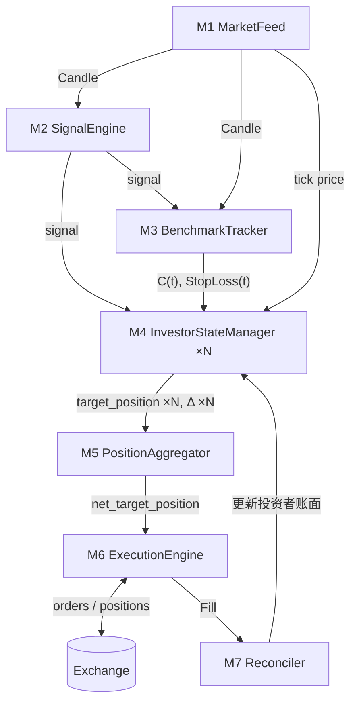
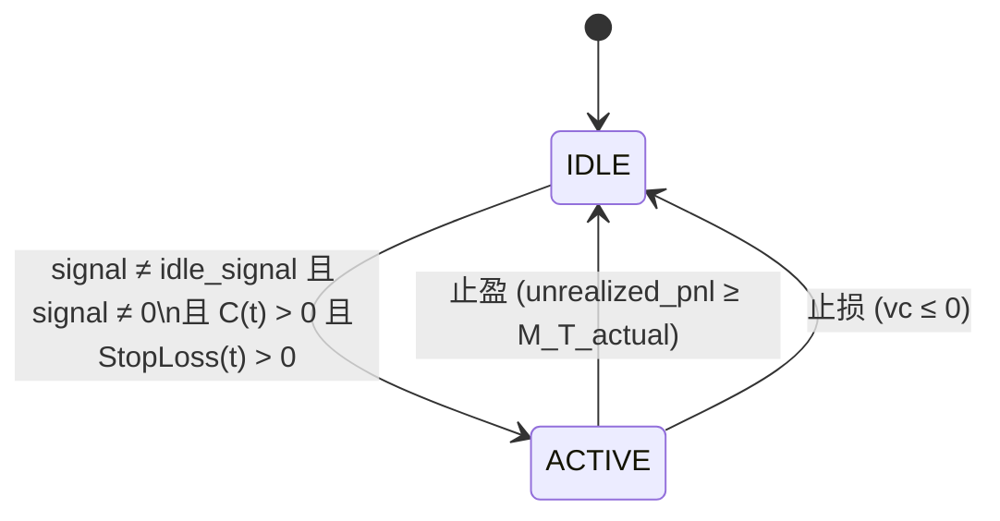

# 涓流基金实盘系统设计

2026-02-14

## 背景

[涓流基金](./66.md)即将进入实盘阶段。在此之前，需要将 [SandTable](./43.md) 中验证过的[资本持久战](../INSIGHTS/6.md)框架，落地为一个可运行的实盘交易系统。

本文定义了实盘系统的模块划分、数据流、状态机和盈亏归因机制。设计遵循以下原则：

1. **信号与投注分离**：信号策略（[LOGS/40](./40.md)）和投注策略是独立模块，人类只能干预信号层，不能干预投注层。
2. **投资者独立状态**：每个投资者维护独立的风控线、止盈线和风险资金状态，最终合并头寸统一下单。
3. **授权现金流驱动**：投资者授权的是现金流速率而非本金（[LOGS/65](./65.md)），基金不收管理费和业绩提成，管理方通过止盈溢价获取收入。

系统由 7 个模块组成，按照[实验设计](./39.md)中定义的数学框架运行。

## 模块总览

| 模块 | 职责 | 触发频率 |
|------|------|----------|
| M1 MarketFeed | 市场数据源：K 线和 tick 价格 | 持续 |
| M2 SignalEngine | 信号计算，输出 -1/0/+1 | 每根 K 线收盘 |
| M3 BenchmarkTracker | 虚拟基准账户，产出全局参数 C(t) 和 StopLoss(t) | 每根 K 线收盘 |
| M4 InvestorStateManager | 每个投资者的独立状态机，计算目标仓位 | K 线收盘 + tick |
| M5 PositionAggregator | 聚合所有投资者的目标仓位为净头寸 | M4 输出变化时 |
| M6 ExecutionEngine | 比较目标与实际持仓，执行差额下单 | M5 输出变化时 |
| M7 Reconciler | 将成交结果归因到每个投资者 | M6 成交后 |

## 数据流



## M1. MarketFeed（市场数据源）

连接交易所，提供两种粒度的数据流。

**输出：**

- `Candle(t)` — K 线流（OHLCV），按固定周期（如 1h）产出，驱动信号计算和基准账户更新。
- `Tick(ts)` — 实时价格流，驱动盘中止盈止损检测。

```ts
interface Candle {
  open: number;
  high: number;
  low: number;
  close: number;
  volume: number;
  timestamp: number;
}

interface Tick {
  price: number;
  timestamp: number;
}
```

## M2. SignalEngine（信号引擎）

每根 K 线收盘时，根据市场数据计算交易信号。这是一个可替换模块，当前实现为 FMAB。

**输入：** `Candle(t)` 来自 M1。

**输出：** `signal(t) ∈ {-1, 0, +1}`

- `+1` = 做多
- `-1` = 做空
- `0` = 平仓，无敞口

信号的变化（翻转）驱动开平仓事件。信号本身不决定仓位大小，仓位由 M4 的投注逻辑决定。

## M3. BenchmarkTracker（基准账户追踪器）

虚拟账户，始终以 1 单位头寸跟随信号交易，不实际下单。用于计算两个全局参数，所有投资者共享同一份。

**输入：** `signal(t)` 来自 M2，`Candle(t)` 来自 M1。

**内部维护：** 每笔虚拟交易的记录：

- 盘中最大浮亏（多头用 `low`，空头用 `high` 计算）
- 最终亏损额 / 持仓时长

**输出：**

- `C(t)` — 输入现金流速率。计算方法：所有历史交易中，`max(|亏损| / 持仓时长)`。
- `StopLoss(t)` — 基准止损额。计算方法：所有历史交易中，`max(盘中最大浮亏)`。

当 `C(t) = 0` 或 `StopLoss(t) = 0` 时，系统处于观察期，不进行交易。这只发生在冷启动阶段，基准账户尚无足够历史数据时。

算法当前使用全部历史数据取最大值，未来可替换为滚动窗口等方案。

## M4. InvestorStateManager（投资者状态管理器）

系统中最复杂的模块。每个投资者维护一套独立的状态，独立计算目标仓位，独立触发止盈止损。

### 外部参数

由投资者设定，仅允许在无持仓时变更（IDLE 状态，或 ACTIVE 且 signal = 0）。

```ts
interface InvestorParams {
  cash_flow_rate: number;  // 授权现金流速率，如 1 USD/day
  M_T: number;             // 投资者止盈目标金额
}
```

### 基金管理方参数

```ts
interface FundParams {
  premium_rate: number;    // 止盈溢价率，如 0.1
}
// 实际止盈触发金额 = M_T * (1 + premium_rate)
// 投资者精确拿到 M_T，超额部分归管理方（参见 LOGS/65）
```

### 内部状态与派生量

```ts
interface InvestorState {
  status: 'IDLE' | 'ACTIVE';
  risk_line: number;        // 风控线，≤ 0，随时间持续下移
  unrealized_pnl: number;   // 当前持仓浮盈浮亏
  realized_pnl: number;     // 累计已实现盈亏
  direction: number;        // 当前持仓方向 -1 | 0 | +1
  position_units: number;   // 当前持仓量（绝对值，实际单位）
  avg_entry_price: number;  // 当前持仓均价
  idle_signal: number;      // 进入 IDLE 时的信号值，用于检测翻转
}

// 派生量（实时计算，不持久化）
// base_unit           = cash_flow_rate / C(t)
// vc                  = unrealized_pnl - risk_line
// position_multiplier = max(1, floor(vc / StopLoss(t)))
// target_position     = direction * position_multiplier * base_unit
```

初始状态：`status = IDLE, idle_signal = 0`，其余字段均为 0。

### 状态机



只有两个状态。冷启动时 `idle_signal = 0`，第一个非零信号到来且 `C(t)` 和 `StopLoss(t)` 就绪时，自然从 IDLE 转入 ACTIVE。无需单独的 OBSERVING 状态——当 `C(t) = 0` 时 `base_unit` 无法计算，IDLE 自然不会转换。

ACTIVE 内部存在两种情况，无需显式建模为子状态：

- **有持仓**（direction ≠ 0）：正常跟随信号，受止盈止损监控。
- **空仓**（direction = 0，因 signal = 0）：已平仓，无敞口，不受止盈止损监控。等 signal 变非零时直接开仓。

所有状态下，风控线持续下移，VC 持续积累。

### K 线收盘时的更新逻辑

每根 K 线收盘时，对每个投资者按以下顺序执行。`dt` 为时间步长（如 1h K 线则 dt = 1/24 天）。

```
// 第一步：所有状态下，风控线下移
risk_line -= C(t) * dt

// 第二步：IDLE 检查是否可以激活
if status == IDLE:
  if signal(t) ≠ idle_signal 且 signal(t) ≠ 0 且 C(t) > 0 且 StopLoss(t) > 0:
    status = ACTIVE
    // direction 仍为 0，下面的统一流程会处理开仓

// 第三步：ACTIVE 统一处理
if status == ACTIVE:
  // 方向变化时：平旧开新
  if signal(t) ≠ direction:
    if direction ≠ 0:
      realized_pnl += unrealized_pnl
      unrealized_pnl = 0
    direction = signal(t)
    if direction ≠ 0:
      avg_entry_price = close_price

  // 计算仓位（无论方向是否变化）
  if direction ≠ 0:
    base_unit = cash_flow_rate / C(t)
    vc = unrealized_pnl - risk_line
    position_multiplier = max(1, floor(vc / StopLoss(t)))
    position_units = position_multiplier * base_unit
    unrealized_pnl = position_units * (close_price - avg_entry_price) * direction
  else:
    position_units = 0
```

这个统一流程覆盖了所有场景：从 IDLE 进入时开仓、信号翻转时平旧开新、signal 归零时平仓、信号不变但 vc 变化时调仓。核心分支只有一个 `if signal(t) ≠ direction`。

### tick 级盘中检测

仅在 `status == ACTIVE` 且 `direction ≠ 0` 时执行。检测频率为每个 tick 或每秒。

```
// 更新浮盈浮亏
unrealized_pnl = position_units * (tick_price - avg_entry_price) * direction
vc = unrealized_pnl - risk_line
M_T_actual = M_T * (1 + premium_rate)
```

**止盈检测：**

```
if unrealized_pnl >= M_T_actual:
  平仓（触发 M5 → M6 执行）
  actual_fill_pnl = 实际平仓盈亏
  investor_realized = M_T                    // 投资者精确拿到 M_T
  manager_realized  = actual_fill_pnl - M_T  // 超额归管理方
  realized_pnl += investor_realized
  unrealized_pnl = 0
  risk_line = 0                              // 重置风控线
  idle_signal = signal(t)                    // 记录当前信号
  status = IDLE
```

**止损检测：**

```
if vc <= 0:
  平仓（触发 M5 → M6 执行）
  realized_pnl += unrealized_pnl             // 锁定亏损
  unrealized_pnl = 0
  idle_signal = signal(t)                    // 记录当前信号
  status = IDLE
  // risk_line 不重置，继续下移
```

止盈和止损都是盘中触发的，不需要等 K 线收盘。触发后立即进入 IDLE，等待信号翻转后重新入场。

止盈后 IDLE 期间，`risk_line` 从 0 开始继续下移，`vc = 0 - risk_line = -risk_line > 0`，VC 逐渐积累。

止损后 IDLE 期间，`risk_line` 不重置，继续下移，`vc = 0 - risk_line > 0`（因为 `risk_line < 0`），VC 同样在积累。两者的区别仅在于止盈重置了 `risk_line` 而止损没有。

## M5. PositionAggregator（头寸聚合器）

将所有投资者的目标持仓聚合为一个净头寸，供执行引擎下单。

**输入：** 所有投资者的 `target_position_i`（带方向和数量）。

**输出：**

- `net_target = Σ target_position_i` — 交易账户的目标净头寸。
- `Δ_i = new_target_i - old_target_i` — 每个投资者的仓位变化量，供 M7 对账用。

当多个投资者的 Δ 方向相反时，会产生内部对冲。例如投资者 A 要 +10，投资者 B 要 -3，净下单仅 +7。所有投资者共享因净单量更小而带来的低滑点好处。

## M6. ExecutionEngine（执行引擎）

比较目标净头寸与当前交易所实际持仓，执行差额下单。

**输入：** `net_target`（来自 M5），`actual_position`（来自交易所）。

**逻辑：**

```
order_delta = net_target - actual_position
if |order_delta| > 最小下单阈值:
  执行市价单
```

**输出：**

```ts
interface Fill {
  price: number;       // 成交均价
  quantity: number;     // 成交数量
  fee: number;          // 手续费
  timestamp: number;
}
```

执行层需要处理：滑点、部分成交、重试、限价/市价选择等工程细节。

## M7. Reconciler（盈亏归因）

将实际成交结果归因到每个投资者的虚拟子账户。所有人按 `fill_price` 记账。

**输入：** `Fill`（来自 M6），各投资者的 `Δ_i`（来自 M5）。

**对每个投资者 i：**

```
// 手续费按仓位变化量的绝对值比例分摊
fee_i = |Δ_i| / Σ|Δ_j| * total_fee

// 加仓（Δ_i 与 direction 同向）
if Δ_i > 0:
  avg_entry_price_i = (旧均价 * 旧仓位 + fill_price * Δ_i) / 新仓位
  position_units_i += Δ_i

// 减仓（Δ_i 与 direction 反向）
if Δ_i < 0:
  realized_pnl_i += |Δ_i| * (fill_price - avg_entry_price_i) * direction_i - fee_i
  position_units_i += Δ_i    // 减少
  // avg_entry_price 不变（减仓不改变均价）
```

内部对冲的部分（投资者之间方向相反的 Δ 互相抵消）不产生实际市场冲击，但仍按 `fill_price` 结算。这对所有投资者都是公平的。

## 关键设计决策汇总

| 决策项 | 结论 | 依据 |
|--------|------|------|
| 信号语义 | -1/0/+1，0 = 平仓无敞口 | [LOGS/37](./37.md) 三层架构 |
| 状态机 | 仅 IDLE / ACTIVE 两个状态 | 冷启动由 IDLE 转换条件自然覆盖 |
| 止盈后行为 | 进入 IDLE，等信号翻转再入场 | 避免在同方向信号上反复开平仓 |
| 止损后行为 | 进入 IDLE，等信号翻转，风控线不重置 | [LOGS/39](./39.md) 止损继续运行 |
| IDLE 期间风控线 | 继续下移，VC 持续积累 | 涓流充电的核心机制 |
| signal=0 时风控线 | 继续下移，VC 持续积累 | 保持 ACTIVE 但无敞口 |
| base_unit 更新 | 每次开仓时用最新的 C(t) 计算 | cash_flow_rate / C(t) |
| 参数变更时机 | 无持仓时（IDLE 或 ACTIVE 且 signal=0） | 避免持仓中仓位突变 |
| 止盈超额归属 | 管理方收入 | [LOGS/65](./65.md) 不收业绩提成 |
| C(t) / StopLoss(t) 算法 | 全部历史数据取 max | 未来可替换为滚动窗口 |
| 盈亏归因 | 所有人按 fill_price 记账 | 简单、公平、共享低滑点 |
| 交易账户 | 合并为一个账户 | 不可能为每个投资者创建独立账户 |
| 投资者状态 | 每人独立维护风控线、止盈线、VC | 投资者可独立决策，无需协调 |
