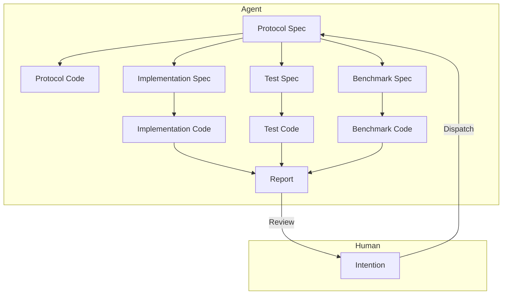

# Module-Level Human-AI Collaborative Software Engineering Architecture

2026-01-05

## Problem Background

Design an LLM-based engineering architecture for module-level human-AI collaboration, aiming to efficiently complete the design, implementation, and iteration of industrial-grade application modules, reducing the cost of human intervention.

1.  Existing AI Agents (Claude Code, CodeX) produce poor-quality code module implementations, still requiring significant human intervention, rework, and review.
2.  Existing AI Agents struggle to define clear module boundaries during implementation, leading to code with unnecessary complexity.
3.  Existing AI Agent implementations are too slow, taking 10-30 minutes from task assignment to acceptance.

## Problem Insights

-   According to [this article](./2.md), human desire for control stems from rational concerns about losing control over outcomes. Establishing a controllable trust mechanism is the solution.
-   According to [this article](./3.md), I believe the physical and economic mechanisms of LLMs inherently make it difficult for them to complete all work in one go.

The key to liberating human productivity lies in eliminating the human desire for control over details. Once this is achieved, humans will adopt a "good enough" mentality and stop excessively scrutinizing AI's output.

So, what checks, once passed, would lead a human to judge that they are no longer capable of intervening or that further action is unnecessary?

1.  The conceptual naming and style of the module's external interfaces meet the requirements. This alleviates concerns about poorly designed interfaces propagating downstream in the system.
2.  Unit tests pass. This alleviates concerns about whether the module functions correctly.
3.  Benchmark tests show optimization or no degradation. This alleviates concerns about the module's efficiency.
    The first point can be identified early on, while the latter two are only known after experimentation. If all three are satisfied, humans have little reason to forcibly intervene in the AI's work.

Whether the module can truly handle real-world data patterns requires testing with production data. Humans would then summarize these patterns and construct a new intention to create a module addressing the new problem. This issue is temporarily outside the scope of this article.

### Priority Goals

1.  Reduce human intervention.
2.  Reduce runtime, improve speed.
3.  Reduce token usage, lower LLM costs.

### Design

1.  **Rapid Intention Alignment**

    The human describes their intention, quickly aligning with the Agent on the module's functional requirements, outputting a Protocol Spec.

    This Protocol Spec includes the module's interface definitions, input/output data formats, functional descriptions, etc., similar to an RFC document. The human should focus on interface definitions and functional descriptions to ensure clear module boundaries, particularly evaluating the taste/style of the interface design.

    This process can involve multiple rounds of interaction. The Agent will iteratively revise the Protocol Spec based on human feedback until approved.

    Following this, a lengthy automated implementation process begins, during which human intervention is not required. Two outcomes are possible: 1. The module is successfully implemented, generating a final report for human review; 2. Implementation fails, generating an arbitration request for human intervention.

2.  **Generate Protocol Code from Protocol Spec**

    The Agent generates the skeleton code (Protocol Code) for the module based on the Protocol Spec, containing interface definitions and comments.
    The Protocol Code is used for subsequent implementation, test, and benchmark code generation. Its primary purpose is to ensure clear module boundaries and avoid unnecessary complexity during implementation.

3.  **Parallel Generation of Implementation Spec, Test Spec, Benchmark Spec from Protocol Spec**

    Different specialized Agents generate the Implementation Spec, Test Spec, and Benchmark Spec based on the Protocol Spec, describing the module's implementation details, test cases, and benchmark testing plan, respectively.

4.  **Generate Test Code from Test Spec**

    A specialized testing Agent generates the module's unit test code (Test Code) based on the Protocol Spec and Test Spec, containing various test cases and assertions. Interface-based testing methods must be used to avoid coupling with implementation details.

5.  **Generate Benchmark Code from Benchmark Spec**

    A specialized benchmarking Agent generates the module's benchmark test code (Benchmark Code) based on the Protocol Spec and Benchmark Spec, containing performance test cases and measurement metrics. Interface-based testing methods must be used to avoid coupling with implementation details.

6.  **Generate Implementation Code from Implementation Spec**

    A specialized implementation Agent generates the module's implementation code (Implementation Code) based on the Protocol Spec, Implementation Spec, Test Spec, and Benchmark Spec. Once implementation is complete, unit tests are run immediately.

    If unit tests fail, analyze the cause.

    -   If the issue is believed to be with the Implementation, modify the Implementation Spec and regenerate the Implementation Code. Repeat this process.
    -   If the issue is believed to be with the Test, collect details of the test failure and formulate a counter-argument. This will be submitted to a higher-level arbitration Agent.

        -   If the counter-argument is accepted, the arbitration Agent may choose to modify the Test Spec and rerun the tests. Repeat this process.
        -   If the counter-argument is rejected, the arbitration Agent generates an explanatory opinion, instructing the implementation Agent to modify the Implementation Spec and restart the implementation process. Repeat this process.
        -   **If the arbitration Agent cannot make a judgment, it will request human intervention for arbitration.**

    If unit tests pass, proceed to benchmark testing.

7.  **Run Benchmark Tests**

    The Implementation Code that passed unit tests can now run benchmark tests.

    If no other comparable implementation version exists, mark the current implementation as the baseline version, run the benchmark tests, record performance metrics, and pass the benchmark test.

    If other comparable implementation versions exist, run the benchmark tests, record performance metrics, and generate a comparison report. The Agent analyzes the performance changes of the current implementation.

    -   If the current implementation's performance degrades, analyze the cause.

        -   If the issue is believed to be with the Implementation, modify the Implementation Spec and regenerate the Implementation Code. Repeat this process.
        -   If the issue is believed to be with the Benchmark, collect details of the benchmark test failure and formulate a counter-argument. This will be submitted to a higher-level arbitration Agent for judgment.

            -   If the counter-argument is accepted, the arbitration Agent may choose to modify the Benchmark Spec and rerun the benchmark tests. Repeat this process.
            -   If the counter-argument is rejected, the arbitration Agent returns the counter-argument to the implementation Agent, instructing it to modify the Implementation Spec and restart the implementation process. Repeat this process.
            -   **If the arbitration Agent cannot make a judgment, it will request human intervention for arbitration.**

    -   If the current implementation's performance does not degrade, the benchmark test passes.

8.  **Generate Final Report**

    Once the Implementation Code passes both unit tests and benchmark tests, generate a final report containing implementation details, test results, and benchmark results.
    The final report is submitted to the human for review. If the human approves the implementation, the task is complete. Otherwise, collect human feedback, formulate a counter-argument, and submit it to a higher-level arbitration Agent. If the counter-argument is accepted, the arbitration Agent may choose to modify the Protocol Spec and restart the entire implementation process. Repeat this process.

## Summary

1.  The core of the architecture is layered collaboration, specialized division of labor, and separation of concerns.
2.  A multi-level arbitration mechanism ensures implementation quality and reduces human intervention.
3.  Clear acceptance criteria (passing unit tests, no performance degradation) establish a trust mechanism, eliminating the human desire for control.

Some unresolved issues remain:

1.  How to improve Protocol Spec quality to ensure clear module boundaries? Add an automated review step.
2.  How to avoid infinite arbitration loops? For example, set a maximum number of automatic arbitration attempts.
3.  How to control actual execution time and token usage within reasonable limits? Measure first, then optimize.
4.  How to guarantee the taste/style of interface design? For example, incorporate a team style guide.

Some future prospects:

1.  Why must the human role be filled by a human? It is essentially a Supervisor. In the future, could a higher-level AI replace humans for intention alignment and final review? This would further reduce human intervention and improve efficiency.
2.  Can this approach be extended beyond module-level tasks to larger-scale system design and implementation? For example, full-stack development tasks involving frontend, backend, and database? This would significantly enhance the application value of AI in software engineering.