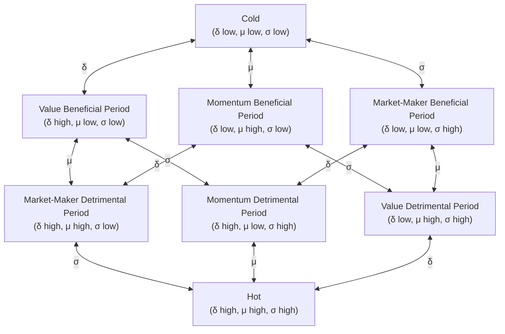

# The Three-Body Dynamics Hypothesis of Capital Markets

2026-02-07

**Why does market behavior exhibit both patterns and profound uncertainty?**

- Why are markets always full of opportunity yet uncertain?
- Why do markets always repeat but never replicate?
- Why are markets sometimes predictable and sometimes not?
- Why do capital markets exhibit volatility clustering, market crashes, and recoveries?
- Why do markets experience sudden regime shifts?
- Why do markets follow patterns of sharp rallies followed by steep declines?
- Why is there a risk of total loss (going to zero)?
- Why are the statistical properties of markets (e.g., fat tails in return distributions, volatility clustering) robust?

## Core Idea

Assume the capital market is a **three-body system**, composed of three fundamentally different types of capital. Their interactions generate complex dynamic behaviors, including emergent phenomena such as volatility clustering and market crash/recovery cycles.

Similar to the three-body problem in celestial mechanics, this system **may not have a steady-state solution**, instead exhibiting limit cycles, quasi-periodic, or chaotic behavior.

## Definition of the Three Bodies

The essential difference among market participants lies not in their identity (retail, institutional, market maker) but in the **nature of their feedback to price changes**.

### Momentum Capital M (Momentum Capital)

**Definition**: Trading capital that provides positive feedback to price changes.

$$\frac{d(\text{Position})}{dS} > 0$$

**Behavioral Characteristics**:

- Buy on strength, sell on weakness (chase rallies, cut losses)
- Use leverage to amplify gains/losses
- Tendency for short-term holding periods
- Momentum trading, trend following

**Impact on the System**:

- Amplifies price movements
- Destabilizing force
- Creates trends and crashes

**Typical Representatives**: Speculators, trend traders, high-leverage traders, holders with passive stop-losses

### Value Capital V (Value Capital)

**Definition**: Trading capital that provides negative feedback to price changes.

$$\frac{d(\text{Position})}{dS} < 0$$

That is: Reduce position when price rises, increase position when price falls.

Typically anchored by an intrinsic value $S^*$:

- When $S < S^*$, tendency to buy
- When $S > S^*$, tendency to sell

**Behavioral Characteristics**:

- Buy low, sell high (contrarian operation)
- Trade based on value judgment
- Tendency for long-term holding periods
- Mean reversion, value investing

**Impact on the System**:

- Dampens price volatility
- Stabilizing force (active)
- Provides market support and resistance

**Typical Representatives**: Value investors, contrarian investors, arbitrageurs

### Liquidity Capital L (Liquidity Capital)

**Definition**: Liquidity-providing capital with no directional response to price changes.

$$\frac{d(\text{Position})}{dS} \approx 0$$

**Behavioral Characteristics**:

- Quote both sides, earn the bid-ask spread
- Do not hold directional exposure (or hedge quickly)
- Continuously provide buy/sell liquidity
- Limited risk tolerance

**Impact on the System**:

- Reduces transaction costs
- Stabilizing force (passive)
- Buffers price shocks

**Typical Representatives**: Market makers, liquidity providers, high-frequency traders (market-making type)

## Interactions Among the Three Bodies

### Interaction Matrix

| Actor → Recipient | Momentum Capital M | Value Capital V | Liquidity Capital L |
| ----------------- | ------------------ | --------------- | ------------------- |
| **Momentum Capital M** | — | Creates trading opportunities | Consumes liquidity |
| **Value Capital V** | Suppresses extreme behavior | — | Restores confidence |
| **Liquidity Capital L** | Constrains shock impact | Facilitates trading | — |

### Detailed Mechanisms

**M → L: Consumes Liquidity**

The buy-on-strength/sell-on-weakness behavior of momentum capital generates large one-sided order flow, depleting market makers' inventory and forcing them to take on larger risk exposure. When volatility becomes too high, market makers may withdraw.

**L → M: Constrains Shock Impact**

Ample liquidity cushions the price impact of momentum capital. In deep markets, even high-leverage trades struggle to move prices significantly. Liquidity acts as a "shock absorber."

**M → V: Creates Trading Opportunities**

Momentum capital's chasing of trends pushes prices away from intrinsic value, creating opportunities for value capital:

- Panic selling → Price below intrinsic value → **Buying** opportunity for V
- Frenzied buying → Price above intrinsic value → **Selling** opportunity for V

This represents an **opportunity transfer** from momentum capital to value capital.

**V → M: Suppresses Extreme Behavior**

The contrarian operations of value capital provide price support, reducing the probability of one-sided price collapses, thereby lowering the expected returns of trend-chasing strategies. Rational momentum capital may thus scale back.

**V → L: Restores Confidence**

The intervention of value capital signals that "the market has a floor," reducing market makers' fear of extreme losses and attracting liquidity back. Value capital acts as "insurance" for market makers.

**L → V: Facilitates Trading**

Ample liquidity allows value capital to establish positions at low cost; large orders do not incur excessive slippage, improving the capital efficiency of value capital.

## Feedback Loops

### Positive Feedback Loop (Destabilizing)

$$M \uparrow \to \sigma \uparrow \to L \downarrow \to \text{Price Impact} \uparrow \to \sigma \uparrow \to M \uparrow \text{ (or forced liquidation)}$$

Increase in momentum capital → Rise in volatility → Withdrawal of liquidity → Intensification of price impact → Further rise in volatility → Continued increase in momentum capital or forced liquidation

This is the mechanism of a **crash spiral**.

### Negative Feedback Loop (Stabilizing)

$$|S - S^*| \uparrow \to \sigma \uparrow \to V \uparrow \to |S - S^*| \downarrow \to \sigma \downarrow \to L \uparrow$$

Price deviation from intrinsic value → Rise in volatility → Intervention of value capital → Price regression → Decline in volatility → Recovery of liquidity

Specific paths:

- **After a sharp decline**: $S < S^*$ → V buys → Price recovers
- **After a sharp rally**: $S > S^*$ → V sells → Price retraces

This is the **recovery mechanism**.

## Phase Transitions of the System

The state of the system depends on **which loop dominates**:

- **Positive feedback > Negative feedback**: System tends towards a crash
- **Negative feedback > Positive feedback**: System tends towards stability
- **Critical point**: System is at the boundary of a phase transition

Phase transitions are **emergent outcomes** of the system, not preset thresholds. The system spontaneously generates phase transitions through the competition between positive and negative feedback.

Describing the market state requires three core variables:

| Variable | Symbol | Meaning |
| :--- | :--- | :--- |
| **Premium** | $\delta$ | Price premium relative to intrinsic value: $\delta = \frac{S - S^*}{S^*}$ |
| **Momentum** | $\mu$ | Rate of price change: $\mu = \frac{dS}{dt}$ |
| **Volatility** | $\sigma$ | Magnitude of price fluctuations |

### Return-Risk-Cost Matrix

There exists a **centrosymmetric** relationship between the three types of capital M, V, L and the three market variables δ, μ, σ:

| | $\delta$ (Premium) | $\mu$ (Momentum) | $\sigma$ (Volatility) |
| :--- | :---: | :---: | :---: |
| **M (Momentum Capital)** | Risk | **Return** | Cost |
| **V (Value Capital)** | **Return** | Cost | Risk |
| **L (Liquidity Capital)** | Cost | Risk | **Return** |

Where:

- **Return**: When this variable increases, this capital directly profits.
- **Risk**: When this variable increases, this capital may incur losses.
- **Cost**: When this variable increases, the operational efficiency of this capital declines.

#### Symmetry

This matrix has a perfect **centrosymmetric structure**:

- **Each row**: One return, one risk, one cost.
- **Each column**: One return, one risk, one cost.
- **Diagonal**: M-μ, V-δ, L-σ each correspond to their core source of return.

#### Three-Body Balance

From the column perspective, an increase in each market variable creates winners, losers, and those whose resources are consumed:

| Variable Increase | Beneficiary | At Risk | Cost Bearer |
| :--- | :--- | :--- | :--- |
| $\delta$ ↑ | V | M | L |
| $\mu$ ↑ | M | L | V |
| $\sigma$ ↑ | L | V | M |

No single variable is beneficial or harmful to all types of capital, which is the essence of the **three-body balance**.

#### Detailed Justification

**Relationship between M and the three variables**:

- $\mu$ (Return): Trend continuation = profit for M. This is M's core source of return.
- $\delta$ (Risk): Excessive premium signals reversal, posing a risk of loss for M.
- $\sigma$ (Cost): High volatility makes stop-losses more likely to be triggered, increasing trading costs for M.

**Relationship between V and the three variables**:

- $\delta$ (Return): Large premium = opportunity for V. This is V's core source of return.
- $\sigma$ (Risk): During high volatility, V may face larger unrealized losses after establishing a position, enduring pain even if the price eventually reverts. High volatility also implies that the intrinsic value $S^*$ itself may be changing, making V's anchor unstable.
- $\mu$ (Cost): During trend continuation, V must wait longer, reducing capital efficiency.

**Relationship between L and the three variables**:

- $\sigma$ (Return): High volatility = more trading opportunities, higher market-making profits. This is L's core source of return.
- $\mu$ (Risk): During strong trends, L's inventory accumulates persistently in one direction, exposing it to directional losses.
- $\delta$ (Cost): During large premiums, L requires wider spreads to protect itself, reducing market-making efficiency.

### Market Phases

Based on the high/low states of the three variables δ, μ, σ, the market exhibits $2^3 = 8$ typical phases.

| Code | $\delta$ | $\mu$ | $\sigma$ | Name | Core Characteristics |
| :---: | :---: | :---: | :---: | :--- | :--- |
| 000 | Low | Low | Low | **Cold** | Market dormant, unprofitable for all three parties |
| 001 | Low | Low | High | **Market-Maker Beneficial Period** | Price reasonable, high volatility, no trend, L dominant |
| 010 | Low | High | Low | **Momentum Beneficial Period** | Trend emerging, premium still small, M begins to profit |
| 011 | Low | High | High | **Value Detrimental Period** | M dominant, high volatility, high trend |
| 100 | High | Low | Low | **Value Beneficial Period** | Large premium but market dormant, V awaits a catalyst |
| 101 | High | Low | High | **Momentum Detrimental Period** | V and L compete, direction unclear |
| 110 | High | High | Low | **Market-Maker Detrimental Period** | Clear trend, M profits, V under pressure |
| 111 | High | High | High | **Hot** | All three high, system at critical point |

Naming convention:
- **Only one variable high**: Beneficiary of that variable + "Beneficial Period"
- **Only one variable low**: Beneficiary of that variable + "Detrimental Period"
- **All low / All high**: Cold / Hot

Four pairs of duals, codes are bitwise complements, names perfectly symmetric:
- Cold (000) ↔ Hot (111)
- Value Beneficial Period (100) ↔ Value Detrimental Period (011)
- Momentum Beneficial Period (010) ↔ Momentum Detrimental Period (101)
- Market-Maker Beneficial Period (001) ↔ Market-Maker Detrimental Period (110)

### Detailed Phase Analysis

#### Cold (000): δ Low, μ Low, σ Low

| Capital | State |
| :--- | :--- |
| M | Return source μ low → Unprofitable |
| V | Return source δ low → No opportunity |
| L | Return source σ low → Unprofitable |

**Characteristics**: All three parties find it unprofitable, market shrinks, low trading volume.

**Typical Scenarios**: Unpopular stocks, near-delisting, despair phase at the end of a bear market.

#### Market-Maker Beneficial Period (001): δ Low, μ Low, σ High

| Capital | State |
| :--- | :--- |
| M | Return source μ low → No trend to follow; Cost source σ high → Frequent stop-losses |
| V | Return source δ low → No opportunity; Risk source σ high → Harsh environment |
| L | Return source σ high → **Highly profitable**; Risk source μ low → Risk controllable |

**Characteristics**: Golden period for L, price oscillates within a reasonable range with high frequency.

**Typical Scenarios**: Consolidation periods in mature markets, markets dominated by high-frequency trading.

#### Momentum Beneficial Period (010): δ Low, μ High, σ Low

| Capital | State |
| :--- | :--- |
| M | Return source μ high → **Profitable**; Cost source σ low → Cost controllable |
| V | Cost source μ high → Efficiency declines; Risk source σ low → Risk controllable |
| L | Risk source μ high → **Harmed**; Return source σ low → Limited returns |

**Characteristics**: M profits, L is harmed, V watches; δ will gradually increase.

**Typical Scenarios**: Early stages of a trend, start of a slow bull/bear market.

#### Value Detrimental Period (011): δ Low, μ High, σ High

| Capital | State |
| :--- | :--- |
| M | Return source μ high → **Highly profitable**; Cost source σ high → Costs increase but manageable |
| V | Return source δ low → No opportunity; Risk source σ high + Cost source μ high → Harsh environment |
| L | Return source σ high → Some returns; Risk source μ high → **High risk** |

**Characteristics**: M dominates the market, high volatility and high trend, δ will increase rapidly.

**Typical Scenarios**: Early stages of MEME coins, initial hype of a theme, breakout moves.

#### Value Beneficial Period (100): δ High, μ Low, σ Low

| Capital | State |
| :--- | :--- |
| M | Return source μ low → Unprofitable; Risk source δ high → Potential reversal risk |
| V | Return source δ high → **Opportunity exists**; Cost source μ low → High waiting cost |
| L | Cost source δ high → Efficiency declines; Return source σ low → Limited returns |

**Characteristics**: V sees opportunity but the market is stagnant, awaiting a catalyst.

**Typical Scenarios**: Undervalued but neglected stocks, deep value investment targets.

#### Momentum Detrimental Period (101): δ High, μ Low, σ High

| Capital | State |
| :--- | :--- |
| M | Return source μ low → No trend; Risk source δ high → High risk; Cost source σ high → High cost |
| V | Return source δ high → **Large opportunity**; Risk source σ high → **High risk also** |
| L | Return source σ high → **Some returns**; Cost source δ high → Efficiency declines |

**Characteristics**: Battleground for V and L, high volatility but no clear direction.

**Typical Scenarios**: Around earnings reports, periods of major event uncertainty, standoff between bulls and bears.

#### Market-Maker Detrimental Period (110): δ High, μ High, σ Low

| Capital | State |
| :--- | :--- |
| M | Return source μ high → **Profitable**; Risk source δ high → Risk accumulates |
| V | Return source δ high → Large opportunity; Cost source μ high → **Under sustained pressure** |
| L | Risk source μ high → **Harmed**; Cost source δ high → Low efficiency |

**Characteristics**: Clear trend but low volatility, M profits steadily, V waits painfully.

**Typical Scenarios**: Mid-phase of a one-sided bull/bear market, main advancing/declining wave after trend establishment.

#### Hot (111): δ High, μ High, σ High

| Capital | State |
| :--- | :--- |
| M | Return source μ high → High returns; Risk source δ high → **Extremely high risk**; Cost source σ high → High cost |
| V | Return source δ high → Large opportunity; Risk source σ high → **Extremely high risk**; Cost source μ high → High cost |
| L | Return source σ high → Theoretically high returns; Risk source μ high → **Extremely high risk**; Cost source δ high → Extremely low efficiency |

**Characteristics**: All three parties face extreme conditions, high returns and high risks, system at a critical point.

**Typical Scenarios**: Peak of a bubble, moment of crash, black swan events.

### Phase Transitions

Each phase can transition to 3 adjacent phases by changing one dimension (δ, μ, or σ). All transitions are bidirectional.



This is a **three-dimensional hypercube (3-cube)** structure: 8 vertices correspond to the 8 phases, 12 edges correspond to the 12 single-dimension transitions.

### Typical Evolution Paths

**Bubble Formation and Collapse**:

```
Cold → Momentum Beneficial Period → Market-Maker Detrimental Period → Hot → Momentum Detrimental Period → Value Beneficial Period → Cold
(000) → (010) → (110) → (111) → (101) → (100) → (000)
```

**Healthy Market Oscillation**:

```
Market-Maker Beneficial Period ↔ Value Detrimental Period ↔ Market-Maker Beneficial Period
(001) ↔ (011) ↔ (001)
```

**Value Discovery**:

```
Value Beneficial Period → Momentum Detrimental Period → Market-Maker Beneficial Period
(100) → (101) → (001)
```

### Symmetry Between Cold and Hot

An important strategic insight from the phase transition diagram:

**All three exits from Hot (111) lead to detrimental periods**:
- δ↓ → Value Detrimental Period (011)
- μ↓ → Momentum Detrimental Period (101)
- σ↓ → Market-Maker Detrimental Period (110)

Whichever variable declines first, one type of capital is harmed, and it's unpredictable which variable will change first. Therefore, in an overheated state, **any directional bet is gambling**. The optimal strategy is to not participate or reduce leverage.

**All three exits from Cold (000) lead to beneficial periods**:
- δ↑ → Value Beneficial Period (100)
- μ↑ → Momentum Beneficial Period (010)
- σ↑ → Market-Maker Beneficial Period (001)

Whichever variable rises first, one type of capital benefits. Therefore, in a cold state, **any participation may be profitable**; the key is to stay in the market.

## Ecological Niches of the Three Bodies

| Capital Type | Ecological Role | Impact on System Stability | Source of Return |
| :--- | :--- | :--- | :--- |
| Momentum Capital M | Energy Injector | Destabilizing | Volatility × Directional Judgment |
| Liquidity Capital L | Buffer | Stabilizing (Passive) | Bid-Ask Spread |
| Value Capital V | Negative Feedback Controller | Stabilizing (Active) | Value Regression |

**Ecological Balance**: A healthy market requires the coexistence of all three.

- Lack of Momentum Capital: Market stagnant, no volatility, no trading opportunities.
- Lack of Liquidity Capital: High transaction costs, low market efficiency.
- Lack of Value Capital: Market fragile, prone to crashes, even risk of going to zero.

## Relation to Traditional Classifications

| Traditional Classification | Essential Belonging | Explanation |
| :--- | :--- | :--- |
| Speculator | Momentum Capital M | Chases rallies/cuts losses, uses leverage |
| Investor | Value Capital V | Buys low/sells high, value judgment |
| Market Maker | Liquidity Capital L | Quotes both sides, earns spread |
| Trend Trader | Momentum Capital M | Momentum strategies |
| Arbitrageur | Value Capital V | Convergence of spreads |
| Passive Index Fund | Approximates L | Generates weak negative feedback during rebalancing |

Note: The same participant may play different roles at different times. The essence of classification is **behavioral pattern**, not identity label.

## Three-Body Analogy

The market three-body system shares a profound similarity with the three-body problem in celestial mechanics.

**Key to the Analogy**: The essence of the three-body problem is the **interaction of three celestial bodies with comparable mass**. Precisely because they are evenly matched, none can dominate the system, leading to chaotic behavior.

In the market, M, V, L are similarly **evenly matched**:

- If M is far larger than V and L: Market experiences one-sided rallies/crashes and may go to zero (bubble burst).
- If V is far larger than M and L: Market exhibits almost no volatility (stagnant).
- If L is far larger than M and V: Price is entirely determined by external information (perfectly efficient market).

Only when the three are evenly matched does the market exhibit genuine complex dynamics.

**Lessons from Celestial Three-Body**:

- The two-body problem has an analytical solution (elliptical orbits).
- The three-body problem generally has no analytical solution and is sensitive to initial conditions.
- Orbits can be periodic, quasi-periodic, or chaotic.

**Inferences for Market Three-Body**:

- **Long-term prediction is impossible**: System is sensitive to initial conditions.
- **Short-term characteristics are predictable**: Trends and volatility clustering are short-term phenomena.
- **Statistical laws are robust**: Macro statistical properties like fat tails in return distributions and volatility clustering are stable.

## Supplement: Long-Term Evolution of Capital Scale

The core of the three-body model is the interaction among M, V, L, but a prerequisite question exists: **Why can the three types of capital coexist and remain evenly matched in the long run?**

This relies on a subordinate mechanism: **Return-Driven Natural Selection**.

### Mechanism Description

Within the same capital type, individual returns follow a distribution. Individual behavior (expansion, contraction, exit) is highly correlated with their return:

- High-return individuals tend to remain or expand.
- Low-return individuals tend to contract or exit.

In the statistical effect of a large number of individuals, this tendency manifests as a change in the total volume of that capital type.

### Self-Regulation

When a certain type of capital is in excess:

1. Internal competition intensifies.
2. Average return declines.
3. Marginal individuals exiting increases.
4. Total volume of that capital contracts.

When a certain type of capital is insufficient:

1. Internal competition weakens.
2. Average return rises.
3. Attracts inflow of new capital.
4. Total volume of that capital expands.

### Return Sources and Competition for Each Capital Type

| Capital Type | Source of Return | Manifestation of Internal Competition when in Excess |
| :--- | :--- | :--- |
| M | Volatility, trend continuation | Crowding out, increased slippage, trends exhausted prematurely |
| V | Value deviation, mean reversion | Value opportunities are snatched up, safety margin disappears |
| L | Trading volume, bid-ask spread | Spreads narrow, market-making profits are diluted |

### Theoretical Status

Return-driven natural selection is a **slow variable** mechanism (weekly to yearly timescale), while three-body interaction is a **fast variable** mechanism (second to daily timescale).

This subordinate mechanism explains the **existence** and **persistence** of the three-body system—why the market does not evolve into a state dominated by a single type of capital—but does not alter the core dynamics of three-body interaction.

## Research Directions

1. **Phase Space Structure**: Attractors, repellors, separatrices.
2. **Timescale Separation**: Fast variables (price), slow variables (capital structure).
3. **Statistical Properties**: Ergodicity, invariant measure, dwell time distribution.
4. **Dynamical Equations**: SDE system based on this framework (detailed in a separate article).

## References

- [Volatility and Leverage](../LOGS/26.md)
- [Volatility Effect Outweighs Leverage Effect](../LOGS/45.md)
- [Capital War of Attrition](./6.md)