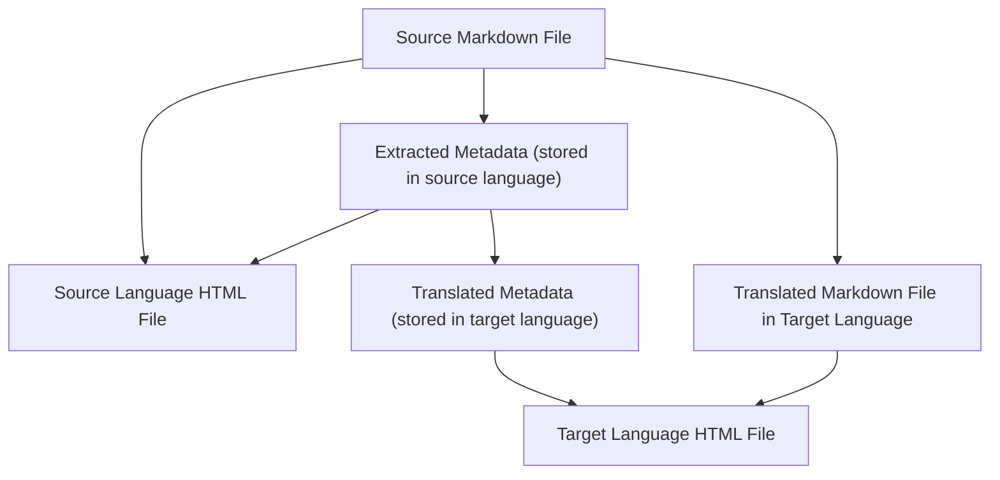

It is now 4:00 AM on Monday, January 26, 2026.

### CZON Directory Structure Refactoring

The effect of the adversarial generation translation [mentioned earlier](./27.md) is indeed good. However, a problem with CZON was discovered: it uses a Hash as the ID for source files. This caused an issue where modifying one article that was referenced 9 times triggered an avalanche of (1 + 9) * 3 = 30 translation tasks. Additionally, the token consumption for adversarial generation translation is approximately 10 times or more than that of regular translation. For long articles that undergo multiple rounds of modifications, token consumption can become very large, leading to high costs. Therefore, I rolled back the OpenCode translation integration again and switched back to using regular single-pass translation.

To solve this problem, I refactored the entire CZON generation directory. Starting from version 0.6.0, CZON will copy source files as-is to the generation directory, maintaining the same path. For example, `docs/guide/intro.md` will be written to `.czon/src/{lang}/docs/guide/intro.md`. This way, after modifying an article, only that article needs to be retranslated, avoiding the avalanche of regeneration. (However, users of previous versions of CZON will need to regenerate the entire `.czon/src` directory, requiring retranslation of all articles once.)

After breaking the chain of avalanche regeneration, the next step is to optimize the token consumption of adversarial generation translation. I found that the adversarial generation Agent sometimes excessively reads other files. For example, in a translation task from zh-Hans to es-ES, the translation Agent might read the content of en-US. This is clearly unnecessary token consumption. However, OpenCode currently cannot restrict file access permissions for Agents at the session level. A small trick is to copy the required files to a temporary directory and then allow the Agent to access only this temporary directory. I am still considering whether to do this. Can unnecessary file access be reduced through detailed prompts? Or is using a temporary directory a safer approach?

After modifying the CZON generation directory structure, the previously dominant SHA-256 Hash ID has almost become obsolete. The `czon://hash` protocol has also been deprecated. However, after the refactoring, link replacement has become more elegant. Before and after translation, these links do not need to be replaced at all. When rendering HTML, links can be replaced with the correct paths through hooks.

Now, this `.czon` directory structure design is more friendly for git and third-party SSG integration.

- Because each `.czon/src/{lang}` directory is a complete directory that can be rendered or previewed independently.
- Using paths instead of Hashes ensures that after modifying a source file, a new target file is not created; instead, the existing target file is overwritten, avoiding the generation of a large number of redundant files.

### Static Resource References

Static resource references can be made using regular links.

In CZON version 0.6.0, arbitrary resource files can also be referenced, such as images, PDFs, etc. These resource files will be copied to the corresponding locations in the generation directory. Not only images but also txt, pdf, docx, etc., can be referenced. CZON will automatically handle the copying of these resource files.

### Further Optimization

**Separating Metadata Translation Tasks**

Furthermore, YAML FrontMatter or Metadata should also be stored in `.czon/meta.json` instead of being enhanced into the beginning of the Markdown file in advance. In fact, the YAML FrontMatter itself may no longer be meaningful.

**Automatically Deleting Residual Files in `.czon/src`**

CZON currently does not delete redundant files in the `.czon/src/{lang}` directory. For example, after an article is deleted, `.czon/src/{lang}/path/to/deleted-article.md` still exists. In future versions, CZON will automatically detect these redundant files and delete them to keep the generation directory clean.

**Re-enabling Adversarial Generation Translation**

This is inevitable because one-shot translation simply cannot handle long articles. Using Agents is essential, but the issue of excessive token consumption needs to be resolved.