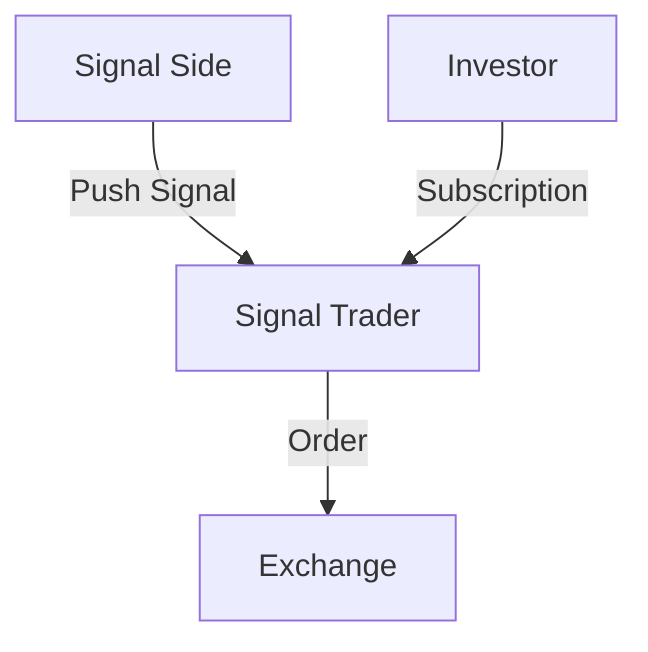

# Discussing the Design of the Endurance War Live Trading Module: Signal Trader

It is Thursday, March 12, 2026, morning.

Yesterday, I discussed the content of the Endurance War live trading module with C1. Summarized some recent practical results.

Last time, we defined its core module as the Signal Trader, meaning a signal-based trader. Its input is signals, and its output is orders. It actively accepts signals pushed from the signal side, performs multi-investor fund allocation, and outputs orders to the exchange.

## Push vs Pull

In software design, Push mode and Pull mode are two common data flow patterns.

**The Signal Trader adopts Push mode.** This means the signal side actively pushes signals to the Signal Trader. The advantage of this mode is that it enables real-time signal transmission, suitable for trading strategies requiring quick responses. Furthermore, Push mode can adapt to various signal sources, offering high flexibility. It naturally supports heterogeneous signal sources—whether they are candlestick strategy signals, high-frequency signals, AI Agent strategy signals, or even human discretionary signals—all can be transmitted via Push mode.

If Pull mode were used, the Signal Trader would need to periodically poll the signal side for the latest signals, which could increase latency, especially when signals update frequently. Additionally, the Signal Trader must be able to actively discover the signal side's service, and the signal side must expose an interface, increasing system complexity.

## Signal Ternary Values: Only Direction, No Intensity

In our design, signals have only direction, not intensity. This is to simplify the signal processing logic, allowing the Signal Trader to focus solely on the signal direction (Long 1, Short -1, Flat 0), without needing to consider signal intensity (e.g., how much to buy or sell). Signals cannot convey intensity information for adding or reducing positions. This also helps effectively avoid overfitting issues, as intensity information often leads models to overfit training data and perform poorly in actual trading. Limiting the model's expressive power can instead enhance its generalization capability.

According to the design principles of the Capital Endurance War, position management is not the responsibility of the signal.

## Stop-Loss Ratio is the Responsibility of the Signal Side

A trading signal also needs to be paired with a stop-loss ratio. Based on the Capital Endurance War strategy, this allows for **position sizing based on risk**, calculating the nominal value for this position opening and placing a stop-loss order. For example, if a signal changes from 0 to 1, indicating a long position, the signal side must also provide a stop-loss ratio, say 0.02, meaning the stop-loss price is 2% below the entry price. Based on this stop-loss ratio, the Signal Trader can calculate the nominal value for this position opening (opening a position with 50x leverage on the VC balance, such that a stop-loss event would exactly deplete the entire VC). It then places an order on the exchange while simultaneously setting the stop-loss order. A larger stop-loss ratio means the stop-loss price is farther from the entry price, representing higher risk and resulting in a smaller nominal value.

The update of the stop-loss ratio and the update of the signal itself are not synchronized. The stop-loss ratio updates less frequently. Stop-loss ratio updates are learned based on the historical performance of signals, while signal updates are generated based on current market conditions. Updating the stop-loss ratio requires accumulation of certain historical data, whereas signal updates do not. The stop-loss ratio update can even be manually set, but it cannot be modified during an open position. Modifying the stop-loss ratio only takes effect on the next position opening.

Initially, we placed the stop-loss learning process within the Signal Trader. This required designing a stop-loss learning module to learn the stop-loss ratio based on historical signal performance. Consequently, we needed to maintain a price monitor inside the Signal Trader to measure the intraday performance of signals. To address the cold-start problem for signals, we also needed to design a function to import historical signals, so that new signals going live wouldn't waste time learning the stop-loss ratio.

It can be observed that the price monitor and historical signal module must also exist on the signal side. So why not place the stop-loss ratio directly on the signal side? This could significantly simplify the design of the Signal Trader.

## Multi-Investor Fund Allocation

**Isolation Principle**: Multiple investors are isolated from each other; any decision by one investor does not affect the interests of other investors.

Based on isolation, we strive to meet the personalized needs of investors.

Multiple investors can independently subscribe to the same signal, specifying their own take-profit ratios and daily investment amounts. After subscription, the Signal Trader creates a subscription relationship for the investor, which internally contains an independent VC account. Whenever a signal triggers, the Signal Trader calculates the total VC amount based on the subscription relationships to get the total nominal value, then allocates order quantities and fees according to each investor's VC proportion.

An investor can create multiple subscription relationships for the same signal to meet different needs for take-profit ratios and daily investment amounts. An investor can also subscribe to multiple different signals simultaneously to meet portfolio needs.

The VC account within each subscription relationship automatically accumulates the investment amount at a specified rate. This can be Lazy Evaluated. The daily investment amount in a subscription relationship can be modified; modifying it does not clear the VC account balance.

Investors can cancel their subscription at any time. The Signal Trader will automatically cancel the subscription relationship and clear the VC account balance when the signal flattens or reverses. The action of an investor canceling a subscription does not affect currently open positions. This is because an investor's fund withdrawal might not align with the minimum lot size, causing floating-point errors that could affect other investors' interests. However, we can go a step further: when an investor wishes to withdraw funds immediately, the Signal Trader will close the current position according to the investor's VC proportion, but the closing quantity must be rounded down to the nearest integer multiple of the minimum trade size. This ensures no impact on other investors' interests. This may leave the investor with a tiny residual position, but this is unavoidable; otherwise, it would violate the Isolation Principle.

## Audit System

Every action on the signal side, exchange side, and investor side must be recorded by the audit system for subsequent analysis and review. The audit system needs to record each signal's trigger time, direction, stop-loss ratio, investor subscription relationships, order placement time, order fill status, and other information. The audit system also needs to provide query interfaces so we can query and analyze data based on different dimensions, such as by signal, by investor, or by time.