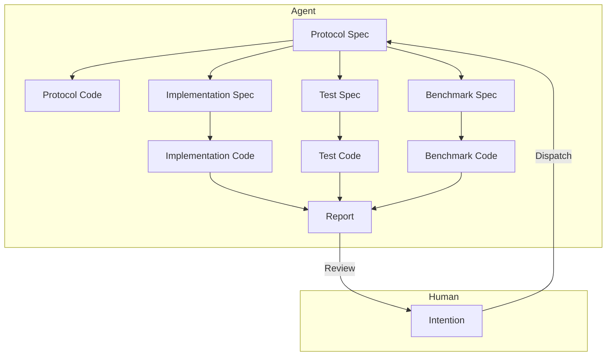

# Module-Level Human-AI Collaborative Software Engineering Architecture

## Problem Background

Design an LLM-based module-level human-AI collaborative engineering architecture aimed at efficiently completing the design, implementation, and iteration of industrial-grade application modules, reducing the cost of human intervention.

1. Existing AI Agents (Claude Code, CodeX) produce poor-quality code module implementations, still requiring significant human intervention, rework, and review.
2. Existing AI Agents struggle to define module boundaries during implementation, resulting in code with unnecessary complexity.
3. Existing AI Agents are too slow; a task from assignment to acceptance takes 10-30 minutes.

## Problem Insights

- According to [this article](czon://b283a1863e9af777d581f5af32c0d2d27ed22194f391f5bc3cef9d0d445b4e8c), human desire for control stems from rational concerns about losing control over outcomes. Establishing a controllable trust mechanism is the solution.
- According to [this article](czon://2b0a022c6abba013f5f8dcf8f24e4cd0662b3db73ff017c3bb8799d0541537ae), I believe the physical and economic mechanisms of LLMs make it difficult for them to complete all tasks in one go.

To liberate human productivity, the key is to eliminate human desire for control over details. Then, humans will adopt a "good enough" mindset and stop excessively demanding AI output.

So, what checks must pass for humans to judge that they are either incapable of intervening or that further measures are unnecessary?

1. The conceptual naming and taste of the module's external interfaces meet the requirements. This alleviates concerns about unreasonable interfaces propagating downstream in the system.
2. Unit tests pass. This alleviates concerns about whether the module functions correctly.
3. Benchmark tests show optimization or no degradation. This alleviates concerns about the module's efficiency.
   The first point can be identified early on, while the latter two are only known after experimentation. If all three are satisfied, humans have no reason to forcibly intervene in the AI's work.

As for whether the module can truly handle real data patterns, production environment data should be used for testing. Humans can then summarize the patterns and construct a new module through intention to address new problems. This issue is temporarily outside the scope of this article.

### Priority Goals

1. Reduce human intervention.
2. Reduce execution time and improve speed.
3. Reduce token usage and lower LLM costs.

### Design

1. **Rapid Intention Alignment**

   Humans quickly align the module's functional requirements with the Agent through intention description, outputting a Protocol Spec.

   The Protocol Spec includes the module's interface definitions, input/output data formats, functional descriptions, etc., similar to an RFC document. Humans need to focus on interface definitions and functional descriptions to ensure clear module boundaries, especially evaluating the taste of interface style.

   This process can involve multiple rounds of interaction. The Agent continuously revises the Protocol Spec based on human feedback until approved by the human.

   Next, a lengthy automated implementation process begins, during which human intervention is not required. Two outcomes are possible: 1. The module is successfully implemented, and a final report is generated for human review; 2. The module implementation fails, and an arbitration request is generated for human intervention.

2. **Generate Protocol Code from Protocol Spec**

   The Agent generates skeleton code (Protocol Code) for the module based on the Protocol Spec, including interface definitions and comments.
   The Protocol Code is used for subsequent implementation, testing, and benchmark code generation. Its main purpose is to ensure clear module boundaries and avoid unnecessary complexity during implementation.

3. **Generate Implementation Spec, Test Spec, and Benchmark Spec in Parallel from Protocol Spec**

   Different Agents are tasked to generate the Implementation Spec, Test Spec, and Benchmark Spec based on the Protocol Spec, describing the module's implementation details, test cases, and benchmark testing plan, respectively.

4. **Generate Test Code from Test Spec**

   A specialized testing Agent generates unit test code (Test Code) for the module based on the Protocol Spec and Test Spec, including various test cases and assertions. Interface-based testing methods must be used to avoid coupling with implementation details.

5. **Generate Benchmark Code from Benchmark Spec**

   A specialized benchmarking Agent generates benchmark test code (Benchmark Code) for the module based on the Protocol Spec and Benchmark Spec, including performance test cases and measurement metrics. Interface-based testing methods must be used to avoid coupling with implementation details.

6. **Generate Implementation Code from Implementation Spec**

   A specialized implementation Agent generates the module's implementation code (Implementation Code) based on the Protocol Spec, Implementation Spec, Test Spec, and Benchmark Spec. Once implementation is complete, unit tests are immediately run.

   If unit tests fail, analyze the cause.

   - If the issue is believed to be with the Implementation, modify the Implementation Spec and regenerate the Implementation Code. Repeat this process.
   - If the issue is believed to be with the Test, collect details of the test failure and integrate them into a counter-argument. This will then be handled by a higher-level arbitration Agent.

     - If the counter-argument is accepted, the arbitration Agent may choose to modify the Test Spec and rerun the tests. Repeat this process.
     - If the counter-argument is rejected, the arbitration Agent generates an explanatory opinion, requiring the implementation Agent to modify the Implementation Spec and restart the implementation process. Repeat this process.
     - **If the arbitration Agent cannot make a judgment, it will request human intervention for arbitration.**

   If unit tests pass, proceed to benchmark testing.

7. **Run Benchmark Tests**

   The Implementation Code that passes unit tests can proceed to benchmark testing.

   If no other comparable implementation version exists, mark the current implementation as the baseline version, run benchmark tests, record performance metrics, and pass the benchmark test.

   If other comparable implementation versions exist, run benchmark tests and record performance metrics. Generate a comparison report for the Agent to analyze the performance changes of the current implementation version.

   - If the current implementation version shows performance degradation, analyze the cause.

     - If the issue is believed to be with the Implementation, modify the Implementation Spec and regenerate the Implementation Code. Repeat this process.

     - If the issue is believed to be with the Benchmark, collect details of the benchmark test failure and integrate them into a counter-argument. This will then be handled by a higher-level arbitration Agent for judgment.

       - If the counter-argument is accepted, the arbitration Agent may choose to modify the Benchmark Spec and rerun the benchmark tests. Repeat this process. If the counter-argument is rejected, the arbitration Agent declares the task failed and generates a final report for human review.
       - If the counter-argument is rejected, the arbitration Agent returns the counter-argument to the implementation Agent, requiring it to modify the Implementation Spec and restart the implementation process. Repeat this process.
       - **If the arbitration Agent cannot make a judgment, it will request human intervention for arbitration.**

   - If the current implementation version shows no performance degradation, the benchmark test is passed.

8. **Generate Final Report**

   Once the Implementation Code passes both unit tests and benchmark tests, generate a final report containing implementation details, test results, and benchmark test results.
   The final report is submitted to the human for review. If the human approves the current implementation, the task is complete; otherwise, collect human feedback and integrate it into a counter-argument. This will then be handled by a higher-level arbitration Agent. If the counter-argument is accepted, the arbitration Agent may choose to modify the Protocol Spec and restart the entire implementation process. Repeat this process.

## Summary

1. The core of the architecture is layered collaboration, specialized division of labor, and separation of concerns.
2. A multi-level arbitration mechanism ensures implementation quality and reduces human intervention.
3. Clear acceptance criteria (passing unit tests, no performance degradation) establish a trust mechanism to eliminate human desire for control.

Some unresolved issues remain:

1. How to improve the quality of the Protocol Spec to ensure clear module boundaries? Add an automated review step.
2. How to avoid infinite arbitration loops? For example, set a maximum number of automatic arbitration attempts.
3. How to control actual execution time and token usage within reasonable limits? Measure first, then optimize.
4. How to ensure good taste in interface design? For example, incorporate a team style guide.

Some future prospects:

1. Why must the human role be filled by a human? It is essentially a Supervisor. In the future, could a more advanced AI replace humans in intention alignment and final review? This would further reduce human intervention and improve efficiency.
2. Can this approach be extended beyond module-level tasks to larger-scale system design and implementation? For example, full-stack development tasks involving frontend, backend, and databases? This would significantly enhance the application value of AI in software engineering.