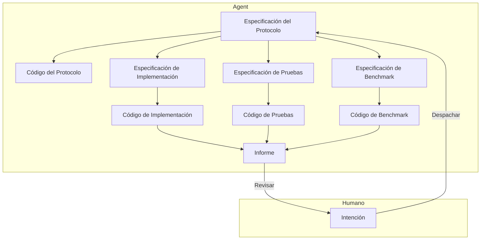

# Arquitectura de Ingeniería de Software con Colaboración Humano-Máquina a Nivel de Módulo

2026-01-05

## Contexto del Problema

Diseñar una arquitectura de ingeniería con colaboración humano-máquina a nivel de módulo utilizando un LLM, con el objetivo de completar de manera eficiente el diseño, implementación e iteración de módulos de aplicaciones de nivel industrial, reduciendo los costos de intervención humana.

1.  Los Agentes de IA existentes (Claude Code, CodeX) tienen una calidad de implementación de módulos de código muy pobre, aún requiriendo una alta intervención, reelaboración y revisión por parte de humanos.
2.  Los Agentes de IA existentes tienen dificultades para definir los límites de los módulos durante la implementación, lo que resulta en la escritura de código con mucha complejidad innecesaria.
3.  La implementación de los Agentes de IA existentes es demasiado lenta; una tarea tarda entre 10 y 30 minutos desde su emisión hasta su aceptación.

## Análisis del Problema

-   Según el punto de vista del [artículo](./2.md), el deseo de control humano surge de una preocupación racional por perder el control de las consecuencias. Establecer mecanismos de confianza controlables es la solución.
-   Según el punto de vista del [artículo](./3.md), creo que los mecanismos físicos y económicos subyacentes del LLM determinan que es difícil que complete todo el trabajo de una sola vez.

La clave para liberar la productividad humana radica en eliminar el deseo humano de controlar los detalles. Entonces, las personas, con una mentalidad de "si funciona, ya está bien", dejarán de exigir más del trabajo de la IA.

Entonces, ¿qué verificación debe pasar para que una persona juzgue que ya no tiene la capacidad de intervenir o que no es necesario tomar más medidas?

1.  **El gusto en la nomenclatura de los conceptos de la interfaz externa del módulo se ajusta a los requisitos.** Esto disipa la preocupación de que interfaces irrazonables se propaguen a las partes posteriores del sistema.
2.  **Pasa las pruebas unitarias.** Esto disipa la preocupación sobre si el módulo funcionará correctamente.
3.  **Hay optimización o no hay degradación en las pruebas de referencia (benchmark).** Esto disipa la preocupación sobre si el módulo será ineficiente.
    El primer punto se puede detectar en la fase inicial, mientras que los otros dos solo se conocen al final del experimento. Si se cumplen los tres, los humanos no tienen motivos para forzar la intervención en el trabajo completado por la IA.

En cuanto a si este módulo puede realmente manejar patrones de datos reales, se debe probar con datos del entorno de producción. Luego, una persona resume sus patrones y, a través de la intención, construye un nuevo módulo para resolver el nuevo problema. Este tema está fuera del alcance de este artículo por ahora.

### Objetivos Prioritarios

1.  Reducir la intervención humana.
2.  Reducir el tiempo de ejecución, mejorar la velocidad.
3.  Reducir el uso de Tokens, disminuir los costos del LLM.

### Diseño

1.  **Alineación Rápida de Intenciones**

    El humano, a través de una descripción de intención, se alinea rápidamente con el Agente sobre los requisitos funcionales del módulo, generando una Especificación del Protocolo (Protocol Spec).

    Esta Especificación del Protocolo incluye la definición de la interfaz del módulo, el formato de datos de entrada/salida, la descripción funcional, etc., básicamente similar a un documento RFC. El humano debe centrarse en la definición de la interfaz y la descripción funcional, asegurando que los límites del módulo sean claros, especialmente evaluando el "gusto" o estilo de la interfaz.

    Este proceso puede completarse a través de múltiples interacciones. El Agente modificará la Especificación del Protocolo según la retroalimentación humana hasta que sea aprobada.

    A continuación, habrá un largo proceso de implementación automatizada durante el cual el humano no necesita intervenir. Habrá dos resultados: 1. La implementación del módulo tiene éxito, se genera un informe final para la revisión humana; 2. La implementación del módulo falla, se genera una solicitud de arbitraje para la intervención humana.

2.  **Generar Código del Protocolo a partir de la Especificación del Protocolo**

    El Agente genera el código esqueleto del módulo (Protocol Code) basándose en la Especificación del Protocolo, incluyendo definiciones de interfaz y comentarios.
    El Protocol Code se utilizará para la generación posterior del código de implementación, pruebas y benchmark. Su objetivo principal es garantizar límites claros del módulo y evitar complejidad innecesaria durante la implementación.

3.  **Generar en Paralelo Especificaciones de Implementación, Pruebas y Benchmark a partir de la Especificación del Protocolo**

    Se solicita a diferentes Agentes especializados que generen, basándose en la Especificación del Protocolo, la Especificación de Implementación (Implementation Spec), la Especificación de Pruebas (Test Spec) y la Especificación de Benchmark (Benchmark Spec), describiendo respectivamente los detalles de implementación, los casos de prueba y el plan de pruebas de referencia del módulo.

4.  **Generar Código de Pruebas a partir de la Especificación de Pruebas**

    Se solicita a un Agente especializado en pruebas que genere el código de pruebas unitarias del módulo (Test Code) basándose en la Especificación del Protocolo y la Especificación de Pruebas, incluyendo varios casos de prueba y aserciones. Es crucial utilizar métodos de prueba basados en la interfaz para evitar acoplamiento con los detalles de implementación.

5.  **Generar Código de Benchmark a partir de la Especificación de Benchmark**

    Se solicita a un Agente especializado en benchmarks que genere el código de pruebas de referencia del módulo (Benchmark Code) basándose en la Especificación del Protocolo y la Especificación de Benchmark, incluyendo casos de prueba de rendimiento y métricas de medición. Es crucial utilizar métodos de prueba basados en la interfaz para evitar acoplamiento con los detalles de implementación.

6.  **Generar Código de Implementación a partir de la Especificación de Implementación**

    Se solicita a un Agente especializado en implementación que genere el código de implementación del módulo (Implementation Code) basándose en la Especificación del Protocolo, la Especificación de Implementación, la Especificación de Pruebas y la Especificación de Benchmark. Una vez completada la implementación, se ejecutan inmediatamente las pruebas unitarias.

    Si las pruebas unitarias no pasan, se analiza la causa del fallo.

    -   Si se considera que el problema está en la Implementación, se modifica la Especificación de Implementación y se regenera el Implementation Code. Se repite este proceso.
    -   Si se considera que el problema está en las Pruebas, se recopilan los detalles del fallo de la prueba y se integran en una objeción. Luego, se enviará a un Agente de Arbitraje de nivel superior para que la procese.
        -   Si la objeción es aceptada, el Agente de Arbitraje puede optar por modificar la Especificación de Pruebas y luego repetir el proceso de prueba. Se repite este proceso.
        -   Si la objeción es rechazada, el Agente de Arbitraje genera una explicación, solicitando al Agente de Implementación que modifique la Especificación de Implementación y luego repita el proceso de implementación. Se repite este proceso.
        -   **Si el Agente de Arbitraje considera que no puede juzgar, solicitará la intervención humana para arbitrar.**

    Si las pruebas unitarias pasan, se procede a las pruebas de benchmark.

7.  **Ejecutar Pruebas de Benchmark**

    El Implementation Code que ha pasado las pruebas unitarias puede ejecutar las pruebas de benchmark.

    Si no existe otra versión de implementación comparable actualmente, se marca la implementación actual como la versión de referencia, se ejecutan las pruebas de benchmark, se registran las métricas de rendimiento y, por lo tanto, se aprueban las pruebas de benchmark.

    Si existe otra versión de implementación comparable actualmente, se ejecutan las pruebas de benchmark y se registran las métricas de rendimiento. Se genera un informe comparativo que el Agente analiza para evaluar los cambios de rendimiento de la versión de implementación actual.

    -   Si el rendimiento de la versión de implementación actual se degrada, se analiza la causa.
        -   Si se considera que el problema está en la Implementación, se modifica la Especificación de Implementación y se regenera el Implementation Code. Se repite este proceso.
        -   Si se considera que el problema está en el Benchmark, se recopilan los detalles del fallo de la prueba de referencia y se integran en una objeción. Luego, se enviará a un Agente de Arbitraje de nivel superior para que juzgue.
            -   Si la objeción es aceptada, el Agente de Arbitraje puede optar por modificar la Especificación de Benchmark y luego repetir el proceso de pruebas de benchmark. Se repite este proceso. Si la objeción es rechazada, el Agente de Arbitraje declara que la tarea ha fallado y genera un informe final para la revisión humana.
            -   Si la objeción es rechazada, el Agente de Arbitraje devuelve la objeción al Agente de Implementación, solicitándole que modifique la Especificación de Implementación y luego repita el proceso de implementación. Se repite este proceso.
            -   **Si el Agente de Arbitraje considera que no puede juzgar, solicitará la intervención humana para arbitrar.**
    -   Si el rendimiento de la versión de implementación actual no se degrada, se aprueban las pruebas de benchmark.

8.  **Generar Informe Final**

    Una vez que el Implementation Code pasa tanto las pruebas unitarias como las de benchmark, se genera un informe final que incluye detalles de implementación, resultados de pruebas y resultados de benchmark.
    El informe final se entrega al humano para su revisión. Si el humano aprueba la implementación actual, la tarea se completa; de lo contrario, se recopila la retroalimentación humana y se integra en una objeción. Luego, se enviará a un Agente de Arbitraje de nivel superior para que la procese. Si la objeción es aceptada, el Agente de Arbitraje puede optar por modificar la Especificación del Protocolo y luego repetir todo el proceso de implementación. Se repite este proceso.

## Resumen

1.  El núcleo de la arquitectura es la colaboración en capas, la división especializada del trabajo y la separación de preocupaciones.
2.  A través de un mecanismo de arbitraje multinivel, se garantiza la calidad de la implementación y se reduce la intervención humana.
3.  Se definen criterios de aceptación claros (pruebas unitarias aprobadas, rendimiento no degradado), se establecen mecanismos de confianza para eliminar el deseo de control humano.

Aún quedan algunos problemas sin resolver:

1.  ¿Cómo mejorar la calidad de la Especificación del Protocolo para garantizar límites claros del módulo? Añadir un enlace de revisión automática.
2.  ¿Cómo evitar bucles infinitos de arbitraje? Por ejemplo, limitando el número máximo de arbitrajes automáticos.
3.  ¿Cómo controlar el tiempo de ejecución real y la cantidad de Tokens utilizados dentro de un rango razonable? Primero medir, luego optimizar.
4.  ¿Cómo garantizar el "gusto" en el diseño de interfaces? Por ejemplo, incorporando una guía de estilo del equipo.

Algunas perspectivas:

1.  ¿Por qué la posición del humano tiene que ser un humano? En realidad, es un Supervisor. En el futuro, ¿se podría utilizar una IA de nivel superior para reemplazar al humano en la alineación de intenciones y la revisión final? Esto reduciría aún más la intervención humana y aumentaría la eficiencia.
2.  Si no es una tarea a nivel de módulo, ¿se podría extender a un diseño e implementación de sistemas a mayor escala? Por ejemplo, ¿una tarea de desarrollo full-stack que incluya frontend, backend y base de datos? Esto aumentaría enormemente el valor de aplicación de la IA en el campo de la ingeniería de software.