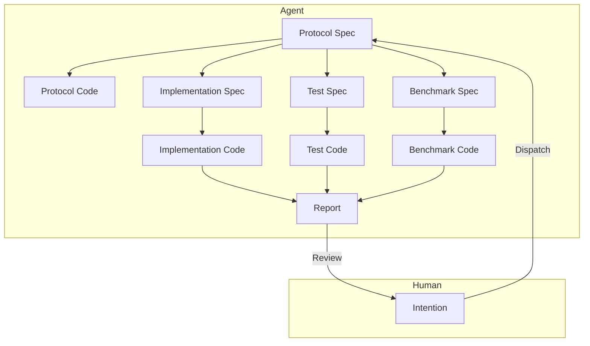

# Arquitectura de Ingeniería de Software para Colaboración Humano-Máquina a Nivel de Módulo

2026-01-05

## Contexto del Problema

Diseñar una arquitectura de ingeniería para colaboración humano-máquina a nivel de módulo utilizando un LLM, con el objetivo de completar de manera eficiente el diseño, implementación e iteración de módulos de aplicaciones de nivel industrial, reduciendo el costo de intervención humana.

1.  Los Agentes de IA existentes (Claude Code, CodeX) tienen una calidad de implementación de módulos de código muy pobre, aún requiriendo una intervención, re-trabajo y revisión humana significativa.
2.  A los Agentes de IA existentes les resulta difícil definir los límites del módulo durante la implementación, lo que lleva a escribir código con complejidad innecesaria.
3.  La implementación por parte de los Agentes de IA existentes es demasiado lenta; una tarea tarda entre 10 y 30 minutos desde su emisión hasta su aceptación.

## Perspectiva del Problema

- Según el punto de vista de [este artículo](./2.md), el deseo de control humano surge de una preocupación racional por la pérdida de control sobre las consecuencias; establecer un mecanismo de confianza controlable es la solución.
- Según el punto de vista de [este artículo](./3.md), creo que los mecanismos físicos y económicos subyacentes del LLM determinan que es difícil que complete todo el trabajo de una sola vez.

La clave para liberar la productividad humana radica en eliminar el deseo humano de controlar los detalles; entonces, las personas, con una mentalidad de "si funciona, sirve", dejarán de exigir más del trabajo de la IA.

Entonces, ¿qué verificaciones deben pasar para que una persona juzgue que ya no tiene la capacidad de intervenir o que no es necesario tomar más medidas?

1.  El gusto en la nomenclatura de los conceptos de la interfaz externa del módulo se ajusta a los requisitos. Esto elimina la preocupación de que interfaces irrazonables se propaguen aguas abajo en el sistema.
2.  Aprobación de las pruebas unitarias. Esto elimina la preocupación sobre si el módulo funcionará correctamente.
3.  Optimización o no degradación en las pruebas de referencia. Esto elimina la preocupación sobre si el módulo es ineficiente.
    El primer punto se puede detectar en la fase inicial, mientras que los otros dos solo se conocen al final del experimento. Si se cumplen los tres, los humanos no tienen motivos para intervenir forzosamente en el trabajo completado por la IA.

En cuanto a si este módulo puede realmente manejar patrones de datos reales, se deben utilizar datos del entorno de producción para probarlo. Luego, una persona resume sus patrones y, a través de la intención, construye un nuevo módulo para resolver el nuevo problema. Este tema está fuera del alcance de este artículo por ahora.

### Objetivos Prioritarios

1.  Reducir la intervención humana.
2.  Reducir el tiempo de ejecución, aumentar la velocidad.
3.  Reducir el uso de Tokens, disminuir el costo del LLM.

### Diseño

1.  Alineación Rápida de Intenciones

    El humano, a través de una descripción de intención, se alinea rápidamente con el Agente sobre los requisitos funcionales del módulo, generando una Especificación de Protocolo (Protocol Spec).

    Esta Especificación de Protocolo incluye la definición de la interfaz del módulo, el formato de datos de entrada/salida, la descripción funcional, etc., básicamente similar a un documento RFC. El humano debe centrarse en la definición de la interfaz y la descripción funcional, asegurando que los límites del módulo sean claros, especialmente evaluando el gusto en el estilo de la interfaz.

    Este proceso puede completarse mediante múltiples interacciones; el Agente modificará continuamente la Especificación de Protocolo según la retroalimentación humana hasta que sea aprobada por el humano.

    A continuación, habrá un largo proceso de implementación automatizada durante el cual el humano no necesita intervenir. Habrá dos resultados: 1. La implementación del módulo tiene éxito, generando un informe final para la revisión humana; 2. La implementación del módulo falla, generando una solicitud de arbitraje para la intervención humana.

2.  Generación de Código de Protocolo a partir de la Especificación de Protocolo

    El Agente genera el código esqueleto del módulo, el Código de Protocolo (Protocol Code), basándose en la Especificación de Protocolo, incluyendo definiciones de interfaz y comentarios.
    El Código de Protocolo se utilizará para la generación posterior del código de implementación, pruebas y referencia. Su objetivo principal es asegurar límites claros del módulo, evitando complejidad innecesaria durante la implementación.

3.  Generación en Paralelo de Especificaciones de Implementación, Pruebas y Referencia a partir de la Especificación de Protocolo

    Se solicita a diferentes Agentes especializados que generen, basándose en la Especificación de Protocolo, la Especificación de Implementación (Implementation Spec), la Especificación de Pruebas (Test Spec) y la Especificación de Referencia (Benchmark Spec), describiendo respectivamente los detalles de implementación, los casos de prueba y el plan de pruebas de referencia del módulo.

4.  Generación de Código de Pruebas a partir de la Especificación de Pruebas

    Se solicita a un Agente de pruebas especializado que genere el código de pruebas unitarias del módulo, el Código de Pruebas (Test Code), basándose en la Especificación de Protocolo y la Especificación de Pruebas, incluyendo varios casos de prueba y aserciones. Es crucial utilizar métodos de prueba basados en la interfaz para evitar acoplamiento con detalles de implementación.

5.  Generación de Código de Referencia a partir de la Especificación de Referencia

    Se solicita a un Agente especializado en pruebas de referencia que genere el código de pruebas de referencia del módulo, el Código de Referencia (Benchmark Code), basándose en la Especificación de Protocolo y la Especificación de Referencia, incluyendo casos de prueba de rendimiento y métricas de medición. Es crucial utilizar métodos de prueba basados en la interfaz para evitar acoplamiento con detalles de implementación.

6.  Generación de Código de Implementación a partir de la Especificación de Implementación

    Se solicita a un Agente de implementación especializado que genere el código de implementación del módulo, el Código de Implementación (Implementation Code), basándose en la Especificación de Protocolo, la Especificación de Implementación, la Especificación de Pruebas y la Especificación de Referencia. Una vez completada la implementación, se ejecutan inmediatamente las pruebas unitarias.

    Si las pruebas unitarias no se aprueban, se analiza la causa del fallo.

   - Si se considera que el problema está en la Implementación, se modifica la Especificación de Implementación y se regenera el Código de Implementación. Se repite este proceso.
   - Si se considera que el problema está en las Pruebas, se recopilan los detalles del fallo de la prueba y se integran en una objeción. Luego, se enviará a un Agente de Arbitraje de nivel superior para que lo procese.

     - Si la objeción es aceptada, el Agente de Arbitraje puede optar por modificar la Especificación de Pruebas y luego repetir el proceso de prueba. Se repite este proceso.
     - Si la objeción es rechazada, el Agente de Arbitraje genera una explicación, solicitando al Agente de Implementación que modifique la Especificación de Implementación y luego repita el proceso de implementación. Se repite este proceso.
     - **Si el Agente de Arbitraje considera que no puede juzgar, solicitará la intervención humana para el arbitraje.**

    Si las pruebas unitarias se aprueban, se procede a las pruebas de referencia.

7.  Ejecución de Pruebas de Referencia

    El Código de Implementación que ha aprobado las pruebas unitarias puede ejecutar las pruebas de referencia.

    Si no existe otra versión de implementación comparable actualmente, se marca la implementación actual como la versión de referencia, se ejecutan las pruebas de referencia, se registran las métricas de rendimiento y, por lo tanto, se aprueban las pruebas de referencia.

    Si existe otra versión de implementación comparable actualmente, se ejecutan las pruebas de referencia y se registran las métricas de rendimiento. Se genera un informe comparativo que el Agente analiza para evaluar los cambios de rendimiento de la versión de implementación actual.

   - Si el rendimiento de la versión de implementación actual se degrada, se analiza la causa.

     - Si se considera que el problema está en la Implementación, se modifica la Especificación de Implementación y se regenera el Código de Implementación. Se repite este proceso.

     - Si se considera que el problema está en la Referencia, se recopilan los detalles del fallo en la prueba de referencia y se integran en una objeción. Luego, se enviará a un Agente de Arbitraje de nivel superior para que juzgue.

       - Si la objeción es aceptada, el Agente de Arbitraje puede optar por modificar la Especificación de Referencia y luego repetir el proceso de pruebas de referencia. Se repite este proceso. Si la objeción es rechazada, el Agente de Arbitraje declara que la tarea ha fallado y genera un informe final para la revisión humana.
       - Si la objeción es rechazada, el Agente de Arbitraje devuelve la objeción al Agente de Implementación, solicitando que modifique la Especificación de Implementación y luego repita el proceso de implementación. Se repite este proceso.
       - **Si el Agente de Arbitraje considera que no puede juzgar, solicitará la intervención humana para el arbitraje.**

   - Si el rendimiento de la versión de implementación actual no se degrada, se aprueban las pruebas de referencia.

8.  Generación del Informe Final

    Una vez que el Código de Implementación aprueba las pruebas unitarias y las pruebas de referencia, se genera un informe final que incluye detalles de implementación, resultados de pruebas y resultados de pruebas de referencia.
    El informe final se entrega al humano para su revisión. Si el humano aprueba la implementación actual, la tarea se completa; de lo contrario, se recopila la retroalimentación humana y se integra en una objeción. Luego, se enviará a un Agente de Arbitraje de nivel superior para que lo procese. Si la objeción es aceptada, el Agente de Arbitraje puede optar por modificar la Especificación de Protocolo y luego repetir todo el proceso de implementación. Se repite este proceso.

## Resumen

1.  El núcleo de la arquitectura es la colaboración en capas, la división especializada del trabajo y la separación de preocupaciones.
2.  A través de un mecanismo de arbitraje multinivel, se asegura la calidad de la implementación y se reduce la intervención humana.
3.  Se establecen criterios de aceptación claros (pruebas unitarias aprobadas, rendimiento no degradado) para crear un mecanismo de confianza y eliminar el deseo de control humano.

Aún quedan algunos problemas sin resolver:

1.  ¿Cómo mejorar la calidad de la Especificación de Protocolo para asegurar límites claros del módulo? Añadir una fase de revisión automática.
2.  ¿Cómo evitar ciclos infinitos de arbitraje? Por ejemplo, limitando el número máximo de arbitrajes automáticos.
3.  ¿Cómo controlar el tiempo de ejecución real y la cantidad de Tokens utilizados dentro de un rango razonable? Primero medir, luego optimizar.
4.  ¿Cómo garantizar el gusto en el diseño de interfaces? Por ejemplo, incorporando una guía de estilo del equipo.

Algunas perspectivas:

1.  ¿Por qué la posición del humano tiene que ser humana? En realidad es un Supervisor. ¿Podría usarse en el futuro una IA de nivel superior para reemplazar al humano en la alineación de intenciones y la revisión final? Esto reduciría aún más la intervención humana y aumentaría la eficiencia.
2.  Si no es una tarea a nivel de módulo, ¿se podría extender a un diseño e implementación de sistemas a mayor escala? Por ejemplo, ¿tareas de desarrollo full-stack que incluyan frontend, backend y base de datos? Esto aumentaría enormemente el valor de la aplicación de la IA en el campo de la ingeniería de software.