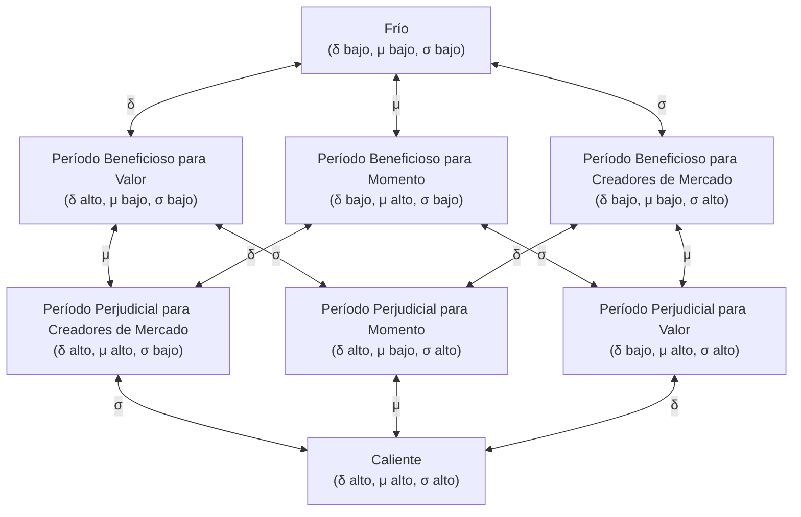

# Hipótesis de la Dinámica de Tres Cuerpos en los Mercados de Capitales

2026-02-07

**¿Por qué el comportamiento del mercado es a la vez regular e impredecible?**

- ¿Por qué el mercado siempre ofrece oportunidades pero es incierto?
- ¿Por qué el mercado siempre repite patrones pero nunca se replica exactamente?
- ¿Por qué el mercado es predecible a veces y otras no?
- ¿Por qué los mercados de capitales presentan agrupación de volatilidad, colapsos y recuperaciones?
- ¿Por qué ocurren fenómenos de cambio abrupto en el mercado?
- ¿Por qué existe el patrón de desplome tras un repunte brusco?
- ¿Por qué existe el riesgo de que el mercado vaya a cero?
- ¿Por qué las propiedades estadísticas del mercado (como las colas pesadas en la distribución de rendimientos, la agrupación de volatilidad, etc.) son robustas?

## Idea Central

Supongamos que el mercado de capitales es un **sistema de tres cuerpos**, compuesto por tres tipos de capital fundamentalmente diferentes. Su interacción genera comportamientos dinámicos complejos, incluyendo fenómenos emergentes como la agrupación de volatilidad, ciclos de colapso y recuperación del mercado.

Similar al problema de los tres cuerpos en mecánica celeste, este sistema **puede no tener una solución de estado estacionario**, sino que exhibe comportamientos de ciclo límite, cuasiperiódicos o caóticos.

## Definición de los Tres Cuerpos

La diferencia esencial entre los participantes del mercado no radica en su identidad (minoristas, instituciones, creadores de mercado), sino en la **naturaleza de su retroalimentación ante los cambios de precio**.

### Capital de Momento M (Momentum Capital)

**Definición**: Capital de negociación que genera retroalimentación positiva ante cambios de precio.

$$\frac{d(\text{Posición})}{dS} > 0$$

**Características de comportamiento**:

- Compra en subidas, vende en bajadas (comprar al alza, vender a la baja)
- Utiliza apalancamiento para amplificar ganancias/pérdidas
- Tiende a mantener posiciones a corto plazo
- Negociación por momento, seguimiento de tendencias

**Impacto en el sistema**:

- Amplifica las fluctuaciones de precios
- Fuerza desestabilizadora
- Genera tendencias y colapsos

**Representantes típicos**: Especuladores, operadores de tendencia, operadores con alto apalancamiento, tenedores con stop-loss pasivo

### Capital de Valor V (Value Capital)

**Definición**: Capital de negociación que genera retroalimentación negativa ante cambios de precio.

$$\frac{d(\text{Posición})}{dS} < 0$$

Es decir: Reduce la posición cuando los precios suben, aumenta la posición cuando los precios bajan.

Normalmente existe un valor intrínseco $S^*$ que sirve de ancla:

- Cuando $S < S^*$, tiende a comprar
- Cuando $S > S^*$, tiende a vender

**Características de comportamiento**:

- Comprar bajo, vender alto (operación contraria)
- Negocia basándose en juicios de valor
- Tiende a mantener posiciones a largo plazo
- Reversión a la media, inversión en valor

**Impacto en el sistema**:

- Suprime las fluctuaciones de precios
- Fuerza estabilizadora (activa)
- Proporciona soporte y resistencia al mercado

**Representantes típicos**: Inversores en valor, inversores contrarios, arbitrajistas

### Capital de Liquidez L (Liquidity Capital)

**Definición**: Capital de liquidez que no reacciona direccionalmente a los cambios de precio.

$$\frac{d(\text{Posición})}{dS} \approx 0$$

**Características de comportamiento**:

- Ofrece cotizaciones bidireccionales, gana con el diferencial
- No mantiene exposición direccional (o la cubre rápidamente)
- Proporciona liquidez de compra/venta continuamente
- Capacidad limitada de asumir riesgo

**Impacto en el sistema**:

- Reduce los costes de transacción
- Fuerza estabilizadora (pasiva)
- Amortigua los impactos en los precios

**Representantes típicos**: Creadores de mercado, proveedores de liquidez, operadores de alta frecuencia (tipo creador de mercado)

## Interacción de los Tres Cuerpos

### Matriz de Interacciones

| Actor → Afectado | Capital de Momento M | Capital de Valor V | Capital de Liquidez L |
| ---------------- | -------------------- | ------------------ | --------------------- |
| **Capital de Momento M** | —                    | Crea oportunidades de negociación | Consume liquidez      |
| **Capital de Valor V**   | Inhibe comportamientos extremos | —                  | Restaura confianza    |
| **Capital de Liquidez L** | Limita el efecto del impacto | Facilita la negociación | —                     |

### Mecanismos Detallados

**M → L: Consume liquidez**

El comportamiento de comprar al alza/vender a la baja del capital de momento genera un gran flujo de órdenes unidireccional, agotando el inventario de los creadores de mercado y obligándoles a asumir una mayor exposición al riesgo. Cuando la volatilidad es demasiado alta, los creadores de mercado optan por retirarse.

**L → M: Limita el efecto del impacto**

Una liquidez adecuada amortigua el impacto del capital de momento en los precios. En mercados profundos, incluso las operaciones con alto apalancamiento tienen dificultad para mover los precios. La liquidez es el "amortiguador".

**M → V: Crea oportunidades de negociación**

El comportamiento de comprar al alza/vender a la baja del capital de momento aleja los precios del valor intrínseco, creando oportunidades para el capital de valor:

- Venta por pánico → precio por debajo del valor intrínseco → oportunidad de **compra** para V
- Compra por euforia → precio por encima del valor intrínseco → oportunidad de **venta** para V

Esta es una **transferencia de oportunidad** del capital de momento al capital de valor.

**V → M: Inhibe comportamientos extremos**

La operación contraria del capital de valor proporciona soporte a los precios, reduce la probabilidad de una caída unilateral y disminuye el rendimiento esperado de la estrategia de comprar al alza/vender a la baja. El capital de momento racional reducirá su escala en consecuencia.

**V → L: Restaura confianza**

La intervención del capital de valor envía una señal de que "el mercado tiene un suelo", reduce la preocupación de los creadores de mercado por pérdidas extremas y atrae el regreso de la liquidez. El capital de valor es el "seguro" del creador de mercado.

**L → V: Facilita la negociación**

Una liquidez adecuada permite al capital de valor establecer posiciones a bajo coste, las órdenes de gran tamaño no generan un deslizamiento excesivo, mejorando la eficiencia del capital de valor.

## Bucles de Retroalimentación

### Bucle de Retroalimentación Positiva (Inestable)

$$M \uparrow \to \sigma \uparrow \to L \downarrow \to \text{impacto en precios} \uparrow \to \sigma \uparrow \to M \uparrow \text{ (o liquidación forzosa)}$$

Aumento del capital de momento → aumento de la volatilidad → retirada de liquidez → intensificación del impacto en precios → mayor aumento de la volatilidad → continuo aumento del capital de momento o su liquidación forzosa

Este es el mecanismo de la **espiral de colapso**.

### Bucle de Retroalimentación Negativa (Estable)

$$|S - S^*| \uparrow \to \sigma \uparrow \to V \uparrow \to |S - S^*| \downarrow \to \sigma \downarrow \to L \uparrow$$

Desviación del precio respecto al valor intrínseco → aumento de la volatilidad → intervención del capital de valor → regresión del precio → disminución de la volatilidad → recuperación de la liquidez

Ruta específica:

- **Tras una fuerte caída**: $S < S^*$ → V compra → recuperación del precio
- **Tras un fuerte repunte**: $S > S^*$ → V vende → corrección del precio

Este es el **mecanismo de recuperación**.

## Transiciones de Fase del Sistema

El estado del sistema depende de **qué bucle domina**:

- **Retroalimentación positiva > negativa**: El sistema tiende al colapso
- **Retroalimentación negativa > positiva**: El sistema tiende a la estabilidad
- **Punto crítico**: El sistema está en el límite de transición de fase

La transición de fase es un **resultado emergente** del sistema, no un umbral predefinido. El sistema genera espontáneamente transiciones de fase en la competencia entre retroalimentación positiva y negativa.

Describir el estado del mercado requiere tres variables centrales:

| Variable     | Símbolo | Significado                                                                 |
| ------------ | ------- | --------------------------------------------------------------------------- |
| **Prima**    | $\delta$ | Prima del precio respecto al valor intrínseco: $\delta = \frac{S - S^*}{S^*}$ |
| **Momento**  | $\mu$   | Tasa de cambio del precio: $\mu = \frac{dS}{dt}$                            |
| **Volatilidad** | $\sigma$ | Amplitud de las fluctuaciones del precio                                    |

### Matriz Rendimiento-Riesgo-Coste

Existe una relación **simétrica central** entre los tres tipos de capital M, V, L y las tres variables de mercado δ, μ, σ:

|                     | $\delta$ (Prima) | $\mu$ (Momento) | $\sigma$ (Volatilidad) |
| ------------------- | :--------------: | :-------------: | :--------------------: |
| **M (Capital de Momento)** |       Riesgo      |   **Rendimiento**   |         Coste          |
| **V (Capital de Valor)**   |    **Rendimiento**    |      Coste      |         Riesgo         |
| **L (Capital de Liquidez)** |       Coste      |      Riesgo     |      **Rendimiento**       |

Donde:

- **Rendimiento**: Cuando esta variable aumenta, este capital obtiene ganancias directas.
- **Riesgo**: Cuando esta variable aumenta, este capital puede sufrir pérdidas.
- **Coste**: Cuando esta variable aumenta, la eficiencia operativa de este capital disminuye.

#### Simetría

Esta matriz tiene una estructura **simétrica central** perfecta:

- **Cada fila**: un rendimiento, un riesgo, un coste.
- **Cada columna**: un rendimiento, un riesgo, un coste.
- **Diagonal**: M-μ, V-δ, L-σ corresponden cada una a su fuente central de rendimiento.

#### Equilibrio de Tres Cuerpos

Desde la perspectiva de las columnas, el cambio en cada variable de mercado genera ganadores, perdedores y consumidores:

| Variable aumenta | Ganador | Perdedor | Consumidor |
| ---------------- | ------- | -------- | ---------- |
| $\delta$ ↑       | V       | M        | L          |
| $\mu$ ↑          | M       | L        | V          |
| $\sigma$ ↑       | L       | V        | M          |

Ninguna variable es beneficiosa o perjudicial para todos los capitales, lo que refleja el **equilibrio de tres cuerpos**.

#### Argumentación Detallada

**Relación de M con las tres variables**:

- $\mu$ (Rendimiento): La continuación de la tendencia = ganancias para M. Esta es la fuente central de rendimiento de M.
- $\delta$ (Riesgo): Una prima excesiva presagia una reversión, M enfrenta pérdidas.
- $\sigma$ (Coste): Alta volatilidad hace que los stop-loss se activen más fácilmente, aumentando los costes de transacción.

**Relación de V con las tres variables**:

- $\delta$ (Rendimiento): Prima grande = oportunidad para V. Esta es la fuente central de rendimiento de V.
- $\sigma$ (Riesgo): Alta volatilidad significa que V puede enfrentar mayores pérdidas flotantes después de establecer posiciones, incluso si finalmente hay regresión, debe soportar el proceso; alta volatilidad también significa que el valor intrínseco $S^*$ mismo puede estar cambiando, el ancla de V es inestable.
- $\mu$ (Coste): Cuando la tendencia continúa, V necesita esperar más tiempo, disminuyendo la eficiencia del capital.

**Relación de L con las tres variables**:

- $\sigma$ (Rendimiento): Alta volatilidad = más oportunidades de transacción, mayores ganancias para el creador de mercado. Esta es la fuente central de rendimiento de L.
- $\mu$ (Riesgo): Cuando la tendencia es fuerte, el inventario de L se acumula continuamente en una dirección, enfrentando pérdidas direccionales.
- $\delta$ (Coste): Cuando la prima es grande, L necesita un diferencial mayor para protegerse, disminuyendo la eficiencia del creador de mercado.

### Estados de Fase del Mercado

Basado en los estados alto/bajo de las tres variables δ, μ, σ, el mercado tiene $2^3 = 8$ estados de fase típicos.

| Código | $\delta$ | $\mu$ | $\sigma$ | Nombre | Característica Central |
| :----: | :------: | :---: | :------: | :----: | ---------------------- |
| 000    |   Bajo   | Bajo  |   Bajo   | **Frío** | Mercado inactivo, ninguno de los tres obtiene beneficios |
| 001    |   Bajo   | Bajo  |   Alto   | **Período Beneficioso para Creadores de Mercado** | Precios razonables, alta volatilidad sin tendencia, L domina |
| 010    |   Bajo   | Alto  |   Bajo   | **Período Beneficioso para Momento** | Tendencia incipiente, prima aún pequeña, M comienza a obtener ganancias |
| 011    |   Bajo   | Alto  |   Alto   | **Período Perjudicial para Valor** | M domina, alta volatilidad y alta tendencia |
| 100    |   Alto   | Bajo  |   Bajo   | **Período Beneficioso para Valor** | Prima grande pero mercado inactivo, V espera un catalizador |
| 101    |   Alto   | Bajo  |   Alto   | **Período Perjudicial para Momento** | V y L compiten, dirección incierta |
| 110    |   Alto   | Alto  |   Bajo   | **Período Perjudicial para Creadores de Mercado** | Tendencia clara, M gana, V bajo presión |
| 111    |   Alto   | Alto  |   Alto   | **Caliente** | Estado triple alto, sistema en punto crítico |

Regla de nomenclatura:
- **Solo uno alto**: Parte beneficiaria correspondiente a esa variable + "Período Beneficioso"
- **Solo uno bajo**: Parte beneficiaria correspondiente a esa variable + "Período Perjudicial"
- **Todos bajos/altos**: Frío/Caliente

Cuatro pares duales, los códigos son complemento bit a bit, la nomenclatura es perfectamente simétrica:
- Frío (000) ↔ Caliente (111)
- Período Beneficioso para Valor (100) ↔ Período Perjudicial para Valor (011)
- Período Beneficioso para Momento (010) ↔ Período Perjudicial para Momento (101)
- Período Beneficioso para Creadores de Mercado (001) ↔ Período Perjudicial para Creadores de Mercado (110)

### Análisis Detallado de los Estados de Fase

#### Frío (000): δ bajo, μ bajo, σ bajo

| Capital | Estado                               |
| ------- | ------------------------------------ |
| M       | Fuente de rendimiento μ baja → sin beneficios |
| V       | Fuente de rendimiento δ baja → sin oportunidades |
| L       | Fuente de rendimiento σ baja → sin beneficios |

**Característica**: Ninguno de los tres obtiene beneficios, el mercado se contrae, volumen bajo.

**Escenario típico**: Acciones poco negociadas, al borde de la exclusión, período de desesperación al final de un mercado bajista.

#### Período Beneficioso para Creadores de Mercado (001): δ bajo, μ bajo, σ alto

| Capital | Estado                                                               |
| ------- | -------------------------------------------------------------------- |
| M       | Fuente de rendimiento μ baja → sin tendencia que seguir; fuente de coste σ alta → stop-loss frecuentes |
| V       | Fuente de rendimiento δ baja → sin oportunidades; fuente de riesgo σ alta → entorno hostil |
| L       | Fuente de rendimiento σ alta → **ganancias sustanciales**; fuente de riesgo μ baja → riesgo controlable |

**Característica**: Época dorada para L, precios fluctúan en un rango razonable con alta frecuencia.

**Escenario típico**: Período de consolidación en mercados maduros, mercados dominados por operaciones de alta frecuencia.

#### Período Beneficioso para Momento (010): δ bajo, μ alto, σ bajo

| Capital | Estado                                                           |
| ------- | ---------------------------------------------------------------- |
| M       | Fuente de rendimiento μ alta → **ganancias**; fuente de coste σ baja → costes controlables |
| V       | Fuente de coste μ alta → eficiencia disminuida; fuente de riesgo σ baja → riesgo controlable |
| L       | Fuente de riesgo μ alta → **perjudicado**; fuente de rendimiento σ baja → rendimiento limitado |

**Característica**: M gana, L pierde, V observa; δ aumentará gradualmente.

**Escenario típico**: Inicio de una tendencia, comienzo de un mercado alcista/bajista lento.

#### Período Perjudicial para Valor (011): δ bajo, μ alto, σ alto

| Capital | Estado                                                                       |
| ------- | ---------------------------------------------------------------------------- |
| M       | Fuente de rendimiento μ alta → **ganancias sustanciales**; fuente de coste σ alta → costes aumentan pero son soportables |
| V       | Fuente de rendimiento δ baja → sin oportunidades; fuente de riesgo σ alta + fuente de coste μ alta → entorno hostil |
| L       | Fuente de rendimiento σ alta → hay rendimiento; fuente de riesgo μ alta → **riesgo elevado** |

**Característica**: M domina el mercado, alta volatilidad y alta tendencia, δ aumentará rápidamente.

**Escenario típico**: Criptomonedas MEME en etapa temprana, inicio de especulación temática, ruptura de rangos.

#### Período Beneficioso para Valor (100): δ alto, μ bajo, σ bajo

| Capital | Estado                                                               |
| ------- | -------------------------------------------------------------------- |
| M       | Fuente de rendimiento μ baja → sin beneficios; fuente de riesgo δ alta → riesgo potencial de reversión |
| V       | Fuente de rendimiento δ alta → **hay oportunidad**; fuente de coste μ baja → coste de espera alto |
| L       | Fuente de coste δ alta → eficiencia disminuida; fuente de rendimiento σ baja → rendimiento limitado |

**Característica**: V ve oportunidades pero el mercado no se mueve, espera un catalizador.

**Escenario típico**: Acciones infravaloradas pero ignoradas, objetivos de inversión de valor profundo.

#### Período Perjudicial para Momento (101): δ alto, μ bajo, σ alto

| Capital | Estado                                                                         |
| ------- | ------------------------------------------------------------------------------ |
| M       | Fuente de rendimiento μ baja → sin tendencia; fuente de riesgo δ alta → riesgo alto; fuente de coste σ alta → costes altos |
| V       | Fuente de rendimiento δ alta → **oportunidad grande**; fuente de riesgo σ alta → **riesgo también grande** |
| L       | Fuente de rendimiento σ alta → **hay rendimiento**; fuente de coste δ alta → eficiencia disminuida |

**Característica**: Campo de batalla entre V y L, alta volatilidad pero sin dirección clara.

**Escenario típico**: Alrededor de resultados trimestrales, período de incertidumbre por eventos importantes, enfrentamiento alcista/bajista.

#### Período Perjudicial para Creadores de Mercado (110): δ alto, μ alto, σ bajo

| Capital | Estado                                                             |
| ------- | ------------------------------------------------------------------ |
| M       | Fuente de rendimiento μ alta → **ganancias**; fuente de riesgo δ alta → riesgo acumulado |
| V       | Fuente de rendimiento δ alta → oportunidad grande; fuente de coste μ alta → **bajo presión continua** |
| L       | Fuente de riesgo μ alta → **perjudicado**; fuente de coste δ alta → eficiencia baja |

**Característica**: Tendencia clara pero poca volatilidad, M gana consistentemente, V espera con dolor.

**Escenario típico**: Mitad de un mercado alcista/bajista unilateral, onda principal de subida/bajada después de establecida la tendencia.

#### Caliente (111): δ alto, μ alto, σ alto

| Capital | Estado                                                                                   |
| ------- | ---------------------------------------------------------------------------------------- |
| M       | Fuente de rendimiento μ alta → rendimiento alto; fuente de riesgo δ alta → **riesgo extremo**; fuente de coste σ alta → costes altos |
| V       | Fuente de rendimiento δ alta → oportunidad grande; fuente de riesgo σ alta → **riesgo extremo**; fuente de coste μ alta → costes altos |
| L       | Fuente de rendimiento σ alta → rendimiento teórico alto; fuente de riesgo μ alta → **riesgo extremo**; fuente de coste δ alta → eficiencia extremadamente baja |

**Característica**: Los tres enfrentan un entorno extremo, alto rendimiento y alto riesgo, el sistema está en un punto crítico.

**Escenario típico**: Cima de una burbuja, momento de colapso, eventos cisne negro.

### Transiciones de Fase

Cada estado de fase puede transformarse en 3 estados adyacentes cambiando una dimensión (δ, μ o σ). Todas las transiciones son bidireccionales.



Esta es una estructura de **hipercubo tridimensional (3-cubo)**: 8 vértices corresponden a 8 estados de fase, 12 aristas corresponden a 12 tipos de transición de una sola dimensión.

### Rutas de Evolución Típicas

**Formación y colapso de una burbuja**:

```
Frío → Período Beneficioso para Momento → Período Perjudicial para Creadores de Mercado → Caliente → Período Perjudicial para Momento → Período Beneficioso para Valor → Frío
(000) → (010) → (110) → (111) → (101) → (100) → (000)
```

**Oscilación saludable del mercado**:

```
Período Beneficioso para Creadores de Mercado ↔ Período Perjudicial para Valor ↔ Período Beneficioso para Creadores de Mercado
(001) ↔ (011) ↔ (001)
```

**Descubrimiento de valor**:

```
Período Beneficioso para Valor → Período Perjudicial para Momento → Período Beneficioso para Creadores de Mercado
(100) → (101) → (001)
```

### Simetría entre Frío y Caliente

Del diagrama de transiciones de fase se obtiene una importante implicación estratégica:

**Las tres salidas de Caliente (111) son todas períodos perjudiciales**:
- δ↓ → Período Perjudicial para Valor (011)
- μ↓ → Período Perjudicial para Momento (101)
- σ↓ → Período Perjudicial para Creadores de Mercado (110)

Independientemente de qué variable retroceda primero, un tipo de capital se verá perjudicado, y es imposible predecir cuál variable cambiará primero. Por lo tanto, en un estado de sobrecalentamiento, **cualquier apuesta direccional es una apuesta**, la estrategia óptima es no participar o reducir el apalancamiento.

**Las tres salidas de Frío (000) son todas períodos beneficiosos**:
- δ↑ → Período Beneficioso para Valor (100)
- μ↑ → Período Beneficioso para Momento (010)
- σ↑ → Período Beneficioso para Creadores de Mercado (001)

Independientemente de qué variable suba primero, un tipo de capital se beneficiará. Por lo tanto, en un estado frío, **cualquier participación puede generar ganancias**, la clave es mantenerse presente.

## Nicho Ecológico de los Tres Cuerpos

| Tipo de Capital | Rol Ecológico | Estabilidad del Sistema | Fuente de Rendimiento |
| --------------- | ------------- | ----------------------- | --------------------- |
| Capital de Momento M | Inyector de energía | Desestabilizador | Volatilidad × Juicio direccional |
| Capital de Liquidez L | Amortiguador | Estabilizador (pasivo) | Diferencial compra/venta |
| Capital de Valor V | Controlador de retroalimentación negativa | Estabilizador (activo) | Regresión al valor |

**Equilibrio ecológico**: Un mercado saludable necesita la coexistencia de los tres.

- Falta de capital de momento: Mercado estancado, sin volatilidad, sin oportunidades de negociación.
- Falta de capital de liquidez: Altos costes de transacción, baja eficiencia del mercado.
- Falta de capital de valor: Mercado frágil, propenso a colapsos, incluso a ir a cero.

## Relación con Clasificaciones Tradicionales

| Clasificación Tradicional | Pertenencia Esencial | Explicación |
| ------------------------- | -------------------- | ----------- |
| Especuladores             | Capital de Momento M | Comprar al alza/vender a la baja, apalancamiento |
| Inversores                | Capital de Valor V   | Comprar bajo/vender alto, juicio de valor |
| Creadores de mercado      | Capital de Liquidez L | Cotizaciones bidireccionales, ganar con el diferencial |
| Operadores de tendencia   | Capital de Momento M | Estrategias de momento |
| Arbitrajistas             | Capital de Valor V   | Convergencia de diferenciales |
| Fondos indexados pasivos  | Aproximadamente L    | Generan retroalimentación negativa débil al rebalancear |

Nota: El mismo participante puede desempeñar diferentes roles en diferentes momentos. La esencia de la clasificación es el **patrón de comportamiento**, no la etiqueta de identidad.

## Analogía con los Tres Cuerpos

El mercado de tres cuerpos tiene una profunda similitud con el problema de los tres cuerpos en mecánica celeste.

**Clave de la analogía**: La esencia del problema de los tres cuerpos es la **interacción de tres cuerpos celestes con masas similares**. Precisamente porque están equilibrados, ninguno puede dominar el sistema, generando comportamiento caótico.

En el mercado, los tres tipos de capital M, V, L también están **equilibrados**:

- Si M es mucho mayor que V y L: El mercado sube/baja unilateralmente y luego va a cero (estallido de burbuja).
- Si V es mucho mayor que M y L: El mercado casi no fluctúa (aguas estancadas).
- Si L es mucho mayor que M y V: Los precios están completamente determinados por información externa (mercado perfectamente eficiente).

Solo cuando los tres están equilibrados, el mercado exhibe la dinámica compleja real.

**Lección de los tres cuerpos celestes**:

- El problema de dos cuerpos tiene solución analítica (órbita elíptica).
- El problema de tres cuerpos generalmente no tiene solución analítica, es sensible a las condiciones iniciales.
- Las órbitas pueden ser periódicas, cuasiperiódicas o caóticas.

**Inferencia para el mercado de tres cuerpos**:

- **Predicción a largo plazo imposible**: El sistema es sensible a las condiciones iniciales.
- **Características a corto plazo predecibles**: Las tendencias y la agrupación de volatilidad son fenómenos a corto plazo.
- **Leyes estadísticas robustas**: Las propiedades estadísticas macro como las colas pesadas en la distribución de rendimientos y la agrupación de volatilidad son estables.

## Suplemento: Evolución a Largo Plazo del Volumen de Capital

El núcleo del modelo de tres cuerpos es la interacción entre M-V-L, pero hay una pregunta previa: **¿Por qué los tres tipos de capital pueden coexistir a largo plazo y estar equilibrados?**

Esto depende de un mecanismo subordinado: **Selección natural impulsada por el rendimiento** (Return-Driven Selection).

### Descripción del Mecanismo

Dentro de la misma clase de capital, el rendimiento individual presenta una distribución. El comportamiento individual (expansión, contracción, salida) está altamente correlacionado con su rendimiento:

- Los individuos con alto rendimiento tienden a permanecer o expandirse.
- Los individuos con bajo rendimiento tienden a contraerse o salir.

En el efecto estadístico de un gran número de individuos, esta tendencia se manifiesta como un cambio en el volumen total de esa clase de capital.

### Regulación Espontánea

Cuando una clase de capital está en exceso:

1. La competencia interna se intensifica.
2. El rendimiento promedio disminuye.
3. Aumenta la salida de individuos marginales.
4. El volumen total de esa clase de capital se contrae.

Cuando una clase de capital es insuficiente:

1. La competencia interna se debilita.
2. El rendimiento promedio aumenta.
3. Atrae la entrada de nuevo capital.
4. El volumen total de esa clase de capital se expande.

### Fuentes de Rendimiento y Competencia de Cada Clase de Capital

| Tipo de Capital | Fuente de Rendimiento | Manifestación de competencia interna en exceso |
| --------------- | --------------------- | --------------------------------------------- |
| M               | Volatilidad, continuación de tendencia | Pisoteo mutuo, aumento del deslizamiento, tendencia agotada prematuramente |
| V               | Desviación de valor, reversión a la media | Los huecos de valor se agotan, desaparece el margen de seguridad |
| L               | Volumen de transacciones, diferencial compra/venta | Reducción del diferencial, dilución de las ganancias del creador de mercado |

### Posición Teórica

La selección natural impulsada por el rendimiento es un mecanismo de **variable lenta** (escala de tiempo de semanas a años), mientras que la interacción de tres cuerpos es un mecanismo de **variable rápida** (escala de tiempo de segundos a días).

Este mecanismo subordinado explica la **existencia** y **persistencia** del sistema de tres cuerpos —por qué el mercado no evoluciona hacia un estado dominado por un solo tipo de capital— pero no altera la dinámica central de la interacción de tres cuerpos.

## Direcciones de Investigación

1. **Estructura del espacio de fases**: Atractores, repulsores, superficies de separación.
2. **Separación de escalas de tiempo**: Variables rápidas (precio), variables lentas (estructura de capital).
3. **Propiedades estadísticas**: Ergodicidad, medida invariante, distribución del tiempo de permanencia.
4. **Ecuaciones dinámicas**: Sistema de EDE basado en este marco (detallado en otro artículo).

## Referencias

- [Volatilidad y apalancamiento](../LOGS/26.md)
- [El efecto de la volatilidad supera al efecto del apalancamiento](../LOGS/45.md)
- [Guerra de desgaste del capital](./6.md)