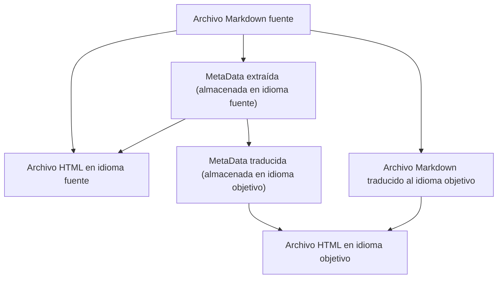

Ahora es lunes, 26 de enero de 2026, 4:00 AM.

### Reestructuración del directorio de CZON

El efecto de la [traducción generativa adversarial](./27.md) mencionado anteriormente es realmente bueno. Sin embargo, descubrí un problema con CZON: utiliza un Hash como ID del archivo fuente. Esto provocó que, después de modificar un artículo que era referenciado 9 veces, se desencadenara una avalancha de (1 + 9) \* 3 = 30 tareas de traducción. Además, el consumo de Tokens de la traducción generativa adversarial es aproximadamente 10 veces mayor que el de una traducción normal. Para artículos largos que pasan por múltiples rondas de modificaciones, el consumo de Tokens sería enorme y el costo muy alto. Por lo tanto, volví a revertir la integración de traducción de OpenCode, cambiándola a una traducción simple única.

Para resolver este problema, reestructuré completamente el directorio de generación de CZON. A partir de la versión 0.6.0, CZON copiará los archivos fuente tal cual al directorio de generación, manteniendo la misma ruta. Por ejemplo, `docs/guide/intro.md` se escribirá en `.czon/src/{lang}/docs/guide/intro.md`. De esta manera, al modificar un artículo, solo es necesario volver a traducir ese artículo, evitando la regeneración en avalancha. (Sin embargo, los usuarios de versiones anteriores de CZON necesitarán regenerar todo el directorio `.czon/src`, lo que requiere volver a traducir todos los artículos una vez).

Una vez cortada la cadena de regeneración en avalancha, el siguiente paso es optimizar el consumo de Tokens de la traducción generativa adversarial. Descubrí que el Agente de generación adversarial a veces lee excesivamente otros archivos; por ejemplo, en una tarea de traducción de zh-Hans a es-ES, el Agente de traducción lee contenido en en-US. Esto claramente es un consumo innecesario de Tokens. Sin embargo, OpenCode actualmente no puede restringir los permisos de acceso a archivos del Agente a nivel de sesión. Un pequeño truco es copiar los archivos necesarios a un directorio temporal y luego permitir que el Agente solo acceda a ese directorio temporal. Pero todavía estoy considerando si hacerlo. ¿Se puede reducir este acceso innecesario a archivos mediante instrucciones detalladas? ¿O es más seguro usar directamente un directorio temporal?

Después de modificar la estructura del directorio de generación de CZON, esto significa que el ID SHA-256 Hash, que antes era dominante, casi no tiene utilidad. El protocolo `czon://hash` también quedó obsoleto. Sin embargo, después de la reestructuración, el reemplazo de enlaces es más elegante. Antes y después de la traducción, estos enlaces no necesitan ser reemplazados en absoluto, y al renderizar el HTML, se pueden reemplazar los enlaces por la ruta correcta mediante un hook.

Ahora, este diseño de la estructura de directorios `.czon` es más amigable para git y la integración con SSG de terceros.

-   Porque cada directorio `.czon/src/{lang}` es un directorio completo que puede ser renderizado o previsualizado por separado.
-   El uso de rutas en lugar de Hash hace que, después de cada modificación de un archivo fuente, no se cree un nuevo archivo de destino, sino que se sobrescriba el archivo de destino existente, evitando la generación de una gran cantidad de archivos redundantes.

### Referencia a recursos estáticos

Las referencias a recursos estáticos se pueden realizar mediante enlaces normales.

En la versión 0.6.0 de CZON, también se pueden referenciar archivos de recursos arbitrarios, como imágenes, PDF, etc. Estos archivos de recursos se copiarán a la ubicación correspondiente en el directorio de generación. No solo imágenes, sino también txt, pdf, docx, etc., pueden ser referenciados. CZON manejará automáticamente la copia de estos archivos de recursos.

### Optimizaciones adicionales

**Separación de la tarea de traducción de Metadata**

Además, el YAML FrontMatter o Metadata también debería permanecer en `.czon/meta.json`, sin necesidad de ser mejorado (enhanced) de antemano al principio del Markdown. Incluso, este YAML FrontMatter en sí mismo pierde sentido.

**Eliminación automática de archivos residuales en `.czon/src`**

Actualmente, CZON no elimina los archivos sobrantes en el directorio `.czon/src/{lang}`. Por ejemplo, si se elimina un artículo, `.czon/src/{lang}/path/to/deleted-article.md` aún existe. En futuras versiones, CZON detectará automáticamente estos archivos sobrantes y los eliminará, manteniendo el directorio de generación ordenado.

**Reactivación de la traducción generativa adversarial**

Esto es inevitable. Porque la traducción one-shot (de un solo intento) simplemente no puede manejar artículos largos. El uso de Agentes es imprescindible, pero es necesario resolver el problema del consumo excesivo de Tokens.