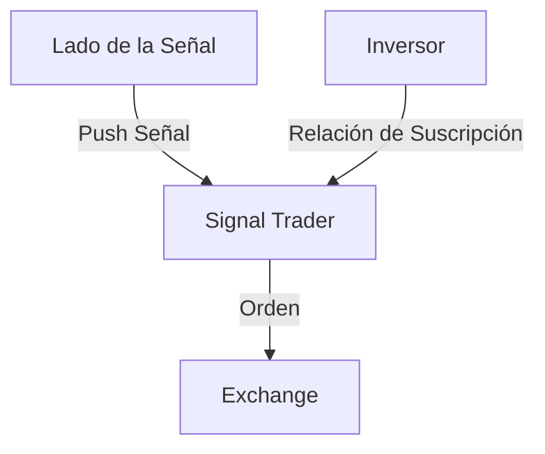

# Diseño del Módulo de Trading en Vivo de la Guerra de Desgaste: Signal Trader

Hoy es jueves, 12 de marzo de 2026, por la mañana.

Ayer hablé con C1 sobre el contenido del módulo de trading en vivo de la Guerra de Desgaste. Resumí algunos resultados prácticos recientes.

La última vez definimos su módulo central como **Signal Trader**, que significa Trader de Señales. Su entrada son las señales y su salida son las órdenes. Recibe señales enviadas activamente por el lado de las señales (push), las distribuye entre múltiples inversores y luego las envía como órdenes a la exchange.

## Push vs Pull

En el diseño de software, los modos **Push** y **Pull** son dos patrones comunes de flujo de datos.

**Signal Trader adopta el modo Push**. Es decir, el lado de la señal envía activamente (push) las señales al Signal Trader. La ventaja de este modo es que permite una transmisión de señales con alta inmediatez, adecuada para estrategias de trading que requieren una respuesta rápida. Además, el modo Push puede adaptarse a múltiples fuentes de señales, ofreciendo una gran flexibilidad. Este modo puede soportar naturalmente fuentes de señales heterogéneas: ¿señales de estrategia basadas en velas? ¿señales de alta frecuencia? ¿o incluso señales de estrategia de Agentes de IA? Incluso señales subjetivas humanas pueden transmitirse mediante el modo Push.

Si se utilizara el modo Pull, el Signal Trader necesitaría sondear periódicamente el lado de la señal para obtener las señales más recientes, lo que podría aumentar la latencia, especialmente cuando las señales se actualizan con frecuencia. Además, el Signal Trader tendría que descubrir activamente el servicio del lado de la señal, y este servicio tendría que exponer una interfaz, lo que aumenta la complejidad del sistema.

## La Señal Toma Tres Valores: Solo Dirección, Sin Intensidad

En nuestro diseño, la señal solo tiene dirección, no intensidad. Esto es para simplificar la lógica de procesamiento de señales, de modo que el Signal Trader solo necesite centrarse en la dirección de la señal (compra/largo 1, venta/corto -1, sin posición 0), sin considerar la intensidad de la señal (como cuánto comprar o vender). La señal no puede expresar información de intensidad para aumentar o reducir la posición. Esto también ayuda a evitar eficazmente el problema del sobreajuste (*overfitting*), ya que la información de intensidad a menudo lleva al modelo a ajustarse excesivamente a los datos de entrenamiento, lo que resulta en un rendimiento deficiente en el trading real. Limitar la capacidad expresiva del modelo puede, de hecho, mejorar su capacidad de generalización.

Según los principios de diseño de la Guerra de Desgaste de Capital, la gestión de posiciones no es responsabilidad de la señal.

## El Ratio de Stop Loss es Responsabilidad del Lado de la Señal

Una señal de trading también debe ir acompañada de un ratio de stop loss. Según la estrategia de la Guerra de Desgaste de Capital, esto permite **determinar el tamaño de la posición en función de la pérdida potencial**, calcular el valor nocional de la posición a abrir y establecer la orden de stop loss. Por ejemplo, si una señal cambia de 0 a 1, indicando una posición larga, el lado de la señal también debe proporcionar un ratio de stop loss, por ejemplo, 0.02, lo que significa que el precio de stop loss está un 2% por debajo del precio de entrada. Basándose en este ratio de stop loss, el Signal Trader puede calcular el valor nocional de esta posición (abriendo la posición con un apalancamiento de 50x sobre el saldo de VC, de modo que si se activa el stop loss, se pierda exactamente todo el VC), y al enviar la orden a la exchange, establecer simultáneamente la orden de stop loss. Cuanto mayor sea el ratio de stop loss, más lejos estará el precio de stop loss del precio de entrada, mayor será el riesgo y menor será el valor nocional.

La actualización del ratio de stop loss y la actualización de la señal en sí no son sincrónicas. El ratio de stop loss se actualiza con menos frecuencia. Su actualización se basa en el aprendizaje del rendimiento histórico de las señales, mientras que la generación de la señal se basa en las condiciones actuales del mercado. La actualización del ratio de stop loss requiere cierta acumulación de datos históricos, mientras que la generación de la señal no. Incluso, la actualización del ratio de stop loss podría ser establecida manualmente, pero no se puede modificar durante el tiempo que se mantiene una posición. Modificar el ratio de stop loss solo surtirá efecto en la próxima apertura de posición.

Inicialmente, colocamos el proceso de aprendizaje del stop loss dentro del Signal Trader, por lo que necesitábamos diseñar un módulo de aprendizaje de stop loss que aprendiera el ratio basándose en el rendimiento histórico de las señales. Esto requería mantener dentro del Signal Trader un monitor de precios para evaluar el rendimiento intradía de las señales. Para resolver el problema del arranque en frío (*cold start*) de las señales, también era necesario diseñar una función para importar señales históricas, de modo que una nueva señal no perdiera tiempo aprendiendo el ratio de stop loss al comenzar el trading en vivo.

Se puede observar que el monitor de precios y el módulo de señales históricas también deben existir necesariamente en el lado de la señal. Entonces, ¿por qué no poner directamente el ratio de stop loss también en el lado de la señal? Esto simplificaría enormemente el diseño del Signal Trader.

## Distribución entre Múltiples Inversores

**Principio de Aislamiento**: Múltiples inversores están aislados entre sí. Cualquier decisión de un inversor no afectará los intereses de otros inversores.

Sobre la base del aislamiento, intentamos satisfacer al máximo las necesidades personalizadas de los inversores.

Múltiples inversores pueden suscribirse de forma independiente a la misma señal, especificando su propio ratio de toma de ganancias (*take profit*) y su inversión diaria. Después de suscribirse, el Signal Trader crea una relación de suscripción para el inversor, que internamente contiene una cuenta VC independiente. Cada vez que se activa una señal, el Signal Trader calcula el VC total según las relaciones de suscripción, obtiene el valor nocional total y luego asigna el volumen de la orden y las comisiones en proporción al VC de cada inversor.

Un inversor puede crear múltiples relaciones de suscripción para la misma señal, para satisfacer diferentes necesidades de ratio de take profit e inversión diaria. Un inversor también puede suscribirse simultáneamente a múltiples señales diferentes, para satisfacer las necesidades de su cartera de inversión.

La cuenta VC dentro de cada relación de suscripción acumula automáticamente la inversión diaria a una tasa determinada. Esto se puede evaluar de forma perezosa (*Lazy Evaluate*). La inversión diaria dentro de una relación de suscripción se puede modificar, y al hacerlo no se borra el saldo de la cuenta VC.

Los inversores pueden cancelar su suscripción en cualquier momento. El Signal Trader cancelará automáticamente la relación de suscripción cuando la señal cierre la posición o se invierta, y borrará el saldo de la cuenta VC. La acción de cancelar la suscripción por parte de un inversor no afectará las posiciones ya abiertas en ese momento. Esto se debe a que la retirada de fondos de un inversor podría no ajustarse al lote mínimo (*basic lot*), habría errores de punto flotante que afectarían los intereses de otros inversores. Sin embargo, podemos ir un paso más allá: cuando un inversor desee retirar fondos inmediatamente, el Signal Trader cerrará la posición actual en proporción al VC del inversor, pero el volumen de cierre se redondeará hacia abajo al múltiplo entero del volumen mínimo de trading. De esta manera, no se afectarán los intereses de otros inversores. Esto puede resultar en que el inversor se quede con una posición residual muy pequeña, pero es inevitable; de lo contrario, se violaría el principio de aislamiento.

## Sistema de Auditoría

Cada acción en el lado de la señal, en el lado de la exchange y en el lado de los inversores debe ser registrada por el sistema de auditoría para su posterior análisis y trazabilidad. El sistema de auditoría debe registrar el momento de activación de cada señal, la dirección de la señal, el ratio de stop loss, las relaciones de suscripción de los inversores, el momento de envío de cada orden, el estado de ejecución de la orden, etc. El sistema de auditoría también debe proporcionar interfaces de consulta para que podamos consultar y analizar datos según diferentes dimensiones, como por señal, por inversor, por tiempo, etc.