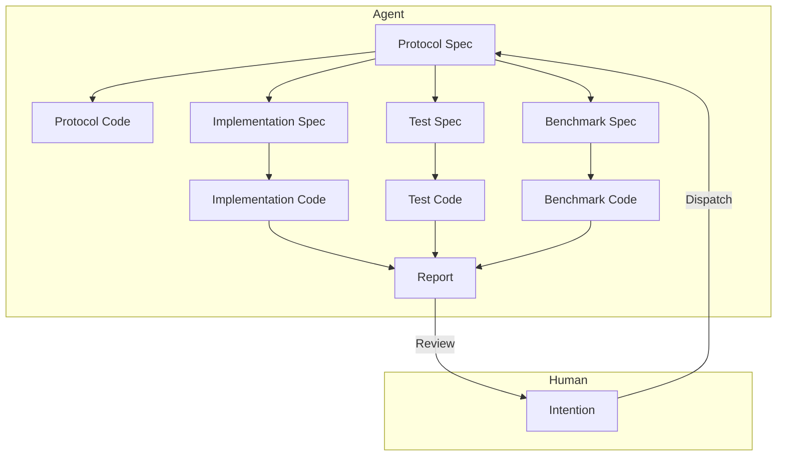

# モジュールレベルでの人間-AI協働ソフトウェアエンジニアリングアーキテクチャ

2026-01-05

## 問題の背景

LLMを用いてモジュールレベルでの人間-AI協働エンジニアリングアーキテクチャを設計し、産業レベルのアプリケーションモジュールの設計、実装、反復を高効率で完了させ、人的介入コストを削減することを目的とします。

1.  既存のAIエージェント（Claude Code、CodeX）によるコードモジュールの実装品質は低く、依然として人間による高度な介入、手直し、レビューが必要です。
2.  既存のAIエージェントは、実装プロセスにおいてモジュール境界を適切に構築することが難しく、不要な複雑さを持つコードを多く生成してしまいます。
3.  既存のAIエージェントの実装は遅く、タスクの発行から受け入れまでに10〜30分の時間を要します。

## 問題の洞察

-   [この記事](./2.md)の観点によれば、人間の支配欲は結果の制御不能に対する合理的な懸念に由来し、制御可能な信頼メカニズムを構築することが解決策です。
-   [この記事](./3.md)の観点によれば、LLMはその物理的・経済的メカニズム上、すべての作業を一度に完了することは困難であると考えられます。

人間の生産性を解放する鍵は、人間の細部に対する支配欲をなくすことにあります。そうすれば、人間は「使えなくはない」という考え方から、AIの作業成果に対してそれ以上厳しく要求しなくなるでしょう。

では、どのようなチェックを通過すれば、人間は自分に介入する能力がない、あるいはそれ以上の措置を取る必要がないと判断するのでしょうか？

1.  モジュールの外部インターフェースの概念と命名が、要求に合致していること。不合理なインターフェースがシステム下流に広がる懸念を払拭します。
2.  単体テストに合格すること。このモジュールが正常に動作するかどうかの懸念を払拭します。
3.  ベンチマークテストにおいて最適化されているか、少なくとも劣化していないこと。このモジュールの効率が低くないかという懸念を払拭します。
    最初の点は初期段階で発見できますが、後の2点は実験が終了して初めてわかります。この3つがすべて満たされれば、人間がAIの作業成果に無理に介入する理由はありません。

このモジュールが実際のデータパターンに対応できるかどうかは、本番環境のデータを用いてテストする必要があります。その後、人間がそのパターンを要約し、意図に基づいて新しいモジュールを構築し、新しい問題を解決します。この問題は、本稿の議論範囲外とします。

### 優先目標

1.  人的介入を減らす。
2.  実行時間を短縮し、速度を向上させる。
3.  Token使用量を減らし、LLMコストを削減する。

### 設計

1.  迅速な意図の合意

    人間は意図の記述を通じて、Agentと迅速にモジュールの機能要件を合意し、Protocol Specを出力します。

    ここでのProtocol Specには、モジュールのインターフェース定義、入出力データ形式、機能記述などが含まれ、基本的にはRFC文書に類似しています。人間はインターフェース定義と機能記述に重点的に注目し、モジュール境界が明確であることを確認する必要があり、特にインターフェーススタイルのセンスの問題を吟味する必要があります。

    このプロセスは複数回の対話を通じて完了でき、Agentは人間のフィードバックに基づいてProtocol Specを修正し続け、人間が承認するまで続けます。

    その後、長い自動実装プロセスが始まり、その間、人間は介入する必要はありません。結果は2つあります：1. モジュール実装が成功し、最終報告書を生成して人間の審査に提出する。2. モジュール実装が失敗し、仲裁要求を生成して人間の介入を求める。

2.  Protocol SpecからProtocol Codeを生成

    AgentはProtocol Specに基づいて、モジュールの骨組みコードであるProtocol Codeを生成し、インターフェース定義とコメントを含めます。
    Protocol Codeは、後続の実装、テスト、ベンチマークコード生成に使用されます。主な目的はモジュール境界を明確にし、実装プロセス中に不要な複雑さが生じるのを防ぐことです。

3.  Protocol Specから並行してImplementation Spec、Test Spec、Benchmark Specを生成

    異なるAgentに依頼し、Protocol Specに基づいてImplementation Spec、Test Spec、Benchmark Specをそれぞれ生成します。これらは、モジュールの実装詳細、テストケース、ベンチマークテスト計画をそれぞれ記述します。

4.  Test SpecからTest Codeを生成

    専門的なテストAgentに依頼し、Protocol SpecとTest Specに基づいて、モジュールの単体テストコードであるTest Codeを生成します。様々なテストケースとアサーションを含めます。実装詳細との結合を避けるため、インターフェースベースのテスト手法を使用することが必須です。

5.  Benchmark SpecからBenchmark Codeを生成

    専門的なベンチマークテストAgentに依頼し、Protocol SpecとBenchmark Specに基づいて、モジュールのベンチマークテストコードであるBenchmark Codeを生成します。パフォーマンステストケースと測定指標を含めます。実装詳細との結合を避けるため、インターフェースベースのテスト手法を使用することが必須です。

6.  Implementation SpecからImplementation Codeを生成

    専門的な実装Agentに依頼し、Protocol Spec、Implementation Spec、Test Spec、Benchmark Specに基づいて、モジュールの実装コードであるImplementation Codeを生成します。実装が完了したら、直ちに単体テストを実行します。

    単体テストが不合格の場合、失敗原因を分析します。

    -   実装（Implementation）に問題があると判断した場合、Implementation Specを修正し、その後Implementation Codeを再生成します。このプロセスを繰り返します。
    -   テスト（Test）に問題があると判断した場合、テスト失敗の詳細を収集し、反対意見として統合します。その後、より上位レベルの仲裁Agentに処理を委ねます。
        -   反対が認められた場合、仲裁AgentはTest Specを修正することを選択し、その後テストを再実行します。このプロセスを繰り返します。
        -   反対が認められなかった場合、仲裁Agentは説明意見を生成し、実装Agentに対してImplementation Specを修正し、その後実装プロセスを再実行するよう要求します。このプロセスを繰り返します。
        -   **仲裁Agentが判断できないと判断した場合、仲裁Agentは人間の介入による仲裁を要求します。**

    単体テストが合格した場合、ベンチマークテストを開始します。

7.  ベンチマークテストの実行

    単体テストに合格したImplementation Codeは、ベンチマークテストを実行できます。

    現在、比較可能な他の実装バージョンが存在しない場合、現在の実装をベースラインバージョンとしてマークし、ベンチマークテストを実行してパフォーマンス指標を記録すれば、ベンチマークテストを通過できます。

    現在、比較可能な他の実装バージョンが存在する場合、ベンチマークテストを実行し、パフォーマンス指標を記録します。比較レポートを生成し、Agentが現在の実装バージョンのパフォーマンス変化を分析します。

    -   現在の実装バージョンのパフォーマンスが劣化している場合、劣化原因を分析します。
        -   実装（Implementation）に問題があると判断した場合、Implementation Specを修正し、その後Implementation Codeを再生成します。このプロセスを繰り返します。
        -   ベンチマーク（Benchmark）に問題があると判断した場合、ベンチマークテスト失敗の詳細を収集し、反対意見として統合します。その後、より上位レベルの仲裁Agentに判断を委ねます。
            -   反対が認められた場合、仲裁AgentはBenchmark Specを修正することを選択し、その後ベンチマークテストを再実行します。このプロセスを繰り返します。反対が認められなかった場合、仲裁Agentはタスク失敗を宣言し、最終報告書を生成して人間の審査に提出します。
            -   反対が認められなかった場合、仲裁Agentは反対意見を実装Agentに差し戻し、Implementation Specを修正し、その後実装プロセスを再実行するよう要求します。このプロセスを繰り返します。
            -   **仲裁Agentが判断できないと判断した場合、仲裁Agentは人間の介入による仲裁を要求します。**
    -   現在の実装バージョンのパフォーマンスが劣化していない場合、ベンチマークテストを通過します。

8.  最終報告書の生成

    Implementation Codeが単体テストとベンチマークテストの両方に合格したら、実装詳細、テスト結果、ベンチマークテスト結果を含む最終報告書を生成します。
    最終報告書は、人間による審査に提出されます。人間が現在の実装を承認すれば、タスク完了となります。そうでない場合、人間のフィードバックを収集し、反対意見として統合します。その後、より上位レベルの仲裁Agentに処理を委ねます。反対が認められた場合、仲裁AgentはProtocol Specを修正することを選択し、その後実装プロセス全体を再実行します。このプロセスを繰り返します。

## まとめ

1.  アーキテクチャの核心は、階層化された協働、専門化された分業、関心の分離にあります。
2.  多段階の仲裁メカニズムを通じて、実装品質を確保し、人的介入を削減します。
3.  受け入れ基準（単体テスト合格、パフォーマンス非劣化）を明確にし、信頼メカニズムを構築して人間の支配欲をなくします。

未解決の問題がいくつか残っています：

1.  Protocol Specの品質を向上させ、モジュール境界を明確にするにはどうすればよいか？自動レビュー工程を追加する。
2.  仲裁の無限ループをどのように回避するか？例えば、最大自動仲裁回数の制限を設ける。
3.  実際の実行時間と使用Tokens数をどのように合理的な範囲内に制御するか？まず計測し、その後最適化する。
4.  インターフェース設計のセンスをどのように保証するか？例えば、チームスタイルガイドを追加する。

いくつかの展望：

1.  人間の位置は必ずしも人間である必要はないでしょうか？それは実はSuperVisorです。将来的には、より上位レベルのAIを用いて、意図の合意と最終審査を代替させることはできないでしょうか？これにより、人的介入をさらに減らし、効率を向上させることができます。
2.  モジュールレベルのタスクでない場合、より大規模なシステム設計と実装に拡張することはできないでしょうか？例えば、フロントエンド＋バックエンド＋データベースのフルスタック開発タスクなどです。これにより、ソフトウェアエンジニアリング分野におけるAIの応用価値を大幅に高めることができます。