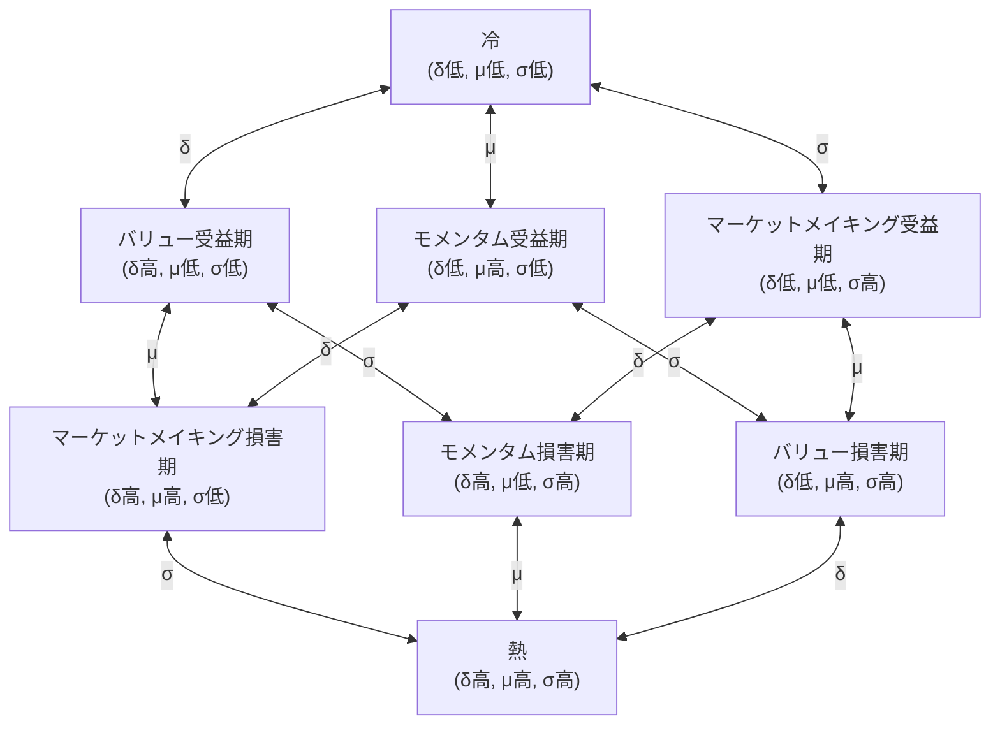

# 資本市場の三体力学仮説

2026-02-07

**なぜ市場の行動には法則性と不確実性が共存するのか？**

- なぜ市場には常に機会があるが、不確実なのか？
- なぜ市場は常に繰り返すが、完全には再現しないのか？
- なぜ市場は予測可能な時と不可能な時があるのか？
- なぜ資本市場にはボラティリティ・クラスタリング、市場崩壊と回復現象が存在するのか？
- なぜ市場には急変現象が存在するのか？
- なぜ市場には急騰後の急落というパターンが存在するのか？
- なぜ市場にはゼロに帰するリスクがあるのか？
- なぜ市場の統計的特性（収益率分布のファットテール、ボラティリティ・クラスタリングなど）は頑健なのか？

## 核心思想

資本市場は**三体システム**であると仮定する。本質的に異なる三種類の資本によって構成され、それらの相互作用を通じて複雑な力学的行動、すなわちボラティリティ・クラスタリング、市場崩壊と回復サイクルなどの創発現象が生じる。

天体力学における三体問題と同様に、このシステムには**定常解が存在しない可能性**があり、リミットサイクル、準周期的、あるいはカオス的な振る舞いを示す。

## 三体の定義

市場参加者の本質的な違いは、その属性（個人投資家、機関投資家、マーケットメイカー）ではなく、**価格変化に対するフィードバックの性質**にある。

### モメンタム資本 M (Momentum Capital)

**定義**：価格変化に対して正のフィードバックを生じさせる取引資本。

$$\frac{d(\text{ポジション})}{dS} > 0$$

**行動特性**：

- 上昇時に買い、下落時に売る（追い上げ・投げ売り）
- レバレッジを用いて利益/損失を増幅
- 短期保有の傾向
- モメンタム取引、トレンドフォロー

**システムへの影響**：

- 価格変動を増幅
- 不安定化する力
- トレンドと崩壊を生み出す

**典型的な代表**：投機家、トレンドトレーダー、高レバレッジトレーダー、受動的ストップロス保有者

### バリュー資本 V (Value Capital)

**定義**：価格変化に対して負のフィードバックを生じさせる取引資本。

$$\frac{d(\text{ポジション})}{dS} < 0$$

すなわち：価格上昇時にポジションを減らし、価格下落時にポジションを増やす。

通常、内在価値 $S^*$ がアンカーとして存在する：

- $S < S^*$ の時、買い傾向
- $S > S^*$ の時、売り傾向

**行動特性**：

- 安く買い高く売る（逆張り操作）
- 価値判断に基づく取引
- 長期保有の傾向
- 平均回帰、バリュー投資

**システムへの影響**：

- 価格変動を抑制
- 安定化する力（能動的）
- 市場の下支えと抵抗を提供

**典型的な代表**：バリュー投資家、逆張り投資家、アービトラージャー

### 流動性資本 L (Liquidity Capital)

**定義**：価格変化に対して方向性のない反応を示す流動性資本。

$$\frac{d(\text{ポジション})}{dS} \approx 0$$

**行動特性**：

- 両建ての価格提示、スプレッドを稼ぐ
- 方向性のあるエクスポージャーを持たない（または迅速にヘッジする）
- 継続的に売買流動性を提供
- リスク許容度は限定的

**システムへの影響**：

- 取引コストを低下
- 安定化する力（受動的）
- 価格ショックを緩衝

**典型的な代表**：マーケットメイカー、流動性提供者、高頻度取引業者（マーケットメイキング型）

## 三体の相互作用

### 作用行列

| 作用側 → 被作用側 | モメンタム資本 M   | バリュー資本 V   | 流動性資本 L |
| ----------------- | ------------------ | ---------------- | ------------ |
| **モメンタム資本 M**    | —                  | 取引機会を創出   | 流動性を消耗 |
| **バリュー資本 V**    | 極端な行動を抑制 | —                | 信頼を回復   |
| **流動性資本 L**  | 衝撃効果を制約   | 取引の便宜を提供 | —            |

### 詳細なメカニズム

**M → L：流動性の消耗**

モメンタム資本の追い上げ・投げ売り行動は大量の一方向注文フローを生み出し、マーケットメイカーの在庫を消耗させ、マーケットメイカーに大きなリスクエクスポージャーを負わせる。ボラティリティが高すぎる場合、マーケットメイカーは撤退を選択する。

**L → M：衝撃効果の制約**

十分な流動性は、モメンタム資本による価格への衝撃を緩和する。市場深度が深い場合、高レバレッジ取引であっても価格を動かすことは難しい。流動性は「ショックアブソーバー」である。

**M → V：取引機会の創出**

モメンタム資本の追い上げ・投げ売りは価格を内在価値から乖離させ、バリュー資本に取引機会を創出する：

- パニック売り → 価格が内在価値を下回る → V の**買い**機会
- 熱狂的な追い上げ → 価格が内在価値を上回る → V の**売り**機会

これはモメンタム資本からバリュー資本への**機会の移転**である。

**V → M：極端な行動の抑制**

バリュー資本の逆張り操作は価格の下支えを提供し、価格が一方的に下落する確率を低下させ、追い上げ・投げ売り戦略の期待収益を低下させる。合理的なモメンタム資本はこれにより規模を縮小する。

**V → L：信頼の回復**

バリュー資本の介入は「市場には底がある」というシグナルを発し、マーケットメイカーの極端な損失に対する懸念を軽減し、流動性の回帰を促す。バリュー資本はマーケットメイカーの「保険」である。

**L → V：取引の便宜の提供**

十分な流動性により、バリュー資本は低コストでポジションを構築でき、大口注文でも過度のスリッページを生じず、バリュー資本の資金効率を向上させる。

## フィードバックループ

### 正のフィードバックループ（不安定）

$$M \uparrow \to \sigma \uparrow \to L \downarrow \to \text{価格衝撃} \uparrow \to \sigma \uparrow \to M \uparrow \text{ (または強制決済)}$$

モメンタム資本増加 → ボラティリティ上昇 → 流動性撤退 → 価格衝撃激化 → ボラティリティ更に上昇 → モメンタム資本更に増加または強制決済

これは**崩壊スパイラル**のメカニズムである。

### 負のフィードバックループ（安定）

$$|S - S^*| \uparrow \to \sigma \uparrow \to V \uparrow \to |S - S^*| \downarrow \to \sigma \downarrow \to L \uparrow$$

価格が内在価値から乖離 → ボラティリティ上昇 → バリュー資本介入 → 価格回帰 → ボラティリティ低下 → 流動性回復

具体的な経路：

- **暴落後**：$S < S^*$ → V 買い → 価格回復
- **暴騰後**：$S > S^*$ → V 売り → 価格下落

これは**回復メカニズム**である。

## システムの相転移

システムの状態は、**どちらのループが支配的か**によって決まる：

- **正のフィードバック > 負のフィードバック**：システムは崩壊へ向かう
- **負のフィードバック > 正のフィードバック**：システムは安定へ向かう
- **臨界点**：システムは相転移の境界にある

相転移はシステムの**創発的結果**であり、事前に設定された閾値ではない。システムは正負のフィードバックの競合の中で自発的に相転移を生じる。

市場状態を記述するには、以下の三つの核心変数が必要である：

| 変数       | 記号     | 意味                                                   |
| ---------- | -------- | ------------------------------------------------------ |
| **プレミアム**   | $\delta$ | 価格の内在価値に対するプレミアム：$\delta = \frac{S - S^*}{S^*}$ |
| **モメンタム**   | $\mu$    | 価格変化率：$\mu = \frac{dS}{dt}$                      |
| **ボラティリティ** | $\sigma$ | 価格変動の振幅                                         |

### 収益-リスク-コスト行列

M、V、L 三種類の資本と δ、μ、σ 三つの市場変数の間には**中心対称**の関係が存在する：

|                     | $\delta$（プレミアム） | $\mu$（モメンタム） | $\sigma$（ボラティリティ） |
| ------------------- | :---------------------: | :-----------------: | :------------------------: |
| **M（モメンタム資本）**   |         リスク         |     **収益**        |           コスト           |
| **V（バリュー資本）**   |       **収益**         |         コスト      |           リスク           |
| **L（流動性資本）** |         コスト         |         リスク      |         **収益**           |

ここで：

- **収益**：この変数が増大すると、この資本は直接的に利益を得る
- **リスク**：この変数が増大すると、この資本は損失を被る可能性がある
- **コスト**：この変数が増大すると、この資本の運用効率が低下する

#### 対称性

この行列は完璧な**中心対称構造**を持つ：

- **各行**：一つの収益、一つのリスク、一つのコスト
- **各列**：一つの収益、一つのリスク、一つのコスト
- **対角線**：M-μ、V-δ、L-σ がそれぞれの核心収益源に対応

#### 三体制衡

列の観点から見ると、各市場変数の変化は勝者、敗者、消耗者を生み出す：

| 変数増大   | 収益側 | リスク側 | コスト側 |
| ---------- | ------ | -------- | -------- |
| $\delta$ ↑ | V      | M        | L        |
| $\mu$ ↑    | M      | L        | V        |
| $\sigma$ ↑ | L      | V        | M        |

どの変数も全ての資本にとって有利でも有害でもない。これがまさに**三体制衡**の体現である。

#### 詳細な論証

**M と三変数の関係**：

- $\mu$（収益）：トレンド継続 = M の利益。これが M の核心収益源。
- $\delta$（リスク）：プレミアムが大きすぎると反転を示唆し、M は損失リスクに直面。
- $\sigma$（コスト）：高ボラティリティ時はストップロスが発動しやすく、取引コストが増加。

**V と三変数の関係**：

- $\delta$（収益）：プレミアム大 = V の機会。これが V の核心収益源。
- $\sigma$（リスク）：高ボラティリティ時、V はポジション構築後により大きな評価損に直面する可能性があり、最終的に回帰するとしてもその過程で苦痛を伴う。また、高ボラティリティは内在価値 $S^*$ 自体が変化している可能性を意味し、V のアンカーが不安定になる。
- $\mu$（コスト）：トレンド継続時、V はより長く待つ必要があり、資金効率が低下。

**L と三変数の関係**：

- $\sigma$（収益）：変動大 = 取引機会多、マーケットメイキング収益高。これが L の核心収益源。
- $\mu$（リスク）：トレンド強時、L の在庫は一方向に継続的に蓄積し、方向性のある損失リスクに直面。
- $\delta$（コスト）：プレミアム大時、L は自己防衛のためにより大きなスプレッドを必要とし、マーケットメイキング効率が低下。

### 市場の相状態

δ、μ、σ 三変数の高/低状態に基づき、市場には $2^3 = 8$ 種類の典型的な相状態が存在する。

| コード | $\delta$ | $\mu$ | $\sigma$ |      名称      | 核心特徴                       |
| :----: | :------: | :---: | :------: | :------------: | ------------------------------ |
| 000  |    低    |  低   |    低    |    **冷**      | 市場沈滞、三者とも利益なし     |
| 001  |    低    |  低   |    高    | **マーケットメイキング受益期** | 価格適正、高ボラ無トレンド、L 主導 |
| 010  |    低    |  高   |    低    | **モメンタム受益期** | トレンド発生初期、プレミアム小、M 利益開始 |
| 011  |    低    |  高   |    高    | **バリュー損害期** | M 主導、高ボラ高トレンド       |
| 100  |    高    |  低   |    低    | **バリュー受益期** | プレミアム大だが市場沈滞、V は触媒待ち |
| 101  |    高    |  低   |    高    | **モメンタム損害期** | V と L のせめぎ合い、方向性不明 |
| 110  |    高    |  高   |    低    | **マーケットメイキング損害期** | トレンド明確、M 利益、V 圧迫   |
| 111  |    高    |  高   |    高    |    **熱**      | 三高状態、システム臨界         |

命名規則：
- **高が一つだけ**：その変数に対応する収益側 + "受益期"
- **低が一つだけ**：その変数に対応する収益側 + "損害期"
- **全低/全高**：冷/熱

四組の対偶があり、コードはビット単位で反転、命名は完璧に対称：
- 冷（000）↔ 熱（111）
- バリュー受益期（100）↔ バリュー損害期（011）
- モメンタム受益期（010）↔ モメンタム損害期（101）
- マーケットメイキング受益期（001）↔ マーケットメイキング損害期（110）

### 相状態詳細分析

#### 冷（000）：δ低, μ低, σ低

| 資本 | 状態                   |
| ---- | ---------------------- |
| M    | 収益源 μ 低 → 利益なし |
| V    | 収益源 δ 低 → 機会なし |
| L    | 収益源 σ 低 → 利益なし |

**特徴**：三者とも利益なし、市場萎縮、出来高薄
**典型的な場面**：人気薄銘柄、上場廃止間際、弱気相場末期の絶望期

#### マーケットメイキング受益期（001）：δ低, μ低, σ高

| 資本 | 状態                                               |
| ---- | -------------------------------------------------- |
| M    | 収益源 μ 低 → 追うトレンドなし；コスト源 σ 高 → 頻繁なストップロス |
| V    | 収益源 δ 低 → 機会なし；リスク源 σ 高 → 環境悪化   |
| L    | 収益源 σ 高 → **利益豊富**；リスク源 μ 低 → リスク管理可能 |

**特徴**：L の黄金期、価格は適正範囲内で高頻度変動
**典型的な場面**：成熟市場の保ち合い期、高頻度取引主導市場

#### モメンタム受益期（010）：δ低, μ高, σ低

| 資本 | 状態                                           |
| ---- | ---------------------------------------------- |
| M    | 収益源 μ 高 → **利益**；コスト源 σ 低 → コスト管理可能 |
| V    | コスト源 μ 高 → 効率低下；リスク源 σ 低 → リスク管理可能 |
| L    | リスク源 μ 高 → **損害**；収益源 σ 低 → 収益限定的 |

**特徴**：M 利益、L 損害、V 傍観；δ は次第に増大
**典型的な場面**：トレンド初期、緩やかな強気/弱気相場の起点

#### バリュー損害期（011）：δ低, μ高, σ高

| 資本 | 状態                                                       |
| ---- | ---------------------------------------------------------- |
| M    | 収益源 μ 高 → **利益豊富**；コスト源 σ 高 → コスト増加も許容可能 |
| V    | 収益源 δ 低 → 機会なし；リスク源 σ 高 + コスト源 μ 高 → 環境悪化 |
| L    | 収益源 σ 高 → 収益あり；リスク源 μ 高 → **リスク大**       |

**特徴**：M が市場を主導、高ボラ高トレンド、δ は急速に増大
**典型的な場面**：ミームコイン初期、テーマ株初期、ブレイクアウト相場

#### バリュー受益期（100）：δ高, μ低, σ低

| 資本 | 状態                                               |
| ---- | -------------------------------------------------- |
| M    | 収益源 μ 低 → 利益なし；リスク源 δ 高 → 潜在的反転リスク |
| V    | 収益源 δ 高 → **機会あり**；コスト源 μ 低 → 待機コスト高 |
| L    | コスト源 δ 高 → 効率低下；収益源 σ 低 → 収益限定的 |

**特徴**：V は機会を見るが市場動かず、触媒待ち
**典型的な場面**：過小評価だが注目されない株式、ディープ・バリュー投資対象

#### モメンタム損害期（101）：δ高, μ低, σ高

| 資本 | 状態                                                             |
| ---- | ---------------------------------------------------------------- |
| M    | 収益源 μ 低 → トレンドなし；リスク源 δ 高 → リスク高；コスト源 σ 高 → コスト高 |
| V    | 収益源 δ 高 → **機会大**；リスク源 σ 高 → **リスクも大**         |
| L    | 収益源 σ 高 → **収益あり**；コスト源 δ 高 → 効率低下             |

**特徴**：V と L のせめぎ合い場、高ボラだが明確な方向性なし
**典型的な場面**：決算発表前後、重大イベント不確定期、多空対峙

#### マーケットメイキング損害期（110）：δ高, μ高, σ低

| 資本 | 状態                                             |
| ---- | ------------------------------------------------ |
| M    | 収益源 μ 高 → **利益**；リスク源 δ 高 → リスク蓄積   |
| V    | 収益源 δ 高 → 機会大；コスト源 μ 高 → **継続的圧迫** |
| L    | リスク源 μ 高 → **損害**；コスト源 δ 高 → 効率低     |

**特徴**：トレンド明確だが変動小、M 安定利益、V 苦痛の待機
**典型的な場面**：一方的な強気/弱気相場中期、トレンド確立後の主上昇/主下落波

#### 熱（111）：δ高, μ高, σ高

| 資本 | 状態                                                                         |
| ---- | ---------------------------------------------------------------------------- |
| M    | 収益源 μ 高 → 収益大；リスク源 δ 高 → **リスク極大**；コスト源 σ 高 → コスト高       |
| V    | 収益源 δ 高 → 機会大；リスク源 σ 高 → **リスク極大**；コスト源 μ 高 → コスト高       |
| L    | 収益源 σ 高 → 理論的収益大；リスク源 μ 高 → **リスク極大**；コスト源 δ 高 → 効率極低 |

**特徴**：三者とも極限環境に直面、高収益高リスク、システム臨界点
**典型的な場面**：バブル頂点、崩壊瞬間、ブラックスワン事象

### 相状態遷移

各相状態は、一つの次元（δ、μ または σ）を変化させることで、隣接する 3 つの相状態へ遷移可能である。全ての遷移は双方向である。



これは**三次元超立方体（3-cube）**構造である：8 つの頂点が 8 つの相状態に対応し、12 本の辺が 12 種類の単一次元遷移に対応する。

### 典型的な進化経路

**バブル形成と崩壊**：

```
冷 → モメンタム受益期 → マーケットメイキング損害期 → 熱 → モメンタム損害期 → バリュー受益期 → 冷
(000) → (010) → (110) → (111) → (101) → (100) → (000)
```

**健全な市場変動**：

```
マーケットメイキング受益期 ↔ バリュー損害期 ↔ マーケットメイキング受益期
(001) ↔ (011) ↔ (001)
```

**価値発見**：

```
バリュー受益期 → モメンタム損害期 → マーケットメイキング受益期
(100) → (101) → (001)
```

### 冷と熱の対称性

相状態遷移図から重要な戦略的示唆が得られる：

**熱（111）の三つの出口は全て損害期である**：
- δ↓ → バリュー損害期（011）
- μ↓ → モメンタム損害期（101）
- σ↓ → マーケットメイキング損害期（110）

どの変数が先に下落しても、ある種類の資本が損害を受け、どの変数が先に変化するかは予測できない。したがって過熱状態では、**いかなる方向性のある賭けもギャンブル**であり、最適戦略は不参加またはレバレッジ低下である。

**冷（000）の三つの出口は全て受益期である**：
- δ↑ → バリュー受益期（100）
- μ↑ → モメンタム受益期（010）
- σ↑ → マーケットメイキング受益期（001）

どの変数が先に上昇しても、ある種類の資本が利益を得る。したがって冷状態では、**いかなる参加も利益を得る可能性がある**。鍵は市場に居続けることである。

## 三体の生態的地位

| 資本タイプ     | 生態的役割     | システム安定性への影響 | 収益源          |
| -------------- | -------------- | ---------------------- | --------------- |
| モメンタム資本 M   | エネルギー注入者 | 不安定化               | ボラティリティ × 方向性判断 |
| 流動性資本 L | 緩衝器         | 安定化（受動的）       | 売買スプレッド  |
| バリュー資本 V   | 負帰還制御器   | 安定化（能動的）       | 価値回帰        |

**生態的均衡**：健全な市場には三者共存が必要。

- モメンタム資本欠如：市場停滞、変動なし、取引機会なし
- 流動性資本欠如：取引コスト高、市場効率低
- バリュー資本欠如：市場脆弱、崩壊しやすく、ゼロ帰還リスクさえある

## 従来の分類との関係

| 従来の分類     | 本質的帰属     | 説明                 |
| -------------- | -------------- | -------------------- |
| 投機家         | モメンタム資本 M   | 追い上げ投げ売り、レバレッジ増幅 |
| 投資家         | バリュー資本 V   | 安買い高売り、価値判断 |
| マーケットメイカー       | 流動性資本 L | 両建て価格提示、スプレッド稼ぎ |
| トレンドトレーダー   | モメンタム資本 M   | モメンタム戦略       |
| アービトラージャー       | バリュー資本 V   | 価格差収斂           |
| パッシブ・インデックスファンド | 近似 L       | リバランス時に弱い負のフィードバックを生む |

注意：同一参加者でも時と場合により異なる役割を演じる可能性がある。分類の本質は**行動パターン**であり、属性ラベルではない。

## 三体の類推

市場三体と天体力学における三体問題には深い類似性がある。

**類推の鍵**：三体問題の本質は**質量が近い三つの天体の相互作用**である。互角であるがゆえに、いずれの天体もシステムを主導できず、カオス的行動が生じる。

市場においても、M、V、L 三種類の資本は同様に**互角**である：

- M が V と L を遥かに上回る場合：市場は一方的に暴騰暴落後ゼロへ（バブル崩壊）
- V が M と L を遥かに上回る場合：市場はほとんど変動しない（死に水）
- L が M と V を遥かに上回る場合：価格は完全に外部情報で決定（完全効率的市場）

三者が互角である時のみ、市場は真の複雑なダイナミクスを示す。

**天体三体の教訓**：

- 二体問題には解析解あり（楕円軌道）
- 三体問題には一般に解析解なく、初期値に敏感
- 軌道は周期的、準周期的、またはカオス的になり得る

**市場三体の推論**：

- **長期予測は不可能**：システムは初期値に敏感
- **短期特性は予測可能**：トレンドとボラティリティ・クラスタリングは短期現象
- **統計的法則は頑健**：収益率分布のファットテール、ボラティリティ・クラスタリングなどの巨視的統計特性は安定

## 補足：資本規模の長期的進化

三体モデルの核心は M-V-L 間の相互作用であるが、前提となる問題がある：**なぜ三種類の資本は長期的に共存し、互角であり続けるのか？**

これは、**収益率駆動自然選択**（Return-Driven Selection）という従属メカニズムに依存している。

### メカニズムの記述

同一種類の資本内部では、個々の収益率は分布を示す。個体の行動（拡大、縮小、退出）はその収益率と強く相関する：

- 高収益個体は残留または拡大傾向
- 低収益個体は縮小または退出傾向

多数の個体の統計的効果として、この傾向性はその種類の資本総量の変化として現れる。

### 自発的調節

ある種類の資本が過剰な場合：

1. 内部競争激化
2. 平均収益率低下
3. 限界個体の退出増加
4. その種類の資本総量縮小

ある種類の資本が不足している場合：

1. 内部競争緩和
2. 平均収益率上昇
3. 新規資本流入を惹起
4. その種類の資本総量拡大

### 各資本の収益源と競争

| 資本タイプ | 収益源           | 過剰時の内巻き現象                   |
| ---------- | ---------------- | ------------------------------------ |
| M        | ボラティリティ、トレンド継続 | 相互踏みつけ、スリッページ増大、トレンドの前倒し |
| V        | 価値乖離、平均回帰 | 価値の窪地が奪い合い、安全余裕消失   |
| L        | 取引量、売買スプレッド | スプレッド縮小、マーケットメイキング利益薄化 |

### 理論的位置づけ

収益率駆動自然選択は**遅い変数**メカニズム（週から年の時間スケール）であり、三体相互作用は**速い変数**メカニズム（秒から日の時間スケール）である。

この従属メカニズムは、三体システムの**存在性**と**持続性**——なぜ市場がある一つの資本が独り勝ちする状態に進化しないのか——を説明するが、三体相互作用の核心的なダイナミクスは変えない。

## 研究方向

1. **相空間構造**：アトラクター、リペラー、分離曲面
2. **時間スケール分離**：速い変数（価格）、遅い変数（資本構造）
3. **統計的特性**：エルゴード性、不変測度、滞在時間分布
4. **力学方程式**：この枠組みに基づく SDE システム（別稿詳述）

## 参考文献

- [ボラティリティとレバレッジ](../LOGS/26.md)
- [ボラティリティ作用はレバレッジ作用に優る](../LOGS/45.md)
- [資本持久戦](./6.md)