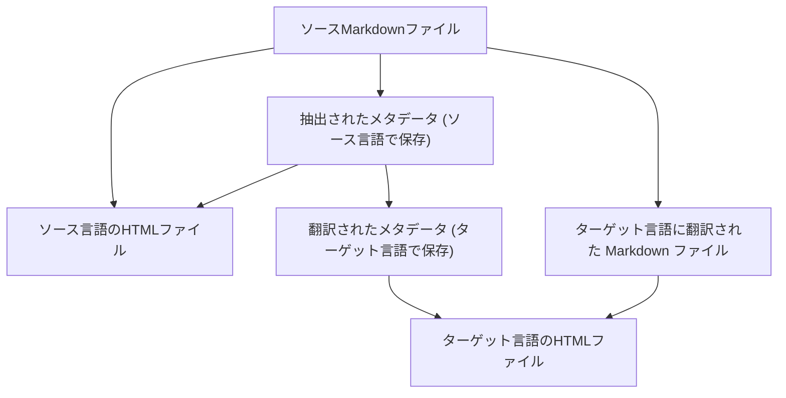

現在は 2026年1月26日、月曜日の午前4時です。

### CZON ディレクトリ構造のリファクタリング

[前回](./27.md) 述べた対抗生成翻訳の効果は確かに優れていました。しかし、CZON に一つの問題があることが判明しました。それは、ソースファイルの ID としてハッシュを使用している点です。これにより、9回参照されている記事を1つ修正しただけで、(1 + 9) \* 3 = 30 件もの翻訳タスクが雪崩式にトリガーされてしまいました。さらに、対抗生成翻訳のトークン消費量は通常の翻訳の約10倍以上にもなり、長文を何度も修正するとトークン消費量が非常に大きくなり、コストも高くなってしまいます。そのため、私は OpenCode の翻訳統合を再度ロールバックし、通常の単発翻訳を使用するように戻しました。

この問題を解決するため、CZON の生成ディレクトリ全体をリファクタリングしました。バージョン 0.6.0 以降、CZON はソースファイルを生成ディレクトリにパスを維持したままそのままコピーします。例えば、`docs/guide/intro.md` は `.czon/src/{lang}/docs/guide/intro.md` に書き込まれます。これにより、一つの記事を修正した場合、その記事のみを再翻訳すれば済むようになり、雪崩式の再生成を回避できます。(ただし、CZON の以前のバージョンをご利用のユーザーは `.czon/src` ディレクトリ全体を再生成する必要があり、すべての記事を再度翻訳する必要があります)

雪崩式再生成の連鎖を断ち切った後は、対抗生成翻訳のトークン消費量の最適化に取り組みました。対抗生成エージェントが時折、他のファイルを過剰に読み取ることがあることに気づきました。例えば、明らかに zh-Hans から es-ES への翻訳タスクなのに、翻訳エージェントが en-US の内容を読み取ってしまうのです。これは明らかに不要なトークン消費です。しかし、OpenCode では現時点でセッションレベルでエージェントのファイルアクセス権限を制限することができません。一つの小さなトリックとして、必要なファイルを一時ディレクトリにコピーし、エージェントにその一時ディレクトリのみをアクセスさせる方法があります。ただ、今のところこの方法を採用するかどうか検討中です。詳細なプロンプトによって、このような不要なファイルアクセスを減らすことはできるでしょうか？それとも、一時ディレクトリを使用する方が確実でしょうか？

CZON の生成ディレクトリ構造を修正したことで、これまで中心的な役割を果たしていた SHA-256 ハッシュ ID はほとんど活躍の場を失いました。`czon://hash` プロトコルも廃止されました。しかし、リファクタリング後はリンクの置き換えがより洗練されました。翻訳前後において、これらのリンクを置き換える必要は全くなく、HTML をレンダリングする際にフックを使用して正しいパスにリンクを置き換えることができます。

現在の .czon ディレクトリ構造の設計は、git およびサードパーティの SSG 統合にとってより親しみやすいものになっています。

- 各 `.czon/src/{lang}` ディレクトリは完全な独立したディレクトリであり、個別にレンダリングやプレビューを行うことができます。
- ハッシュではなくパスを使用することで、ソースファイルを修正するたびに新しいターゲットファイルが作成されるのではなく、既存のターゲットファイルが上書きされるため、大量の冗長ファイルの発生を防ぎます。

### 静的リソースの参照

静的リソースは、通常のリンク方式で参照することができます。

CZON バージョン 0.6.0 では、画像、PDF など任意のリソースファイルを参照することも可能です。これらのリソースファイルは、生成ディレクトリ内の対応する位置にコピーされます。画像だけでなく、txt、pdf、docx なども参照できます。CZON はこれらのリソースファイルのコピー作業を自動的に処理します。

### さらなる最適化

**メタデータの翻訳タスクの分離**

さらに進めて、YAML FrontMatter、すなわちメタデータも `.czon/meta.json` に残しておき、事前に Markdown の先頭に埋め込む (enhance) 必要はありません。むしろ、この YAML FrontMatter 自体が無意味になる可能性もあります。

**`.czon/src` 内の残留ファイルの自動削除**

CZON は現在、`.czon/src/{lang}` ディレクトリ内の不要なファイルを削除しません。例えば、ある記事が削除された後も、`.czon/src/{lang}/path/to/deleted-article.md` は残り続けます。将来のバージョンでは、CZON がこれらの不要なファイルを自動的に検出し、削除して生成ディレクトリを整理された状態に保ちます。

**対抗生成翻訳の再導入**

これは必然です。なぜなら、ワンショット翻訳では長文を全く処理できないからです。エージェントの使用は必須ですが、トークン消費量が過大になる問題を解決する必要があります。