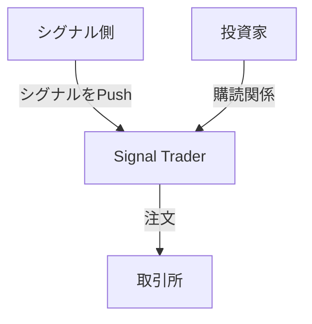

# 持久戦実戦モジュール設計について: Signal Trader

現在は 2026年3月12日、木曜日、午前中です。

昨日、C1と持久戦実戦モジュールの内容について話し合いました。最近のいくつかの実践結果をまとめました。

前回、その中核モジュールを Signal Trader（シグナルトレーダー）と定義しました。これは、入力がシグナルで、出力が注文であることを意味します。シグナル側から能動的にプッシュされたシグナルを受け取り、複数の投資家への配分処理を経て、取引所への注文として出力します。

## Push 対 Pull

ソフトウェア設計において、Push モードと Pull モードは、データフローの2つの一般的なパターンです。

**Signal Trader は Push モードを採用しています**。つまり、シグナル側が能動的に Signal Trader へシグナルをプッシュします。このモードの利点は、リアルタイム性の高いシグナル伝達を実現できることであり、迅速な対応が必要な取引戦略に適しています。また、Push モードは多様なシグナルソースに柔軟に対応できます。Push モードは、異質なシグナルソースを自然にサポートできます。それはローソク足戦略のシグナルでしょうか？高頻度シグナルでしょうか？それとも AI エージェント戦略のシグナル？あるいは人間の主観的なシグナルでさえ、Push モードを通じて伝達することが可能です。

Pull モードを使用する場合、Signal Trader は定期的にシグナル側をポーリングして最新のシグナルを取得する必要があり、特にシグナルの更新頻度が高い場合、遅延が増加する可能性があります。さらに、Signal Trader は能動的にシグナル側のサービスを発見できなければならず、シグナル側サービスはインターフェースを公開する必要があるため、システムの複雑さが増します。

## シグナルの三値：方向のみ、強度なし

私たちの設計では、シグナルには方向のみがあり、強度はありません。これは、シグナルの処理ロジックを簡素化するためであり、Signal Trader がシグナルの方向（買い 1、売り -1、無ポジション 0）のみに注力すればよく、シグナルの強度（例えば、いくら買うか、いくら売るか）を考慮する必要がなくなります。シグナルは、追加購入や一部売却の強度情報を表現することはできません。これにより、過学習問題も効果的に回避できます。なぜなら、強度情報はしばしばモデルが学習データに過剰に適合（過学習）し、実際の取引ではパフォーマンスが低下する原因となるからです。モデルの表現力を制限することで、かえってモデルの汎化能力を向上させることができます。

資本持久戦の設計原則に基づけば、ポジション管理はシグナルの責務ではありません。

## 損切り比率はシグナル側の責務

一つの取引シグナルには、損切り比率も合わせて必要です。資本持久戦の戦略に基づいて初めて、**損失額からポジションサイズを決定**し、今回の建玉の名目価値を計算し、損切り注文を設定することができます。例えば、あるシグナルが 0 から 1 に変化した場合、それは買いを意味します。シグナル側はさらに損切り比率、例えば 0.02（エントリー価格の 2% 下方が損切り価格）を提供する必要があります。この損切り比率に基づいて、Signal Trader は今回の建玉の名目価値を計算できます（VC 残高の 50倍のレバレッジでポジションを開き、損切りが発生した時点で VC がちょうどゼロになるように）。そして、取引所に注文を出す際に同時に損切り注文を設定します。損切り比率が大きいほど、損切り価格はエントリー価格から遠ざかり、リスクが大きくなり、名目価値は小さくなります。

損切り比率の更新とシグナル自体の更新は、同期していません。損切り比率の更新頻度はより低くなります。損切り比率の更新は過去のシグナルのパフォーマンスに基づいて学習されますが、シグナルの更新は現在の市場状況に基づいて生成されます。損切り比率の更新には一定の履歴データの蓄積が必要ですが、シグナルの更新には必要ありません。損切り比率の更新は人為的に設定されることさえありますが、ポジション保有中に変更することはできません。損切り比率の変更は、次回の新規建玉時にのみ有効になります。

当初、私たちは損切り学習プロセスを Signal Trader 内に配置していました。そのため、過去のシグナルのパフォーマンスに基づいて損切り比率を学習する損切り学習モジュールを設計する必要がありました。その結果、Signal Trader 内部に価格モニターを維持し、シグナルの日中パフォーマンスを測定する必要が生じました。また、シグナルのコールドスタート問題を解決するために、新しいシグナルを実戦投入する際に損切り比率の学習に時間を浪費しないよう、過去シグナルのインポート機能も設計する必要がありました。

観察できるように、価格モニターや過去シグナルモジュールは、シグナル側にも必ず存在します。それならば、なぜ損切り比率もシグナル側に直接配置しないのでしょうか？そうすることで、Signal Trader の設計を大幅に簡素化できます。

## 複数投資家への配分

**分離原則**: 複数の投資家は互いに分離されており、いかなる投資家の決定も他の投資家の利益に影響を与えません。

分離を基礎として、私たちは投資家の個別ニーズを可能な限り満たすように努めます。

複数の投資家は、同じシグナルを独立して購読し、各自の利益確定比率と毎日の投資額を指定できます。購読後、Signal Trader は投資家のために購読関係を作成し、内部に独立した VC 口座を含めます。シグナルがトリガーされるたびに、Signal Trader は購読関係に基づいて総 VC 量を計算し、総名目価値を得てから、各投資家の VC 比率に応じて注文量と手数料を配分します。

一つの投資家は、異なる利益確定比率や毎日の投資額のニーズを満たすために、同じシグナルの複数の購読関係を作成できます。また、一つの投資家は投資ポートフォリオのニーズを満たすために、複数の異なるシグナルを同時に購読することもできます。

各購読関係内の VC 口座は、レートに従って投資額が自動的に累積されます。これは遅延評価が可能です。購読関係内の毎日の投資額は変更可能であり、変更時に VC 口座の残高はクリアされません。

投資家はいつでも購読を解除できます。Signal Trader は、シグナルがポジションをクローズするか反転した時に、購読関係を自動的に解除し、VC 口座の残高をクリアします。投資家が購読を解除するアクションは、現在すでに建てられているポジションには影響しません。これは、投資家の資金引き出しが基本単位に合わない可能性があり、浮動小数点誤差が生じ、他の投資家の利益に影響を与える可能性があるためです。しかし、私たちはさらに一歩進んで、投資家が即座に資金を引き出したい場合、Signal Trader は投資家の VC 比率に基づいて現在のポジションを決済しますが、決済量は最小取引量の整数倍に切り捨てられます。これにより、他の投資家の利益に影響を与えることはありません。これにより、投資家はごくわずかな残ポジションを持つ可能性がありますが、これは避けられないことです。そうでなければ、分離原則に違反することになります。

## 監査システム

シグナル側、取引所側、投資家側のあらゆるアクションは、監査システムによって記録され、後の分析や追跡が可能でなければなりません。監査システムは、各シグナルのトリガー時刻、シグナルの方向、損切り比率、投資家の購読関係、注文の発注時刻、注文の約定状況などの情報を記録する必要があります。監査システムはさらに、異なる次元に基づいてデータを照会・分析できるよう、クエリインターフェースを提供する必要があります。例えば、シグナル別、投資家別、時間別などの次元で照会できるようにします。