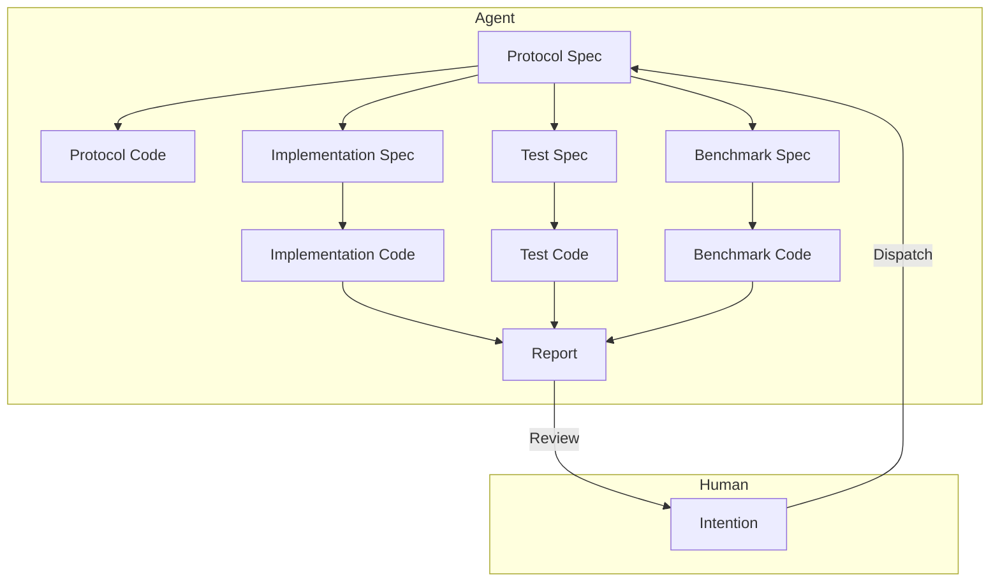

# モジュールレベルにおける人間-AI協調のソフトウェアエンジニアリングアーキテクチャ

## 問題の背景

LLMを用いたモジュールレベルの人間-AI協調エンジニアリングアーキテクチャを設計し、産業レベルのアプリケーションモジュールの設計、実装、反復を高効率で完了させ、人的介入コストを削減することを目指します。

1.  既存のAIエージェント（Claude Code、CodeXなど）によるコードモジュールの実装品質は低く、依然として人間による高度な介入、手直し、レビューが必要です。
2.  既存のAIエージェントは、実装プロセスにおいてモジュールの境界を構築することが難しく、不要な複雑さを持つコードを多く記述してしまいます。
3.  既存のAIエージェントの実装は非常に遅く、タスクの発行から受入までに10〜30分の時間を要します。

## 問題の洞察

-   [この記事](czon://b283a1863e9af777d581f5af32c0d2d27ed22194f391f5bc3cef9d0d445b4e8c)の見解によれば、人間の支配欲は結果の制御不能に対する合理的な懸念に由来し、制御可能な信頼メカニズムの構築が解決策となります。
-   [この記事](czon://2b0a022c6abba013f5f8dcf8f24e4cd0662b3db73ff017c3bb8799d0541537ae)の見解によれば、LLMはその物理的・経済的メカニズム上、すべての作業を一度に完了することが難しいと考えられます。

人間の生産性を解放する鍵は、人間の細部に対する支配欲を解消することにあります。そうすれば、人間は「使えなくはない」という考え方から、AIの作業成果に対してこれ以上厳しく要求しなくなるでしょう。

では、どのようなチェックを通過すれば、人間は自分に介入する能力がない、あるいはそれ以上の措置を取る必要がないと判断するのでしょうか？

1.  モジュールの外部インターフェースの概念命名が、要求に合致し、センスが良いこと。不合理なインターフェースがシステム下流に波及する懸念を払拭します。
2.  単体テストに合格すること。このモジュールが正常に動作するかどうかの懸念を払拭します。
3.  ベンチマークテストにおいて最適化されているか、少なくとも劣化していないこと。このモジュールの効率が非常に低いのではないかという懸念を払拭します。

    1点目は初期段階で発見可能ですが、2点目と3点目は実験終了後でなければ確認できません。これら3点がすべて満たされれば、人間がAIの作業成果に強引に介入する理由はなくなります。

このモジュールが実際のデータパターンに対応できるかどうかについては、本番環境のデータを用いてテストする必要があります。その後、人間がそのパターンを要約し、意図を構築して新しいモジュールを作成し、新しい問題を解決します。この問題は本稿の範囲外とします。

### 優先目標

1.  人的介入を減らす。
2.  実行時間を減らし、速度を向上させる。
3.  Token使用量を減らし、LLM費用を削減する。

### 設計

1.  迅速な意図の調整

    人間は意図の記述を通じて、迅速にエージェントとモジュールの機能要件を調整し、Protocol Specを出力します。

    ここでのProtocol Specは、モジュールのインターフェース定義、入出力データ形式、機能記述などを含み、基本的にはRFC文書に類似しています。人間はインターフェース定義と機能記述に特に注目し、モジュールの境界が明確であることを保証する必要があり、特にインターフェーススタイルのセンスの問題を吟味する必要があります。

    このプロセスは複数回の対話を通じて完了でき、エージェントは人間のフィードバックに基づいてProtocol Specを修正し続け、人間が承認するまで続けます。

    その後、長い自動実装プロセスが始まり、その間、人間は介入する必要はありません。結果は2つあります：1. モジュール実装が成功し、最終報告書を生成して人間の審査に提出する。2. モジュール実装が失敗し、仲裁要求を生成して人間の介入を求める。

2.  Protocol SpecからProtocol Codeを生成

    エージェントはProtocol Specに基づいて、モジュールの骨組みコードであるProtocol Codeを生成します。これにはインターフェース定義とコメントが含まれます。
    Protocol Codeは、後続の実装、テスト、ベンチマークコード生成に使用されます。主な目的はモジュールの境界を明確にし、実装プロセスで不要な複雑さが生じるのを防ぐことです。

3.  Protocol Specから並行してImplementation Spec、Test Spec、Benchmark Specを生成

    それぞれ異なるエージェントに依頼し、Protocol Specに基づいてImplementation Spec、Test Spec、Benchmark Specを生成します。これらはそれぞれ、モジュールの実装詳細、テストケース、ベンチマークテスト計画を記述します。

4.  Test SpecからTest Codeを生成

    専門のテストエージェントに依頼し、Protocol SpecとTest Specに基づいて、モジュールの単体テストコードであるTest Codeを生成します。これには様々なテストケースとアサーションが含まれます。実装詳細との結合を避けるため、インターフェースベースのテスト手法を使用することが必須です。

5.  Benchmark SpecからBenchmark Codeを生成

    専門のベンチマークテストエージェントに依頼し、Protocol SpecとBenchmark Specに基づいて、モジュールのベンチマークテストコードであるBenchmark Codeを生成します。これには性能テストケースと測定指標が含まれます。実装詳細との結合を避けるため、インターフェースベースのテスト手法を使用することが必須です。

6.  Implementation SpecからImplementation Codeを生成

    専門の実装エージェントに依頼し、Protocol Spec、Implementation Spec、Test Spec、Benchmark Specに基づいて、モジュールの実装コードであるImplementation Codeを生成します。実装が完了したら、直ちに単体テストを実行します。

    単体テストが不合格の場合、失敗原因を分析します。

    -   実装（Implementation）に問題があると判断した場合、Implementation Specを修正し、その後Implementation Codeを再生成します。このプロセスを繰り返します。
    -   テスト（Test）に問題があると判断した場合、テスト失敗の詳細を収集し、反対意見として統合します。その後、より上位レベルの仲裁エージェントに処理を委ねます。
        -   反対が認められた場合、仲裁エージェントはTest Specを修正することを選択し、その後テストを再実行します。このプロセスを繰り返します。
        -   反対が認められなかった場合、仲裁エージェントは説明意見を生成し、実装エージェントにImplementation Specの修正を要求し、その後実装プロセスを再実行します。このプロセスを繰り返します。
        -   **仲裁エージェントが判断できないと判断した場合、仲裁エージェントは人間の仲裁介入を要求します。**

    単体テストが合格した場合、ベンチマークテストを開始します。

7.  ベンチマークテストの実行

    単体テストに合格したImplementation Codeは、ベンチマークテストを実行できます。

    現在、比較可能な他の実装バージョンが存在しない場合、現在の実装をベースラインバージョンとしてマークし、ベンチマークテストを実行して性能指標を記録すれば、ベンチマークテストを通過できます。

    現在、比較可能な他の実装バージョンが存在する場合、ベンチマークテストを実行して性能指標を記録します。比較レポートを生成し、エージェントが現在の実装バージョンの性能変化を分析します。

    -   現在の実装バージョンの性能が劣化している場合、劣化原因を分析します。
        -   実装（Implementation）に問題があると判断した場合、Implementation Specを修正し、その後Implementation Codeを再生成します。このプロセスを繰り返します。
        -   ベンチマーク（Benchmark）に問題があると判断した場合、ベンチマークテスト失敗の詳細を収集し、反対意見として統合します。その後、より上位レベルの仲裁エージェントに判断を委ねます。
            -   反対が認められた場合、仲裁エージェントはBenchmark Specを修正することを選択し、その後ベンチマークテストを再実行します。このプロセスを繰り返します。反対が認められなかった場合、仲裁エージェントはタスク失敗を宣言し、最終報告書を生成して人間の審査に提出します。
            -   反対が認められなかった場合、仲裁エージェントは反対意見を実装エージェントに差し戻し、Implementation Specの修正を要求し、その後実装プロセスを再実行します。このプロセスを繰り返します。
            -   **仲裁エージェントが判断できないと判断した場合、仲裁エージェントは人間の仲裁介入を要求します。**
    -   現在の実装バージョンの性能が劣化していない場合、ベンチマークテストを通過します。

8.  最終報告書の生成

    Implementation Codeが単体テストとベンチマークテストの両方に合格したら、実装詳細、テスト結果、ベンチマークテスト結果を含む最終報告書を生成します。
    最終報告書は人間による審査に提出されます。人間が現在の実装を承認すれば、タスクは完了します。そうでない場合、人間のフィードバックを収集し、反対意見として統合します。その後、より上位レベルの仲裁エージェントに処理を委ねます。反対が認められた場合、仲裁エージェントはProtocol Specを修正することを選択し、その後実装プロセス全体を再実行します。このプロセスを繰り返します。

## まとめ

1.  アーキテクチャの中核は、階層化された協調、専門的な分業、関心の分離です。
2.  多段階の仲裁メカニズムを通じて、実装品質を確保し、人的介入を削減します。
3.  明確な受入基準（単体テスト合格、性能劣化なし）を設定し、信頼メカニズムを構築して人間の支配欲を解消します。

未解決の問題がいくつか残っています：

1.  Protocol Specの品質を向上させ、モジュールの境界を明確にするにはどうすればよいか？自動レビュー工程を追加する。
2.  仲裁の無限ループをどのように回避するか？例：最大自動仲裁回数の制限。
3.  実際の実行時間と使用Token数をどのように合理的な範囲内に制御するか？まず計測し、その後最適化する。
4.  インターフェース設計のセンスをどのように保証するか？例：チームスタイルガイドの導入。

いくつかの展望：

1.  人間の位置は必ずしも人間である必要はない。それは実はSuperVisor（監督者）である。将来、より高度なAIを用いて、意図の調整と最終審査における人間の役割を代替することは可能か？これにより、人的介入がさらに減少し、効率が向上するでしょう。
2.  モジュールレベルのタスクでない場合、より大規模なシステム設計と実装（例えば、フロントエンド＋バックエンド＋データベースのフルスタック開発タスク）に拡張することは可能か？これは、ソフトウェアエンジニアリング分野におけるAIの応用価値を大幅に高めるでしょう。