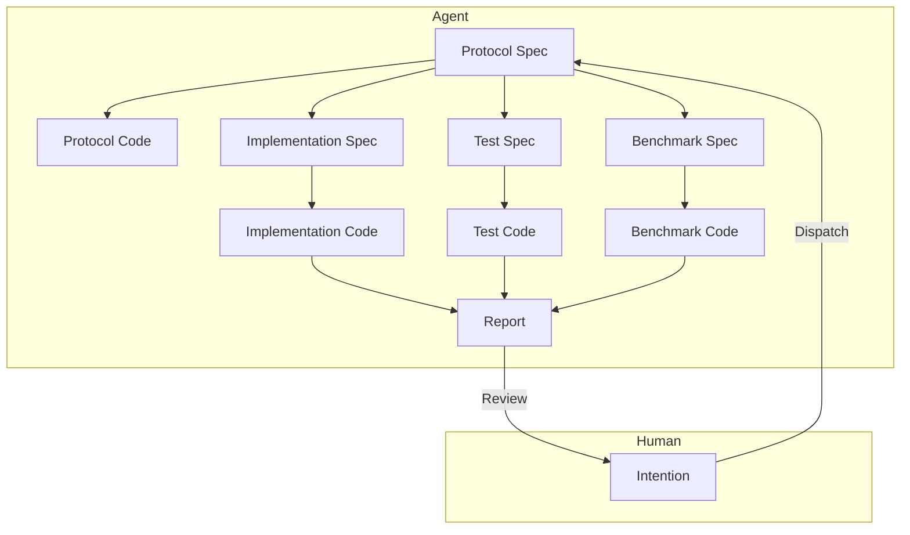

# モジュールレベルにおける人間-AI協調のソフトウェアエンジニアリングアーキテクチャ

2026-01-05

## 問題の背景

LLMを用いたモジュールレベルの人間-AI協調エンジニアリングアーキテクチャを設計し、産業レベルのアプリケーションモジュールの設計、実装、反復を高効率で完了させ、人的介入コストを削減することを目的とします。

1.  既存のAIエージェント（Claude Code、CodeXなど）によるコードモジュールの実装品質は低く、依然として人間による高度な介入、手直し、レビューが必要です。
2.  既存のAIエージェントは、実装プロセスにおいてモジュールの境界を適切に構築することが難しく、不要な複雑さを持つコードを多く生成してしまいます。
3.  既存のAIエージェントの実装は遅く、タスクの発行から受入までに10〜30分の時間を要します。

## 問題の洞察

-   [この記事](czon://3a40b7b252512466f0b0feb8c7ea77fc624bb0026cbae8882c5c205462e0aa64)の観点によれば、人間の制御欲求は、結果に対するコントロールを失うことへの合理的な懸念に起因します。制御可能な信頼メカニズムを構築することが解決策です。
-   [この記事](czon://038e3e093437a25f9eb22aabb4debaa185632c4e19a53b3103b614e016160b80)の観点によれば、LLMはその物理的・経済的メカニズム上、すべての作業を一度に完了することが本質的に難しいと考えられます。

人間の生産性を解放する鍵は、人間の細部に対する制御欲求をなくすことにあります。そうすれば、人間は「使えないわけではない」という考え方から、AIの作業成果に対して過度に要求しなくなるでしょう。

では、どのようなチェックを通過すれば、人間は自分に介入する能力がない、あるいはそれ以上の措置を取る必要がないと判断するのでしょうか？

1.  モジュールの外部インターフェースの概念と命名が、要求に合致していること。不合理なインターフェースがシステム下流に広がる懸念を払拭します。
2.  単体テストに合格すること。このモジュールが正常に動作するかどうかの懸念を払拭します。
3.  ベンチマークテストにおいて最適化されているか、少なくとも劣化していないこと。このモジュールの効率が低くないかという懸念を払拭します。

    1点目は初期段階で発見可能ですが、2点目と3点目は実験が終了するまでわかりません。この3つがすべて満たされれば、人間がAIの作業成果に強引に介入する理由はなくなります。

このモジュールが実際のデータパターンに対応できるかどうかは、本番環境のデータを用いてテストする必要があります。その後、人間がそのパターンを要約し、意図を基に新しいモジュールを構築して新たな問題を解決します。この問題は本稿の範囲外とします。

### 優先目標

1.  人的介入を減らす。
2.  実行時間を短縮し、速度を向上させる。
3.  Token使用量を減らし、LLM費用を削減する。

### 設計

1.  迅速な意図の合意形成

    人間が意図の記述を通じて、エージェントと迅速にモジュールの機能要件を合意させ、Protocol Specを出力します。

    ここでのProtocol Specには、モジュールのインターフェース定義、入出力データ形式、機能記述などが含まれ、基本的にはRFC文書に類似します。人間は特にインターフェース定義と機能記述に注目し、モジュールの境界が明確であることを保証する必要があり、特にインターフェーススタイルの「センス」の問題を吟味する必要があります。

    このプロセスは複数回の対話を通じて完了でき、エージェントは人間のフィードバックに基づいてProtocol Specを修正し続け、人間が承認するまで続けます。

    その後は、長い自動化実装プロセスが始まり、その間、人間は介入する必要はありません。結果は2つあります：1. モジュール実装が成功し、最終報告書を生成して人間の審査に提出する。2. モジュール実装が失敗し、仲裁要求を生成して人間の介入を求める。

2.  Protocol SpecからProtocol Codeを生成

    エージェントはProtocol Specに基づいて、モジュールの骨組みコードであるProtocol Codeを生成します。これにはインターフェース定義とコメントが含まれます。
    Protocol Codeは、後続の実装、テスト、ベンチマークコード生成に使用されます。主な目的はモジュールの境界を明確にし、実装プロセスで不要な複雑さが生じるのを防ぐことです。

3.  Protocol SpecからImplementation Spec、Test Spec、Benchmark Specを並行生成

    それぞれ異なるエージェントに依頼し、Protocol Specに基づいてImplementation Spec（実装仕様）、Test Spec（テスト仕様）、Benchmark Spec（ベンチマーク仕様）を生成します。これらはそれぞれ、モジュールの実装詳細、テストケース、ベンチマークテスト計画を記述します。

4.  Test SpecからTest Codeを生成

    専門的なテストエージェントに依頼し、Protocol SpecとTest Specに基づいて、モジュールの単体テストコード（Test Code）を生成します。これには様々なテストケースとアサーションが含まれます。実装詳細との結合を避けるため、インターフェースベースのテスト手法を使用することが必須です。

5.  Benchmark SpecからBenchmark Codeを生成

    専門的なベンチマークテストエージェントに依頼し、Protocol SpecとBenchmark Specに基づいて、モジュールのベンチマークテストコード（Benchmark Code）を生成します。これにはパフォーマンステストケースと測定指標が含まれます。実装詳細との結合を避けるため、インターフェースベースのテスト手法を使用することが必須です。

6.  Implementation SpecからImplementation Codeを生成

    専門的な実装エージェントに依頼し、Protocol Spec、Implementation Spec、Test Spec、Benchmark Specに基づいて、モジュールの実装コード（Implementation Code）を生成します。実装が完了したら、直ちに単体テストを実行します。

    単体テストが不合格の場合、失敗原因を分析します。

    -   実装（Implementation）に問題があると判断した場合、Implementation Specを修正し、その後Implementation Codeを再生成します。このプロセスを繰り返します。
    -   テスト（Test）に問題があると判断した場合、テスト失敗の詳細を収集し、反対意見として統合します。その後、より上位レベルの仲裁エージェントに処理を委ねます。
        -   反対が認められた場合、仲裁エージェントはTest Specを修正することを選択し、その後テストを再実行します。このプロセスを繰り返します。
        -   反対が却下された場合、仲裁エージェントは説明意見を生成し、実装エージェントに対してImplementation Specの修正を要求し、その後実装プロセスを再開します。このプロセスを繰り返します。
        -   **仲裁エージェントが判断できないと判断した場合、仲裁エージェントは人間の介入による仲裁を要求します。**

    単体テストが合格した場合、ベンチマークテストを開始します。

7.  ベンチマークテストの実行

    単体テストに合格したImplementation Codeは、ベンチマークテストを実行できます。

    現在、比較可能な他の実装バージョンが存在しない場合、現在の実装をベースラインバージョンとしてマークし、ベンチマークテストを実行してパフォーマンス指標を記録すれば、ベンチマークテストを通過できます。

    現在、比較可能な他の実装バージョンが存在する場合、ベンチマークテストを実行してパフォーマンス指標を記録します。比較レポートを生成し、エージェントが現在の実装バージョンのパフォーマンス変化を分析します。

    -   現在の実装バージョンのパフォーマンスが劣化している場合、劣化原因を分析します。
        -   実装（Implementation）に問題があると判断した場合、Implementation Specを修正し、その後Implementation Codeを再生成します。このプロセスを繰り返します。
        -   ベンチマーク（Benchmark）に問題があると判断した場合、ベンチマークテスト失敗の詳細を収集し、反対意見として統合します。その後、より上位レベルの仲裁エージェントに判断を委ねます。
            -   反対が認められた場合、仲裁エージェントはBenchmark Specを修正することを選択し、その後ベンチマークテストを再実行します。このプロセスを繰り返します。反対が却下された場合、仲裁エージェントはタスク失敗を宣言し、最終報告書を生成して人間の審査に提出します。
            -   反対が却下された場合、仲裁エージェントは反対意見を実装エージェントに差し戻し、Implementation Specの修正を要求し、その後実装プロセスを再開します。このプロセスを繰り返します。
            -   **仲裁エージェントが判断できないと判断した場合、仲裁エージェントは人間の介入による仲裁を要求します。**
    -   現在の実装バージョンのパフォーマンスが劣化していない場合、ベンチマークテストを通過します。

8.  最終報告書の生成

    Implementation Codeが単体テストとベンチマークテストの両方に合格したら、実装詳細、テスト結果、ベンチマークテスト結果を含む最終報告書を生成します。
    最終報告書は人間による審査に提出されます。人間が現在の実装を承認すれば、タスク完了となります。そうでない場合、人間のフィードバックを収集し、反対意見として統合します。その後、より上位レベルの仲裁エージェントに処理を委ねます。反対が認められた場合、仲裁エージェントはProtocol Specを修正することを選択し、その後実装プロセス全体を再開します。このプロセスを繰り返します。

## まとめ

1.  このアーキテクチャの中核は、階層化された協調、専門化された分業、関心の分離にあります。
2.  多段階の仲裁メカニズムを通じて、実装品質を確保し、人的介入を減らします。
3.  明確な受入基準（単体テスト合格、性能劣化なし）を設定することで、信頼メカニズムを構築し、人間の制御欲求を排除します。

まだ解決されていない問題がいくつかあります：

1.  Protocol Specの品質を向上させ、モジュールの境界を明確にするにはどうすればよいか？自動レビュー工程を追加する。
2.  仲裁の無限ループをどのように回避するか？例：最大自動仲裁回数の制限。
3.  実際の実行時間と使用されるTokens数を、どのように合理的な範囲内に制御するか？まず計測し、その後最適化する。
4.  インターフェース設計の「センス」をどのように保証するか？例：チームスタイルガイドの導入。

今後の展望：

1.  人間の位置は必ずしも人間である必要があるでしょうか？それは実はSuperVisor（監督者）です。将来的には、より高次のAIを用いて、意図の合意形成と最終審査における人間の役割を代替することは可能でしょうか？これにより、人的介入がさらに減少し、効率が向上するでしょう。
2.  モジュールレベルのタスクだけでなく、より大規模なシステム設計と実装に拡張することは可能でしょうか？例えば、フロントエンド＋バックエンド＋データベースを含むフルスタック開発タスクなど。これは、ソフトウェアエンジニアリング分野におけるAIの応用価値を大幅に高めるでしょう。