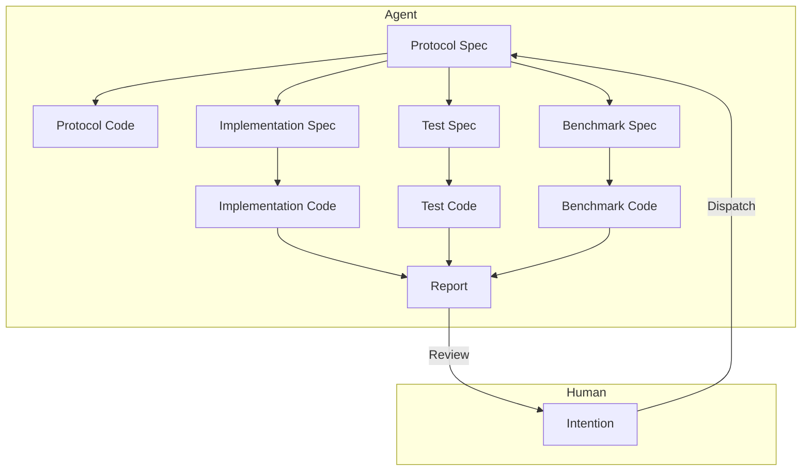

# 模块级人机协同的软件工程架构

2026-01-05

## 问题背景

设计一个 LLM 进行模块级别的人机协同工程架构，旨在高效率地完成工业级应用模块的设计、实现和迭代，减少人工介入成本。

1. 现有 AI Agent (Claude Code、CodeX) 对于代码模块的实现质量很差，仍然需要人类高度介入、返工、Review。
2. 现有 AI Agent 在实现过程中难以构造模块边界，导致编写出很多无用复杂度的代码。
3. 现有的 AI Agent 实现太慢，一个任务从发布到验收需要 10-30 分钟时间。

## 问题洞察

- 根据 [这篇文章](./2.md) 的观点，人的控制欲源于对后果失控的理性担忧，建立可控信任机制是解决之道。
- 根据 [这篇文章](./3.md) 的观点，我认为 LLM 在其物理层面、经济层面的机制决定了它很难一次性完成所有工作。

我们想要解放人的生产力，关键在于消灭人类对细节的控制欲，然后人就会出于“又不是不能用”的心态，不再进一步苛求 AI 的工作产出。

那么，什么检查通过之后，人会判断自己已经不具有能力介入，或者不必要采取更多措施？

1. 模块对外的接口概念命名品味符合需求。打消不合理的接口会蔓延到系统下游的顾虑。
2. 通过单元测试。打消这个模块是否能正常工作的顾虑。
3. 基准测试上有优化或者不劣化。打消这个模块是否效率很低的顾虑。
   第一点是在初始阶段就能发现的，而后面的需要等到实验结束才能得知。如果三者都满足了，人类没有什么理由去强行介入 AI 完成的工作。

至于此模块是否真正能应对真实数据模式，要使用生产环境数据来测试。然后由人总结其模式，通过意图构造一个新的模块，解决新的问题。这个问题暂时不在本文讨论范围之内。

### 优先级目标

1. 减少人工介入。
2. 减少运行时间，提升速度
3. 减少 Token 使用量，减少 LLM 费用。

### 设计

1. 快速意图对齐

   人类通过意图描述，快速与 Agent 对齐模块的功能需求，输出 Protocol Spec。

   这里的 Protocol Spec 包含模块的接口定义、输入输出数据格式、功能描述等，基本上类似于 RFC 文档。人类需要重点关注接口定义和功能描述，确保模块边界清晰，特别是需要品一下接口风格的品味问题。

   这个过程可以通过多轮交互完成，Agent 会根据人类的反馈不断修改 Protocol Spec，直到人类批准为止。

   接下来，会是一个漫长的自动化实现过程，期间人类不需要介入。会有两个结果：1. 模块实现成功，生成最终报告交给人类审核；2. 模块实现失败，生成仲裁请求给人类介入仲裁。

2. 从 Protocol Spec 生成 Protocol Code

   Agent 根据 Protocol Spec 生成模块的骨架代码 Protocol Code，包含接口定义和注释。
   Protocol Code 会被用于后续的实现、测试和基准代码生成。主要就是为了确保模块边界清晰，避免实现过程中出现不必要的复杂度。

3. 从 Protocol Spec 并行生成 Implementation Spec、Test Spec、Benchmark Spec

   分别请不同的 Agent 根据 Protocol Spec 生成 Implementation Spec、Test Spec、Benchmark Spec，分别描述模块的实现细节、测试用例和基准测试方案。

4. 从 Test Spec 生成 Test Code

   请专业的测试 Agent 根据 Protocol Spec 和 Test Spec 生成模块的单元测试代码 Test Code，包含各种测试用例和断言。务必使用基于接口的测试方法，避免耦合实现细节。

5. 从 Benchmark Spec 生成 Benchmark Code

   请专业的基准测试 Agent 根据 Protocol Spec 和 Benchmark Spec 生成模块的基准测试代码 Benchmark Code，包含性能测试用例和测量指标。务必使用基于接口的测试方法，避免耦合实现细节。

6. 从 Implementation Spec 生成 Implementation Code

   请专业的实现 Agent 根据 Protocol Spec, Implementation Spec, Test Spec, Benchmark Spec 生成模块的实现代码 Implementation Code。一旦实现完成，立刻进行单元测试。

   如果单元测试未通过，分析失败原因。

   - 如果认为是 Implementation 有问题，修改 Implementation Spec，然后重新生成 Implementation Code。重复此过程。
   - 如果认为是 Test 有问题，需要采集测试失败的细节，整合成一个反对意见。之后会交给一个更高级别的仲裁 Agent 来处理。

     - 如果反对通过，仲裁 Agent 可以选择修改 Test Spec，然后重新进行测试。重复此过程。
     - 如果反对失败，仲裁 Agent 生成解释意见，要求实现 Agent 修改 Implementation Spec，然后重新进行实现流程。重复此过程。
     - **如果仲裁 Agent 认为无法判断，仲裁 Agent 会要求人类介入仲裁。**

   如果单元测试通过，开始进行基准测试。

7. 运行基准测试

   通过了单元测试的 Implementation Code，可以运行基准测试。

   如果当前不存在其他可对比的实现版本，标记当前实现为基准版本，运行基准测试，记录性能指标，即可通过基准测试。

   如果当前存在其他可对比的实现版本，运行基准测试，记录性能指标。生成对比报告，由 Agent 分析当前实现版本的性能变化。

   - 如果当前实现版本的性能劣化，分析劣化原因。

     - 如果认为是 Implementation 有问题，修改 Implementation Spec，然后重新生成 Implementation Code。重复此过程。

     - 如果认为是 Benchmark 有问题，需要采集基准测试失败的细节，整合成一个反对意见。之后会交给一个更高级别的仲裁 Agent 来判断。

       - 如果反对通过，仲裁 Agent 可以选择修改 Benchmark Spec，然后重新进行基准测试。重复此过程。如果反对失败，仲裁 Agent 宣告任务失败，生成最终报告交给人类审核。
       - 如果反对失败，仲裁 Agent 将反对意见打回给实现 Agent，要求其修改 Implementation Spec，然后重新进行实现流程。重复此过程。
       - **如果仲裁 Agent 认为无法判断，仲裁 Agent 会要求人类介入仲裁。**

   - 如果当前实现版本的性能没有劣化，通过基准测试。

8. 生成最终报告

   一旦 Implementation Code 通过单元测试和基准测试，生成最终报告，包含实现细节、测试结果和基准测试结果。
   最终报告会被交给人类进行审核。如果人类认可当前实现，任务完成；否则，采集人类的反馈，整合成一个反对意见。之后会交给一个更高级别的仲裁 Agent 来处理。如果反对通过，仲裁 Agent 可以选择修改 Protocol Spec，然后重新进行整个实现流程。重复此过程。

## 总结

1. 架构的核心是分层协作，专业化分工，关注点分离。
2. 通过多级仲裁机制，确保实现质量，减少人工介入。
3. 明确验收标准(单测通过、性能不劣化)，建立信任机制，消除人类控制欲。

仍有一些未解决的问题：

1. 如何提高 Protocol Spec 的质量，确保模块边界清晰？再加一个自动评审环节。
2. 仲裁无限循环如何避免？例如最大自动仲裁次数限制。
3. 实际执行时间和使用的 Tokens 数量如何控制在合理范围内？先度量再优化。
4. 接口设计的品味如何保证？例如加入一个团队风格指南。

一些展望：

1. 人类的位置又何必是人类？它其实是一个 SuperVisor。未来是否可以用更高级别的 AI 来替代人类进行意图对齐和最终审核？这将进一步减少人工介入，提高效率。
2. 如果不是模块级别的任务，是否可以推广到更大规模的系统设计和实现？例如前端+后端+数据库的全栈开发任务？这将极大地提升 AI 在软件工程领域的应用价值。
