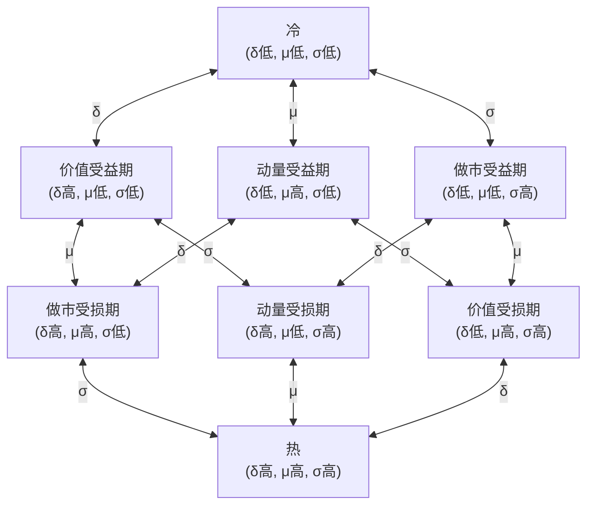

# 资本市场的三体动力学假说

2026-02-07

**为什么市场的行为既有规律又充满不确定性？**

- 为什么市场总是有机会但不确定？
- 为什么市场总是重演但不复现？
- 为什么市场时而可预测，时而不可预测？
- 为什么资本市场会有波动率聚集、市场崩溃与恢复现象？
- 为什么市场会有突变现象？
- 为什么市场会有暴涨后暴跌的模式？
- 为什么市场会有归零的风险？
- 为什么市场的统计特性（如收益率分布的肥尾、波动率聚集等）是稳健的？

## 核心思想

假设资本市场是一个**三体系统**，由三类本质不同的资本构成。它们通过相互作用产生复杂的动力学行为，包括波动率聚集、市场崩溃与恢复周期等涌现现象。

与天体力学中的三体问题类似，这个系统**可能不存在稳态解**，而是呈现极限环、准周期或混沌行为。

## 三体的定义

市场参与者的本质区别不在于身份（散户、机构、做市商），而在于**对价格变化的反馈性质**。

### 动量资本 M (Momentum Capital)

**定义**：对价格变化产生正反馈的交易资本。

$$\frac{d(\text{Position})}{dS} > 0$$

**行为特征**：

- 涨时买入，跌时卖出（追涨杀跌）
- 使用杠杆放大收益/亏损
- 倾向于短期持仓
- 动量交易、趋势跟踪

**对系统的影响**：

- 放大价格波动
- 不稳定化力量
- 制造趋势和崩溃

**典型代表**：投机者、趋势交易者、高杠杆交易者、被动止损的持仓者

### 价值资本 V (Value Capital)

**定义**：对价格变化产生负反馈的交易资本。

$$\frac{d(\text{Position})}{dS} < 0$$

即：价格上涨时减仓，价格下跌时加仓。

通常存在内在价值 $S^*$ 作为锚点：

- 当 $S < S^*$ 时，倾向于买入
- 当 $S > S^*$ 时，倾向于卖出

**行为特征**：

- 低买高卖（逆向操作）
- 基于价值判断进行交易
- 倾向于长期持仓
- 均值回归、价值投资

**对系统的影响**：

- 抑制价格波动
- 稳定化力量（主动）
- 提供市场支撑和阻力

**典型代表**：价值投资者、逆向投资者、套利者

### 流动性资本 L (Liquidity Capital)

**定义**：对价格变化无方向性反应的流动性资本。

$$\frac{d(\text{Position})}{dS} \approx 0$$

**行为特征**：

- 双边报价，赚取价差
- 不持有方向性敞口（或快速对冲）
- 持续提供买卖流动性
- 风险承受度有限

**对系统的影响**：

- 降低交易成本
- 稳定化力量（被动）
- 缓冲价格冲击

**典型代表**：做市商、流动性提供者、高频交易商（做市类）

## 三体的相互作用

### 作用矩阵

| 作用方 → 受作用方 | 动量资本 M   | 价值资本 V   | 流动性资本 L |
| ----------------- | ------------ | ------------ | ------------ |
| **动量资本 M**    | —            | 创造交易机会 | 消耗流动性   |
| **价值资本 V**    | 抑制极端行为 | —            | 恢复信心     |
| **流动性资本 L**  | 约束冲击效果 | 提供交易便利 | —            |

### 详细机制

**M → L：消耗流动性**

动量资本的追涨杀跌行为产生大量单向订单流，消耗做市商的库存，迫使做市商承担更大风险敞口。当波动率过高时，做市商会选择撤离。

**L → M：约束冲击效果**

充足的流动性会缓冲动量资本对价格的冲击。在深度市场中，即使高杠杆交易也难以撬动价格。流动性是"减震器"。

**M → V：创造交易机会**

动量资本的追涨杀跌将价格推离内在价值，为价值资本创造交易机会：

- 恐慌抛售 → 价格低于内在价值 → V 的**买入**机会
- 狂热追涨 → 价格高于内在价值 → V 的**卖出**机会

这是从动量资本向价值资本的**机会转移**。

**V → M：抑制极端行为**

价值资本的逆向操作提供价格支撑，降低价格单边下跌的概率，使追涨杀跌策略的预期收益下降。理性的动量资本会因此收缩规模。

**V → L：恢复信心**

价值资本的介入发出"市场有底"的信号，降低做市商对极端亏损的担忧，吸引流动性回归。价值资本是做市商的"保险"。

**L → V：提供交易便利**

充足的流动性使价值资本可以低成本建仓，大额订单不会产生过大滑点，提高价值资本的资金效率。

## 反馈回路

### 正反馈回路（不稳定）

$$M \uparrow \to \sigma \uparrow \to L \downarrow \to \text{价格冲击} \uparrow \to \sigma \uparrow \to M \uparrow \text{ (或爆仓)}$$

动量资本增加 → 波动率上升 → 流动性撤离 → 价格冲击加剧 → 波动率进一步上升 → 动量资本继续增加或被强制平仓

这是**崩溃螺旋**的机制。

### 负反馈回路（稳定）

$$|S - S^*| \uparrow \to \sigma \uparrow \to V \uparrow \to |S - S^*| \downarrow \to \sigma \downarrow \to L \uparrow$$

价格偏离内在价值 → 波动率上升 → 价值资本介入 → 价格回归 → 波动率下降 → 流动性恢复

具体路径：

- **暴跌后**：$S < S^*$ → V 买入 → 价格回升
- **暴涨后**：$S > S^*$ → V 卖出 → 价格回落

这是**恢复机制**。

## 系统的相变

系统的状态取决于**哪条回路占主导**：

- **正反馈 > 负反馈**：系统趋向崩溃
- **负反馈 > 正反馈**：系统趋向稳定
- **临界点**：系统处于相变边界

相变是系统的**涌现结果**，而非预设阈值。系统会自发地在正负反馈的竞争中产生相变。

描述市场状态需要三个核心变量：

| 变量       | 符号     | 含义                                                   |
| ---------- | -------- | ------------------------------------------------------ |
| **溢价**   | $\delta$ | 价格相对内在价值的溢价：$\delta = \frac{S - S^*}{S^*}$ |
| **动量**   | $\mu$    | 价格变化率：$\mu = \frac{dS}{dt}$                      |
| **波动率** | $\sigma$ | 价格波动的幅度                                         |

### 收益-风险-成本矩阵

M、V、L 三类资本与 δ、μ、σ 三个市场变量之间存在**中心对称**的关系：

|                     | $\delta$（溢价） | $\mu$（动量） | $\sigma$（波动率） |
| ------------------- | :--------------: | :-----------: | :----------------: |
| **M（动量资本）**   |       风险       |   **收益**    |        成本        |
| **V（价值资本）**   |     **收益**     |     成本      |        风险        |
| **L（流动性资本）** |       成本       |     风险      |      **收益**      |

其中：

- **收益**：该变量增大时，该资本直接获利
- **风险**：该变量增大时，该资本可能亏损
- **成本**：该变量增大时，该资本的运营效率下降

#### 对称性

这个矩阵具有完美的**中心对称结构**：

- **每行**：一个收益、一个风险、一个成本
- **每列**：一个收益、一个风险、一个成本
- **对角线**：M-μ、V-δ、L-σ 各自对应核心收益来源

#### 三体制衡

从列的角度看，每个市场变量的变化都会产生赢家、输家和被消耗者：

| 变量增大   | 收益方 | 风险方 | 成本方 |
| ---------- | ------ | ------ | ------ |
| $\delta$ ↑ | V      | M      | L      |
| $\mu$ ↑    | M      | L      | V      |
| $\sigma$ ↑ | L      | V      | M      |

没有任何一个变量对所有资本都有利或都有害，这正是**三体制衡**的体现。

#### 详细论证

**M 与三变量的关系**：

- $\mu$（收益）：趋势延续 = M 获利，这是 M 的核心收益来源
- $\delta$（风险）：溢价过大预示反转，M 面临亏损
- $\sigma$（成本）：高波动时止损更容易被触发，交易成本增加

**V 与三变量的关系**：

- $\delta$（收益）：溢价大 = V 的机会，这是 V 的核心收益来源
- $\sigma$（风险）：高波动时，V 建仓后可能面临更大浮亏，即使最终回归也要承受过程中的煎熬；高波动还意味着内在价值 $S^*$ 本身可能在变化，V 的锚点不稳定
- $\mu$（成本）：趋势延续时，V 需要等待更久，资金效率下降

**L 与三变量的关系**：

- $\sigma$（收益）：波动大 = 交易机会多，做市收益高，这是 L 的核心收益来源
- $\mu$（风险）：趋势强时，L 的库存持续单向累积，面临方向性亏损
- $\delta$（成本）：溢价大时，L 需要更大的价差来保护自己，做市效率下降

### 市场相态

基于 δ、μ、σ 三个变量的高/低状态，市场存在 $2^3 = 8$ 种典型相态。

| 编码 | $\delta$ | $\mu$ | $\sigma$ |      名称      | 核心特征                       |
| :--: | :------: | :---: | :------: | :------------: | ------------------------------ |
| 000  |    低    |  低   |    低    |    **冷**      | 市场沉寂，三方都无利可图       |
| 001  |    低    |  低   |    高    | **做市受益期** | 价格合理，高波动无趋势，L 主导 |
| 010  |    低    |  高   |    低    | **动量受益期** | 趋势刚起，溢价尚小，M 开始获利 |
| 011  |    低    |  高   |    高    | **价值受损期** | M 主导，高波动高趋势           |
| 100  |    高    |  低   |    低    | **价值受益期** | 溢价大但市场沉寂，V 等待催化剂 |
| 101  |    高    |  低   |    高    | **动量受损期** | V 与 L 博弈，方向不明          |
| 110  |    高    |  高   |    低    | **做市受损期** | 趋势明确，M 获利，V 承压       |
| 111  |    高    |  高   |    高    |    **热**      | 三高状态，系统临界             |

命名规则：
- **只有一个高**：该变量对应的收益方 + "受益期"
- **只有一个低**：该变量对应的收益方 + "受损期"
- **全低/全高**：冷/热

四组对偶，编码互为按位取反，命名完美对称：
- 冷（000）↔ 热（111）
- 价值受益期（100）↔ 价值受损期（011）
- 动量受益期（010）↔ 动量受损期（101）
- 做市受益期（001）↔ 做市受损期（110）

### 相态详细分析

#### 冷（000）：δ低, μ低, σ低

| 资本 | 状态                   |
| ---- | ---------------------- |
| M    | 收益源 μ 低 → 无利可图 |
| V    | 收益源 δ 低 → 无机会   |
| L    | 收益源 σ 低 → 无利可图 |

**特征**：三方都无利可图，市场萎缩，成交清淡

**典型场景**：冷门股、退市边缘、熊市末期的绝望期

#### 做市受益期（001）：δ低, μ低, σ高

| 资本 | 状态                                               |
| ---- | -------------------------------------------------- |
| M    | 收益源 μ 低 → 无趋势可追；成本源 σ 高 → 频繁止损   |
| V    | 收益源 δ 低 → 无机会；风险源 σ 高 → 环境恶劣       |
| L    | 收益源 σ 高 → **获利丰厚**；风险源 μ 低 → 风险可控 |

**特征**：L 的黄金时期，价格在合理范围内高频波动

**典型场景**：成熟市场的盘整期、高频交易主导的市场

#### 动量受益期（010）：δ低, μ高, σ低

| 资本 | 状态                                           |
| ---- | ---------------------------------------------- |
| M    | 收益源 μ 高 → **获利**；成本源 σ 低 → 成本可控 |
| V    | 成本源 μ 高 → 效率下降；风险源 σ 低 → 风险可控 |
| L    | 风险源 μ 高 → **受损**；收益源 σ 低 → 收益有限 |

**特征**：M 获利，L 受损，V 观望；δ 将逐渐增大

**典型场景**：趋势初期、缓慢牛市/熊市的起点

#### 价值受损期（011）：δ低, μ高, σ高

| 资本 | 状态                                                       |
| ---- | ---------------------------------------------------------- |
| M    | 收益源 μ 高 → **获利丰厚**；成本源 σ 高 → 成本增加但可承受 |
| V    | 收益源 δ 低 → 无机会；风险源 σ 高 + 成本源 μ 高 → 恶劣环境 |
| L    | 收益源 σ 高 → 有收益；风险源 μ 高 → **风险大**             |

**特征**：M 主导市场，高波动高趋势，δ 将快速增大

**典型场景**：MEME 币早期、题材炒作初期、突破行情

#### 价值受益期（100）：δ高, μ低, σ低

| 资本 | 状态                                               |
| ---- | -------------------------------------------------- |
| M    | 收益源 μ 低 → 无利可图；风险源 δ 高 → 潜在反转风险 |
| V    | 收益源 δ 高 → **有机会**；成本源 μ 低 → 等待成本高 |
| L    | 成本源 δ 高 → 效率下降；收益源 σ 低 → 收益有限     |

**特征**：V 看到机会但市场不动，等待催化剂

**典型场景**：被低估但无人问津的股票、深度价值投资标的

#### 动量受损期（101）：δ高, μ低, σ高

| 资本 | 状态                                                             |
| ---- | ---------------------------------------------------------------- |
| M    | 收益源 μ 低 → 无趋势；风险源 δ 高 → 风险高；成本源 σ 高 → 成本高 |
| V    | 收益源 δ 高 → **机会大**；风险源 σ 高 → **风险也大**             |
| L    | 收益源 σ 高 → **有收益**；成本源 δ 高 → 效率下降                 |

**特征**：V 和 L 的博弈场，高波动但无明确方向

**典型场景**：财报前后、重大事件不确定期、多空对峙

#### 做市受损期（110）：δ高, μ高, σ低

| 资本 | 状态                                             |
| ---- | ------------------------------------------------ |
| M    | 收益源 μ 高 → **获利**；风险源 δ 高 → 风险累积   |
| V    | 收益源 δ 高 → 机会大；成本源 μ 高 → **持续承压** |
| L    | 风险源 μ 高 → **受损**；成本源 δ 高 → 效率低     |

**特征**：趋势明确但波动不大，M 稳定获利，V 痛苦等待

**典型场景**：单边牛市/熊市中期、趋势确立后的主升/主跌浪

#### 热（111）：δ高, μ高, σ高

| 资本 | 状态                                                                         |
| ---- | ---------------------------------------------------------------------------- |
| M    | 收益源 μ 高 → 收益大；风险源 δ 高 → **风险极大**；成本源 σ 高 → 成本高       |
| V    | 收益源 δ 高 → 机会大；风险源 σ 高 → **风险极大**；成本源 μ 高 → 成本高       |
| L    | 收益源 σ 高 → 理论收益大；风险源 μ 高 → **风险极大**；成本源 δ 高 → 效率极低 |

**特征**：三方都面临极端环境，高收益高风险，系统处于临界点

**典型场景**：泡沫顶点、崩盘时刻、黑天鹅事件

### 相态转换

每个相态可以通过改变一个维度（δ、μ 或 σ）转换到相邻的 3 个相态。所有转换都是双向的。



这是一个 **三维超立方体（3-cube）** 结构：8 个顶点对应 8 个相态，12 条边对应 12 种单维度转换。

### 典型演化路径

**泡沫形成与崩溃**：

```
冷 → 动量受益期 → 做市受损期 → 热 → 动量受损期 → 价值受益期 → 冷
(000) → (010) → (110) → (111) → (101) → (100) → (000)
```

**健康市场震荡**：

```
做市受益期 ↔ 价值受损期 ↔ 做市受益期
(001) ↔ (011) ↔ (001)
```

**价值发现**：

```
价值受益期 → 动量受损期 → 做市受益期
(100) → (101) → (001)
```

### 冷与热的对称性

从相态转换图中可以得到一个重要的策略启示：

**热（111）的三个出口全部是受损期**：
- δ↓ → 价值受损期（011）
- μ↓ → 动量受损期（101）
- σ↓ → 做市受损期（110）

无论哪个变量先回落，都有一类资本受损，且无法预测哪个变量先变。因此在过热状态下，**任何方向性押注都是赌博**，最优策略是不参与或降低杠杆。

**冷（000）的三个出口全部是受益期**：
- δ↑ → 价值受益期（100）
- μ↑ → 动量受益期（010）
- σ↑ → 做市受益期（001）

无论哪个变量先上升，都有一类资本受益。因此在冷状态下，**任何参与都可能获利**，关键是保持在场。

## 三体的生态位

| 资本类型     | 生态角色     | 对系统稳定性   | 收益来源          |
| ------------ | ------------ | -------------- | ----------------- |
| 动量资本 M   | 能量注入者   | 不稳定化       | 波动率 × 方向判断 |
| 流动性资本 L | 缓冲器       | 稳定化（被动） | 买卖价差          |
| 价值资本 V   | 负反馈控制器 | 稳定化（主动） | 价值回归          |

**生态平衡**：健康的市场需要三者共存。

- 缺少动量资本：市场死水，无波动，无交易机会
- 缺少流动性资本：交易成本高，市场效率低
- 缺少价值资本：市场脆弱，易崩溃，甚至归零

## 与传统分类的关系

| 传统分类     | 本质归属     | 说明                 |
| ------------ | ------------ | -------------------- |
| 投机者       | 动量资本 M   | 追涨杀跌，杠杆放大   |
| 投资者       | 价值资本 V   | 低买高卖，价值判断   |
| 做市商       | 流动性资本 L | 双边报价，赚取价差   |
| 趋势交易者   | 动量资本 M   | 动量策略             |
| 套利者       | 价值资本 V   | 价差收敛             |
| 被动指数基金 | 近似 L       | 再平衡时产生弱负反馈 |

注意：同一参与者在不同时刻可能扮演不同角色。分类的本质是**行为模式**，而非身份标签。

## 三体类比

市场三体与天体力学中的三体问题具有深刻的相似性。

**类比的关键**：三体问题的本质是**三个质量相近的天体相互作用**。正因为势均力敌，任何一方都无法主导系统，才产生混沌行为。

市场中，M、V、L 三种资本同样**旗鼓相当**：

- 若 M 远大于 V 和 L：市场单边暴涨暴跌后归零（泡沫破裂）
- 若 V 远大于 M 和 L：市场几乎不波动（死水）
- 若 L 远大于 M 和 V：价格完全由外部信息决定（完美有效市场）

只有三者势均力敌时，市场才呈现真实的复杂动态。

**天体三体的教训**：

- 两体问题有解析解（椭圆轨道）
- 三体问题一般无解析解，对初值敏感
- 轨道可能是周期的、准周期的或混沌的

**市场三体的推论**：

- **长期预测不可能**：系统对初值敏感
- **短期特性可预测**：趋势和波动率聚集是短期现象
- **统计规律稳健**：收益率分布的肥尾、波动率聚集等宏观统计特性是稳定的

## 补充：资本体量的长期演化

三体模型的核心是 M-V-L 之间的相互作用，但有一个前提问题：**为什么三种资本能够长期共存且势均力敌？**

这依赖于一个从属机制：**收益率驱动的自然选择**（Return-Driven Selection）。

### 机制描述

同一类资本内部，个体收益率呈分布状态。个体的行为（扩张、收缩、退出）与其收益率高度相关：

- 高收益个体倾向于留存或扩张
- 低收益个体倾向于收缩或退出

在大量个体的统计效应下，这种倾向性体现为该类资本总量的变化。

### 自发调节

当某类资本过剩时：

1. 内部竞争加剧
2. 平均收益率下降
3. 边际个体退出增加
4. 该类资本总量收缩

当某类资本不足时：

1. 内部竞争减弱
2. 平均收益率上升
3. 吸引新资本流入
4. 该类资本总量扩张

### 各类资本的收益来源与竞争

| 资本类型 | 收益来源           | 过剩时的内卷表现                   |
| -------- | ------------------ | ---------------------------------- |
| M        | 波动率、趋势延续   | 互相踩踏，滑点增大，趋势被提前透支 |
| V        | 价值偏离、均值回归 | 价值洼地被抢光，安全边际消失       |
| L        | 交易量、买卖价差   | 价差收窄，做市利润摊薄             |

### 理论地位

收益率驱动的自然选择是一个**慢变量**机制（周到年的时间尺度），而三体相互作用是**快变量**机制（秒到天的时间尺度）。

这个从属机制解释了三体系统的**存在性**和**持久性**——为什么市场不会演化到某一类资本独大的状态——但不改变三体相互作用的核心动态。

## 研究方向

1. **相空间结构**：吸引子、排斥子、分离曲面
2. **时间尺度分离**：快变量（价格）、慢变量（资本结构）
3. **统计特性**：遍历性、不变测度、停留时间分布
4. **动力学方程**：基于此框架的 SDE 系统（另文详述）

## 参考

- [波动率和杠杆](../LOGS/26.md)
- [波动率作用优于杠杆作用](../LOGS/45.md)
- [资本持久战](./6.md)
