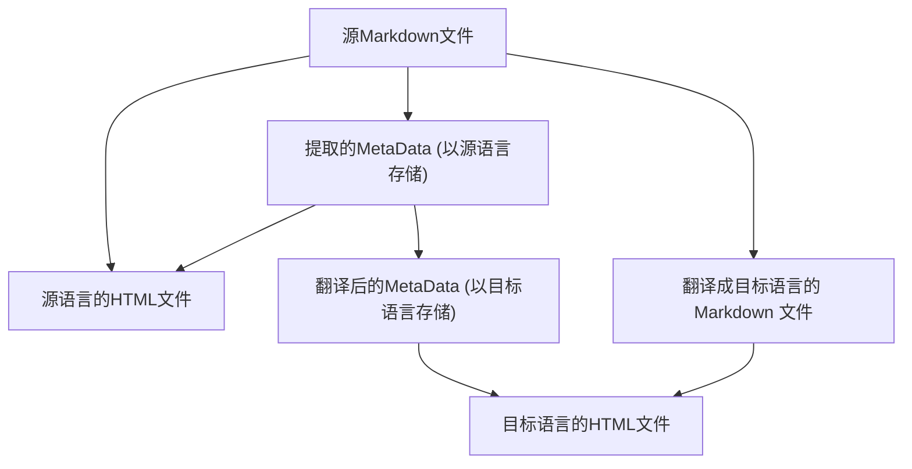

现在是 2026年1月26日，周一凌晨 4 点。

### CZON 目录结构重构

[之前](./27.md) 提到的对抗生成翻译的效果确实不错。但是，发现了 CZON 的一个问题，它以 Hash 作为源文件的 ID，这导致我修改了一篇被引用了 9 次的文章后，雪崩式地触发了 (1 + 9) \* 3 = 30 次翻译任务，另外，对抗生成翻译的 Token 消耗约为普通翻译的 10 倍以上，长文章经过多轮修改后，Token 消耗会非常大，成本也会非常高。因此我再次回滚了 OpenCode 的翻译集成，改为使用普通的单次翻译。

为了解决这个问题，我重构了整个 CZON 的生成目录。自从 0.6.0 开始，CZON 将原样拷贝源文件到生成目录中，保持路径一致。例如 `docs/guide/intro.md` 会被写入到 `.czon/src/{lang}/docs/guide/intro.md`。这样，修改一篇文章后，只需要重新翻译该文章即可，避免了雪崩式的重新生成。(不过 CZON 之前版本的用户需要重新生成整个 `.czon/src` 目录，需要重新翻译所有文章一次)

斩断了雪崩式重新生成的链条后，接下来是优化对抗生成翻译的 Token 消耗。我发现对抗生成的 Agent 有时候会过度读取其他文件，例如明明是 zh-Hans 到 es-ES 的翻译任务，翻译 Agent 却读取了 en-US 的内容。这显然是不必要的 Token 消耗。然而，OpenCode 暂时无法在 session 级别限制 Agent 的文件访问权限。一个小小的 Trick 是，将需要的文件拷贝到一个临时目录中，然后让 Agent 只访问这个临时目录。只是我现在还在斟酌是否要这么做。是否可以通过详细的提示词来减少这种不必要的文件访问？还是说，直接用临时目录更保险？

我修改完了 CZON 的生成目录结构后，这意味着原本主导地位的 SHA-256 Hash ID 几乎无用武之地了。`czon://hash` 的协议也被废弃了。不过重构后，链接的替换更加优雅了。在翻译前后，这些链接完全不需要替换，而在渲染 HTML 时，可以通过钩子替换链接为正确的路径。

现在这个 .czon 的目录结构设计对于 git 以及第三方 SSG 集成来说更加友好了。

- 因为每一个 `.czon/src/{lang}` 目录都是一个完整的目录，可以被单独进行渲染或者预览。
- 使用路径而不是 Hash，这使得每次修改源文件后，不会创建一个新的目标文件，而是覆盖原有的目标文件，避免了大量冗余文件的产生。

### 静态资源引用

静态资源引用可以通过普通链接的方式进行。

在 CZON 0.6.0 版本中，还可以引用任意的资源文件，例如图片、PDF 等等。这些资源文件会被拷贝到生成目录中对应的位置。不止是图片，txt、pdf、docx 等等都可以被引用。CZON 会自动处理这些资源文件的拷贝工作。

### 进一步优化

**分离 Metadata 的翻译任务**

更进一步地，YAML FrontMatter 或者说 Metadata 也应该被留在 `.czon/meta.json` 中，而不需要提前被 enhance 到 Markdown 的开头。甚至，这个 YAML FrontMatter 本身也就没有意义了。

**自动删除残留的 `.czon/src` 中的文件**

CZON 目前并不会删除 `.czon/src/{lang}` 目录中多余的文件。例如，某篇文章被删除后，`.czon/src/{lang}/path/to/deleted-article.md` 仍然存在。未来的版本中，CZON 会自动检测这些多余的文件，并将其删除，保持生成目录的整洁。

**重新启用对抗生成翻译**

这是必然的。因为 one-shot 翻译根本无法处理长文章。使用 Agent 势在必行，但需要解决 Token 消耗过大的问题。
