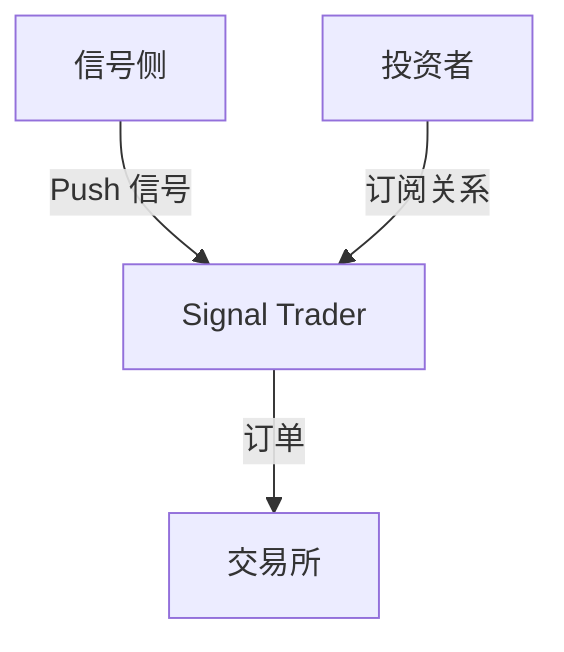

# 谈谈持久战实盘模块设计: Signal Trader

现在是 2026 年 3 月 12 日，星期四，上午。

昨天和 C1 聊了一下持久战实盘模块的内容。总结了一下最近的一些实践结果。

我们上次将其核心模块定义为 Signal Trader，意为信号交易者。它的输入是信号，输出是订单。接受信号侧主动 push 信号，经过多投资者分账后，输出到交易所订单。

## Push vs Pull

在软件设计中，Push 模式和 Pull 模式是两种常见的数据流模式。

**Signal Trader 采用了 Push 模式**。即信号侧主动 push 信号到 Signal Trader。这种模式的优点是可以实现实时性较高的信号传递，适合需要快速响应的交易策略。并且，Push 模式可以适配多种信号来源，灵活性较高。Push 模式可以天然地支持异质性的信号来源，是 K 线策略信号？高频信号？还是 AI Agent 策略信号？甚至是人类主观信号，都可以通过 Push 模式进行传递。

使用 Pull 模式的话，Signal Trader 需要定期轮询信号侧获取最新的信号，这可能会导致延迟增加，尤其是在信号更新频繁的情况下。并且，Signal Trader 必须能主动发现信号侧的服务，信号侧服务必须暴露接口，这增加了系统的复杂性。

## 信号三元取值，只有方向，没有强度

在我们的设计中，信号只有方向，没有强度。这是为了简化信号的处理逻辑，使得 Signal Trader 只需要关注信号的方向（做多 1、做空 -1、空仓 0），而不需要考虑信号的强度（如买入多少、卖出多少），信号无法表达加仓或者减仓的强度信息。这样还能很好地避免过拟合问题，因为强度信息往往会导致模型过度拟合训练数据，而在实际交易中表现不佳。限制模型的表达能力，反而能提升模型的泛化能力。

根据资本持久战的设计原则，仓位管理不是信号的职责。

## 止损比例是信号侧的职责

一个交易信号，也需要配合一个止损比例，根据资本持久战的策略，才能**以损定仓**，计算出本次建仓的名义价值，并设立止损单。例如，某个信号从 0 变成了 1，表示做多，信号侧还需要给出一个止损比例，比如 0.02，表示止损价位是入场价的 2% 下方。根据这个止损比例，Signal Trader 就可以计算出本次建仓的名义价值 (按照 VC 存量的 50x 杠杆进行开仓，发生止损时恰好把 VC 全部亏完)，并且在交易所下单时同时设置止损单。止损比例越大，止损价位越远离入场价，风险越大，名义价值越小。

止损比例的更新和信号本身的额更新，是不同步的。止损比例的更新频率更低。止损比例的更新是基于历史信号的表现来学习的，而信号的更新是基于当前市场情况来生成的。止损比例的更新需要一定的历史数据积累，而信号的更新则不需要。止损比例的更新甚至可以是人为设定的，但它在持仓过程中不能修改。修改止损比例，只会在下一次开仓时生效。

一开始，我们将止损的学习过程放在了 Signal Trader 中，于是我们需要设计一个止损学习模块，根据历史信号的表现来学习止损比例。于是我们需要在 Signal Trader 内部维护一个价格监控器，来衡量信号的盘中表现。为了解决信号的冷启动问题，还需要设计一个导入历史信号的功能，以便新的信号上实盘时不要浪费时间来学习止损比例。

可以观察到，价格监控器、历史信号模块，在信号侧也一定是有的。那么为什么不直接把止损比例也放到信号侧呢？这样可以大幅简化 Signal Trader 的设计。

## 多投资者分账

**隔离原则**：多个投资者彼此之间是隔离的，投资者的任何决策不会影响到其他投资者的利益。

在隔离的基础上，我们尽量满足投资者的个性化需求。

多个投资者可以独立地订阅同一个信号，指定自己的止盈比例和每天的投资额。订阅后，Signal Trader 会为投资者创建一个订阅关系，内部包含一个独立的 VC 帐户。每当信号触发时，Signal Trader 会根据订阅关系计算总 VC 量，得到总的名义价值，然后按照每个投资者的 VC 占比来分配订单量和手续费。

一个投资者可以创建同一个信号的多个订阅关系，以满足不同的止盈比例和每天投资额的需求。一个投资者也可以同时订阅多个不同的信号，以满足投资组合的需求。

每个订阅关系中的 VC 帐户会按照速率自动累计投资额。这个可以 Lazy Evaluate。订阅关系中的每天投资额是可以修改的，修改的时候不会清空 VC 帐户的余额。

投资者可以随时取消订阅，Signal Trader 会在信号平仓或者反转时自动取消订阅关系，并且清空 VC 帐户的余额。投资者取消订阅的动作不会影响当前已经开仓的仓位，这是因为投资者的资金撤出可能不符合基本手，会有浮点数误差，会影响到其他投资者的利益。但我们仍然可以更进一步，在投资者希望立即撤出资金时，Signal Trader 会按照投资者的 VC 占比来平掉当前仓位，但是平仓量要向下取整到最小交易量的整数倍，这样就不会影响到其他投资者的利益。这会导致投资者可能会有一个微小的残仓，但这也是无法避免的，否则将违反隔离原则。

## 审计系统

信号侧、交易所侧、投资者侧的每一个动作都需要被审计系统记录下来，以便后续的分析和回溯。审计系统需要记录每一个信号的触发时间、信号的方向、止损比例、投资者的订阅关系、订单的下单时间、订单的成交情况等信息。审计系统还需要提供查询接口，以便我们可以根据不同的维度来查询和分析数据，比如按照信号、按照投资者、按照时间等维度来查询。
