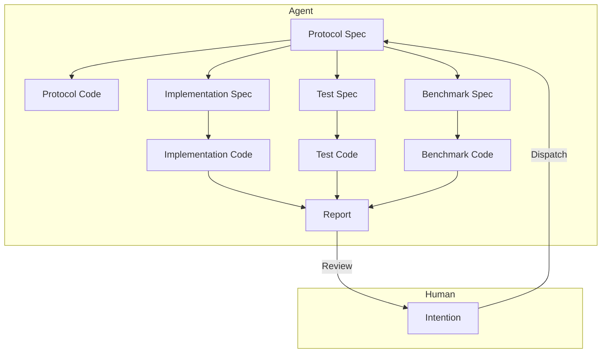

# Module-Level Human-AI Collaborative Software Engineering Architecture

## Problem Background

Design an LLM-based human-AI collaborative engineering architecture at the module level, aiming to efficiently complete the design, implementation, and iteration of industrial-grade application modules while reducing manual intervention costs.

1. Existing AI Agents (Claude Code, CodeX) produce poor-quality code module implementations, still requiring significant human intervention, rework, and review.
2. Existing AI Agents struggle to construct clear module boundaries during implementation, leading to unnecessary code complexity.
3. Existing AI Agents are too slow; a task from assignment to acceptance takes 10-30 minutes.

## Problem Insights

- According to [this article](./2.md), human desire for control stems from rational concerns about losing control over outcomes. Establishing a controllable trust mechanism is the solution.
- According to [this article](./3.md), I believe the physical and economic mechanisms of LLMs make it difficult for them to complete all tasks perfectly in a single attempt.

To liberate human productivity, the key is to eliminate human desire for control over details. Then, humans will adopt a "good enough" mindset and stop excessively scrutinizing AI's output.

So, what checks must pass for humans to judge that they are no longer capable of intervening or that further measures are unnecessary?

1. The conceptual naming and taste of the module's external interfaces meet requirements. This alleviates concerns about poor interfaces propagating downstream in the system.
2. Unit tests pass. This alleviates concerns about whether the module functions correctly.
3. Benchmark tests show optimization or no degradation. This alleviates concerns about the module's efficiency.
   The first point can be identified early, while the latter two are only known after experimentation. If all three are satisfied, humans have little reason to forcibly intervene in the AI's work.

As for whether the module can truly handle real-world data patterns, production environment data should be used for testing. Humans can then summarize the patterns and construct a new module through intention to address new issues. This problem is temporarily outside the scope of this document.

### Priority Goals

1. Reduce manual intervention.
2. Reduce runtime and improve speed.
3. Reduce token usage and lower LLM costs.

### Design

1. **Rapid Intention Alignment**

   Humans quickly align module functional requirements with the Agent through intention descriptions, outputting a Protocol Spec.

   The Protocol Spec includes the module's interface definitions, input/output data formats, functional descriptions, etc., similar to an RFC document. Humans should focus on interface definitions and functional descriptions to ensure clear module boundaries, particularly evaluating the taste of interface style.

   This process can involve multiple rounds of interaction. The Agent continuously revises the Protocol Spec based on human feedback until approved.

   Following this, a lengthy automated implementation process begins, during which no human intervention is required. Two outcomes are possible: 1. The module is successfully implemented, generating a final report for human review; 2. The module implementation fails, generating an arbitration request for human intervention.

2. **Generate Protocol Code from Protocol Spec**

   The Agent generates skeleton code (Protocol Code) for the module based on the Protocol Spec, including interface definitions and comments.
   Protocol Code is used for subsequent implementation, testing, and benchmark code generation. Its primary purpose is to ensure clear module boundaries and avoid unnecessary complexity during implementation.

3. **Generate Implementation Spec, Test Spec, Benchmark Spec in Parallel from Protocol Spec**

   Different Agents are tasked to generate the Implementation Spec, Test Spec, and Benchmark Spec based on the Protocol Spec, describing the module's implementation details, test cases, and benchmarking plan, respectively.

4. **Generate Test Code from Test Spec**

   A specialized testing Agent generates unit test code (Test Code) for the module based on the Protocol Spec and Test Spec, including various test cases and assertions. Interface-based testing methods must be used to avoid coupling with implementation details.

5. **Generate Benchmark Code from Benchmark Spec**

   A specialized benchmarking Agent generates benchmark test code (Benchmark Code) for the module based on the Protocol Spec and Benchmark Spec, including performance test cases and measurement metrics. Interface-based testing methods must be used to avoid coupling with implementation details.

6. **Generate Implementation Code from Implementation Spec**

   A specialized implementation Agent generates the module's implementation code (Implementation Code) based on the Protocol Spec, Implementation Spec, Test Spec, and Benchmark Spec. Once implementation is complete, unit tests are immediately run.

   If unit tests fail, analyze the cause.

   - If the issue is believed to be with the Implementation, modify the Implementation Spec and regenerate Implementation Code. Repeat this process.
   - If the issue is believed to be with the Test, collect details of the test failure and compile a counter-argument. This will be submitted to a higher-level arbitration Agent.

     - If the counter-argument is accepted, the arbitration Agent may choose to modify the Test Spec and rerun the tests. Repeat this process.
     - If the counter-argument is rejected, the arbitration Agent generates an explanatory opinion, instructing the implementation Agent to modify the Implementation Spec and restart the implementation process. Repeat this process.
     - **If the arbitration Agent cannot make a judgment, it will request human intervention for arbitration.**

   If unit tests pass, proceed to benchmarking.

7. **Run Benchmark Tests**

   Implementation Code that passes unit tests can proceed to benchmark testing.

   If no other comparable implementation version exists, mark the current implementation as the baseline version, run benchmark tests, record performance metrics, and pass the benchmark test.

   If other comparable implementation versions exist, run benchmark tests and record performance metrics. Generate a comparison report for the Agent to analyze performance changes in the current implementation.

   - If the current implementation shows performance degradation, analyze the cause.

     - If the issue is believed to be with the Implementation, modify the Implementation Spec and regenerate Implementation Code. Repeat this process.

     - If the issue is believed to be with the Benchmark, collect details of the benchmark failure and compile a counter-argument. This will be submitted to a higher-level arbitration Agent for judgment.

       - If the counter-argument is accepted, the arbitration Agent may choose to modify the Benchmark Spec and rerun the benchmark tests. Repeat this process. If the counter-argument is rejected, the arbitration Agent declares the task failed and generates a final report for human review.
       - If the counter-argument is rejected, the arbitration Agent returns the counter-argument to the implementation Agent, instructing it to modify the Implementation Spec and restart the implementation process. Repeat this process.
       - **If the arbitration Agent cannot make a judgment, it will request human intervention for arbitration.**

   - If the current implementation shows no performance degradation, the benchmark test is passed.

8. **Generate Final Report**

   Once Implementation Code passes both unit tests and benchmark tests, generate a final report containing implementation details, test results, and benchmark results.
   The final report is submitted to humans for review. If humans approve the implementation, the task is complete. Otherwise, collect human feedback, compile a counter-argument, and submit it to a higher-level arbitration Agent. If the counter-argument is accepted, the arbitration Agent may choose to modify the Protocol Spec and restart the entire implementation process. Repeat this process.

## Summary

1. The core of the architecture is layered collaboration, specialized division of labor, and separation of concerns.
2. A multi-level arbitration mechanism ensures implementation quality and reduces manual intervention.
3. Clear acceptance criteria (passing unit tests, no performance degradation) and trust mechanisms eliminate human desire for control.

Some unresolved issues remain:

1. How to improve Protocol Spec quality to ensure clear module boundaries? Add an automated review step.
2. How to avoid infinite arbitration loops? For example, set a maximum number of automatic arbitration attempts.
3. How to control actual execution time and token usage within reasonable limits? Measure first, then optimize.
4. How to ensure good taste in interface design? For example, incorporate a team style guide.

Future Prospects:

1. Why must the human role be a human? It is essentially a Supervisor. In the future, could a higher-level AI replace humans in intention alignment and final review? This would further reduce manual intervention and improve efficiency.
2. Can this approach be extended beyond module-level tasks to larger-scale system design and implementation? For example, full-stack development tasks involving frontend, backend, and databases? This would significantly enhance the application value of AI in software engineering.