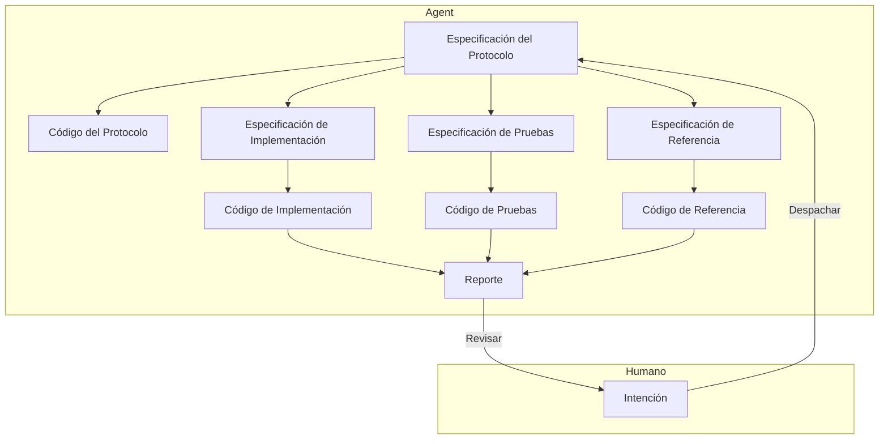

# Arquitectura de Ingeniería de Software para Colaboración Humano-Máquina a Nivel de Módulo

## Contexto del Problema

Diseñar una arquitectura de ingeniería para colaboración humano-máquina a nivel de módulo utilizando un LLM, con el objetivo de completar de manera eficiente el diseño, implementación e iteración de módulos para aplicaciones de nivel industrial, reduciendo los costos de intervención humana.

1.  Los Agentes de IA existentes (Claude Code, CodeX) tienen una calidad de implementación de código de módulo muy pobre, aún requiriendo una alta intervención, re-trabajo y revisión por parte de humanos.
2.  A los Agentes de IA existentes les resulta difícil construir límites claros de módulo durante la implementación, lo que lleva a escribir código con complejidad innecesaria.
3.  La implementación con los Agentes de IA existentes es demasiado lenta; una tarea desde su asignación hasta su aceptación puede tomar de 10 a 30 minutos.

## Insights del Problema

- Según el punto de vista de [este artículo](./2.md), el deseo de control humano surge de una preocupación racional por perder el control de las consecuencias; establecer mecanismos de confianza controlables es la solución.
- Según el punto de vista de [este artículo](./3.md), creo que los mecanismos físicos y económicos subyacentes del LLM determinan que es difícil que complete todo el trabajo de una sola vez.

La clave para liberar la productividad humana radica en eliminar el deseo humano de controlar los detalles; entonces, los humanos, con una mentalidad de "si funciona, sirve", dejarán de exigir más del trabajo producido por la IA.

Entonces, ¿qué verificaciones deben pasar para que una persona juzgue que ya no tiene la capacidad de intervenir o que no es necesario tomar más medidas?

1.  El gusto en la nomenclatura de los conceptos de la interfaz externa del módulo se ajusta a los requisitos. Esto disipa la preocupación de que interfaces poco razonables se propaguen aguas abajo en el sistema.
2.  Aprobación de las pruebas unitarias. Esto disipa la preocupación sobre si el módulo funcionará correctamente.
3.  Optimización o no degradación en las pruebas de referencia. Esto disipa la preocupación sobre si el módulo será ineficiente.
    El primer punto se puede detectar en la fase inicial, mientras que los otros dos solo se conocen al final del experimento. Si se cumplen los tres, los humanos no tienen razones para intervenir forzosamente en el trabajo completado por la IA.

En cuanto a si este módulo puede realmente manejar patrones de datos reales, se deben utilizar datos del entorno de producción para probarlo. Luego, un humano resume sus patrones y, a través de la intención, construye un nuevo módulo para resolver el nuevo problema. Este tema queda fuera del alcance de este documento por ahora.

### Objetivos Prioritarios

1.  Reducir la intervención humana.
2.  Reducir el tiempo de ejecución, aumentar la velocidad.
3.  Reducir el uso de Tokens, disminuir los costos del LLM.

### Diseño

1.  Alineación Rápida de Intenciones

    El humano, a través de una descripción de intención, se alinea rápidamente con el Agente sobre los requisitos funcionales del módulo, generando una Especificación del Protocolo.

    Esta Especificación del Protocolo contiene la definición de la interfaz del módulo, el formato de datos de entrada/salida, la descripción funcional, etc., básicamente similar a un documento RFC. El humano debe centrarse en la definición de la interfaz y la descripción funcional, asegurando que los límites del módulo sean claros, especialmente prestando atención al gusto en el estilo de la interfaz.

    Este proceso puede completarse a través de múltiples rondas de interacción. El Agente modificará continuamente la Especificación del Protocolo según la retroalimentación humana hasta que sea aprobada por el humano.

    A continuación, habrá un largo proceso automatizado de implementación durante el cual el humano no necesita intervenir. Habrá dos resultados: 1. La implementación del módulo tiene éxito, generando un reporte final para la revisión humana; 2. La implementación del módulo falla, generando una solicitud de arbitraje para la intervención humana.

2.  Generar Código del Protocolo desde la Especificación del Protocolo

    El Agente genera el código esqueleto del módulo, el Código del Protocolo, basándose en la Especificación del Protocolo, incluyendo definiciones de interfaz y comentarios.
    El Código del Protocolo se utilizará para la generación posterior del código de implementación, pruebas y referencia. Su propósito principal es garantizar límites claros del módulo y evitar complejidades innecesarias durante la implementación.

3.  Generar en Paralelo la Especificación de Implementación, Especificación de Pruebas y Especificación de Referencia desde la Especificación del Protocolo

    Se solicita a diferentes Agentes especializados que generen, basándose en la Especificación del Protocolo, la Especificación de Implementación, la Especificación de Pruebas y la Especificación de Referencia, describiendo respectivamente los detalles de implementación del módulo, los casos de prueba y el plan de pruebas de referencia.

4.  Generar Código de Pruebas desde la Especificación de Pruebas

    Se solicita a un Agente especializado en pruebas que genere el código de pruebas unitarias del módulo, el Código de Pruebas, basándose en la Especificación del Protocolo y la Especificación de Pruebas, incluyendo varios casos de prueba y aserciones. Es imperativo utilizar métodos de prueba basados en la interfaz para evitar acoplamiento con los detalles de implementación.

5.  Generar Código de Referencia desde la Especificación de Referencia

    Se solicita a un Agente especializado en pruebas de referencia que genere el código de pruebas de referencia del módulo, el Código de Referencia, basándose en la Especificación del Protocolo y la Especificación de Referencia, incluyendo casos de prueba de rendimiento y métricas de medición. Es imperativo utilizar métodos de prueba basados en la interfaz para evitar acoplamiento con los detalles de implementación.

6.  Generar Código de Implementación desde la Especificación de Implementación

    Se solicita a un Agente especializado en implementación que genere el código de implementación del módulo, el Código de Implementación, basándose en la Especificación del Protocolo, la Especificación de Implementación, la Especificación de Pruebas y la Especificación de Referencia. Una vez completada la implementación, se ejecutan inmediatamente las pruebas unitarias.

    Si las pruebas unitarias no se aprueban, se analiza la causa del fallo.

   - Si se considera que el problema está en la Implementación, se modifica la Especificación de Implementación y luego se regenera el Código de Implementación. Se repite este proceso.
   - Si se considera que el problema está en las Pruebas, se recopilan los detalles del fallo de la prueba y se integran en una objeción. Posteriormente, se entregará a un Agente de Arbitraje de nivel superior para que la procese.

     - Si la objeción es aceptada, el Agente de Arbitraje puede optar por modificar la Especificación de Pruebas y luego repetir las pruebas. Se repite este proceso.
     - Si la objeción es rechazada, el Agente de Arbitraje genera una explicación, solicitando al Agente de Implementación que modifique la Especificación de Implementación y luego repita el proceso de implementación. Se repite este proceso.
     - **Si el Agente de Arbitraje considera que no puede juzgar, solicitará la intervención humana para arbitrar.**

    Si las pruebas unitarias se aprueban, se procede a las pruebas de referencia.

7.  Ejecutar Pruebas de Referencia

    El Código de Implementación que ha aprobado las pruebas unitarias puede ejecutar las pruebas de referencia.

    Si no existe otra versión de implementación comparable actualmente, se marca la implementación actual como la versión de referencia, se ejecutan las pruebas de referencia, se registran las métricas de rendimiento y, por lo tanto, se aprueban las pruebas de referencia.

    Si existe otra versión de implementación comparable actualmente, se ejecutan las pruebas de referencia y se registran las métricas de rendimiento. Se genera un reporte comparativo que es analizado por el Agente para evaluar los cambios de rendimiento de la versión de implementación actual.

   - Si el rendimiento de la versión de implementación actual se degrada, se analiza la causa.

     - Si se considera que el problema está en la Implementación, se modifica la Especificación de Implementación y luego se regenera el Código de Implementación. Se repite este proceso.

     - Si se considera que el problema está en las Pruebas de Referencia, se recopilan los detalles del fallo en las pruebas de referencia y se integran en una objeción. Posteriormente, se entregará a un Agente de Arbitraje de nivel superior para que juzgue.

       - Si la objeción es aceptada, el Agente de Arbitraje puede optar por modificar la Especificación de Referencia y luego repetir las pruebas de referencia. Se repite este proceso. Si la objeción es rechazada, el Agente de Arbitraje declara que la tarea ha fallado y genera un reporte final para la revisión humana.
       - Si la objeción es rechazada, el Agente de Arbitraje devuelve la objeción al Agente de Implementación, solicitándole que modifique la Especificación de Implementación y luego repita el proceso de implementación. Se repite este proceso.
       - **Si el Agente de Arbitraje considera que no puede juzgar, solicitará la intervención humana para arbitrar.**

   - Si el rendimiento de la versión de implementación actual no se degrada, se aprueban las pruebas de referencia.

8.  Generar Reporte Final

    Una vez que el Código de Implementación aprueba las pruebas unitarias y las pruebas de referencia, se genera un reporte final que contiene los detalles de implementación, los resultados de las pruebas y los resultados de las pruebas de referencia.
    El reporte final se entrega al humano para su revisión. Si el humano aprueba la implementación actual, la tarea se completa; de lo contrario, se recopila la retroalimentación humana y se integra en una objeción. Posteriormente, se entregará a un Agente de Arbitraje de nivel superior para que la procese. Si la objeción es aceptada, el Agente de Arbitraje puede optar por modificar la Especificación del Protocolo y luego repetir todo el proceso de implementación. Se repite este proceso.

## Resumen

1.  El núcleo de la arquitectura es la colaboración en capas, la división especializada del trabajo y la separación de preocupaciones.
2.  A través de un mecanismo de arbitraje multinivel, se garantiza la calidad de la implementación y se reduce la intervención humana.
3.  Se establecen criterios de aceptación claros (pruebas unitarias aprobadas, rendimiento no degradado) y se crean mecanismos de confianza para eliminar el deseo de control humano.

Aún quedan algunos problemas sin resolver:

1.  ¿Cómo mejorar la calidad de la Especificación del Protocolo para garantizar límites claros del módulo? Añadir una etapa automática de revisión.
2.  ¿Cómo evitar ciclos infinitos de arbitraje? Por ejemplo, limitando el número máximo de arbitrajes automáticos.
3.  ¿Cómo controlar el tiempo de ejecución real y la cantidad de Tokens utilizados dentro de un rango razonable? Primero medir, luego optimizar.
4.  ¿Cómo garantizar el gusto en el diseño de interfaces? Por ejemplo, incorporando una guía de estilo del equipo.

Algunas perspectivas:

1.  ¿Por qué la posición del humano tiene que ser un humano? En realidad es un Supervisor. ¿Podría en el futuro una IA de nivel superior reemplazar al humano en la alineación de intenciones y la revisión final? Esto reduciría aún más la intervención humana y aumentaría la eficiencia.
2.  Si no es una tarea a nivel de módulo, ¿se podría extender a un diseño e implementación de sistemas a mayor escala? Por ejemplo, ¿una tarea de desarrollo full-stack que incluya frontend, backend y base de datos? Esto aumentaría enormemente el valor de aplicación de la IA en el campo de la ingeniería de software.