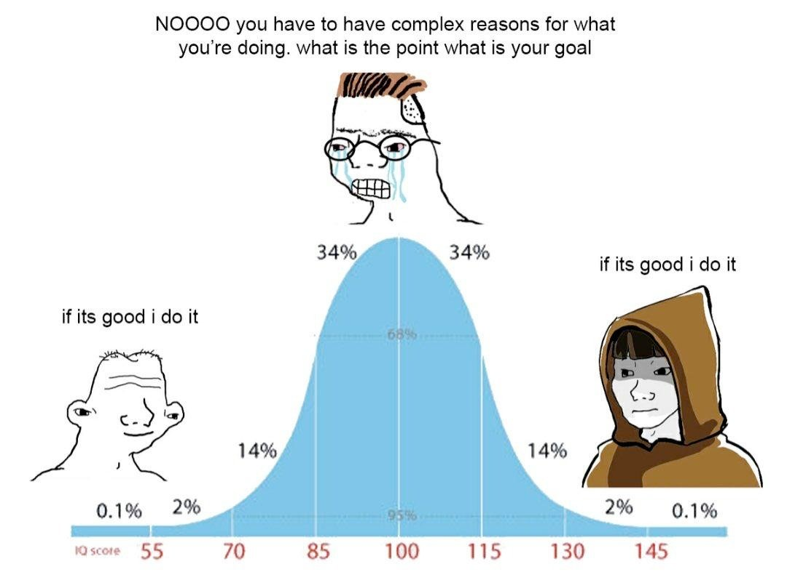
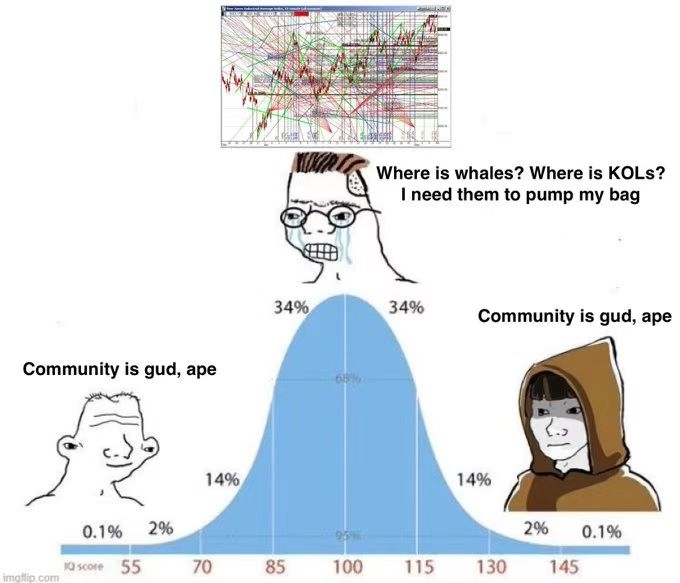

# 返璞归真：复杂性是认知的必经之路

2026-02-03

读完 swyx 的 [Don't Rush to Simplicity](https://dev.to/swyx/don-t-rush-to-simplicity-on-the-other-side-of-complexity-105n) 这篇文章，深有共鸣。

Oliver Wendell Holmes Jr. 的那句话说得太好了：

> "I would not give a fig for the simplicity this side of complexity, but I would give my life for the simplicity on the other side of complexity."
>
> "我不会为复杂性这一边的简单付出任何代价，但我愿意为复杂性另一边的简单付出生命。"

我最近在做量化投资的实验研究，有一个深刻的体会：**认知的发展是螺旋上升的过程**。无论是 AI 还是人类，都无法一蹴而就。但我们仍然要到达那个"复杂性另一边的简单"，即**返璞归真**的境界。

## 从 AI 编程说起

最近我在用 AI 辅助编程，踩了不少坑。有一次让 AI 帮我搭建一个实验项目，迭代了几轮之后，整个工程开始失控——新功能加不进去，旧代码删不干净，到处都是为了"兼容"而保留的僵尸接口。

问题出在哪？AI 没有经历过这个项目的演化过程，它不理解哪些抽象是核心的、哪些是临时的权宜之计。它只能看到当前的代码，然后用最"安全"的方式打补丁。结果就是，代码越来越臃肿，复杂性不断累积，最终不得不推倒重来。

这让我意识到：**好的抽象，必须建立在对问题域的深刻理解之上**。AI 可以帮你写代码，但它无法替你完成那段"与复杂性搏斗"的认知过程。

## 投资领域的"Midwit"陷阱

投资圈里有很多听起来很有道理的"简单智慧"：做时间的朋友、复利的魔力、长期持有优质资产……这些话本身没错，但问题在于，很多人把它们当成了可以直接套用的公式。

我管这叫"Midwit 陷阱"——用一套看似完备的理论框架，来回避对具体问题的深入思考。

比如，"稳健增长"听起来很美好，但它回避了一个现实问题：如果你的目标是实现财富的跨越式增长，每年 20% 的收益率需要多少年？这个时间尺度，和你的人生阶段匹配吗？

真正理解投资的人，往往会回归到一些看起来"过于简单"的原则。但他们的简单，是经历过市场毒打之后的简单，是知道什么该做、什么不该做的简单。例如，资本持久战，仍然是对经典的投资原则的诠释。“截断亏损，让利润奔跑”、“盈亏同源”——这些原则看似简单，简单到看起来像是废话，但背后蕴含着对市场复杂性的深刻理解。

## 为什么不能跳过复杂性？

**你不能通过模仿大师的行为来成为大师**。

复杂性阶段到底给了我们什么？我觉得至少有三样东西：

**第一，失败的经验。** 很多道理，不亲自踩一遍坑是理解不了的。书上说"牛市最容易亏钱"，但只有真正在市场里被教训过，你才会明白这句话的分量。

**第二，完整的心智模型。** 经历过复杂性的人，脑子里有一张完整的地图。他知道这个领域里有哪些坑、哪些路是通的、哪些看起来是捷径实际上是死胡同。这张地图，是无法通过阅读别人的总结来获得的。

**第三，直觉判断力。** 当你对一个领域足够熟悉，你会发展出一种"嗅觉"——能够快速判断一个方案靠不靠谱，一个人说的话有没有水分。这种直觉，是长期浸泡在复杂性中的副产品。

## 什么才算穿越复杂性？

既然复杂性不能跳过，那什么样的行为才算是在"穿越"它，而不是在"逃避"它？

我的判断标准是：**你是否在投入注意力，并回收认知**。

穿越复杂性，不是简单地"经历"，而是"深入体验"。你需要全神贯注地参与，然后从体验中提取出属于自己的理解。

很多看起来在"学习"的行为，其实是逃避：
- 读了很多书，但只是信息流过，没有沉淀
- 做了模拟盘，但没有认真复盘，做完就忘
- 抄了别人的代码，但没有理解为什么这样写

这些行为的共同点是：**注意力没有真正投入，或者体验了但没有回收认知**。

真正的穿越，是带着问题去体验，然后带着答案出来。

## 如何降低穿越复杂性的成本？

既然复杂性不可跳过，那能不能降低穿越它的成本？

我的观察是：**复杂性的"学费"存在距离衰减效应**。

- 发生在遥远的事故——别人的失败案例、历史上的教训——只能令人唏嘘，认知冲击很弱。你读完就忘了。
- 发生在身旁的事故——同事踩的坑、朋友亏的钱——足够令人印象深刻，你会记住很久。
- 发生在自己身上的事故——刻骨铭心，但代价最大。

所以问题变成了：**如何用"身旁的小亏"来替代"自己的大亏"？**

用投资的语言来说：你不能完全通过读书来学会投资，那太远了，冲击力不够；但你也不必真的亏掉全部身家才能学会，那太贵了。最优解是：**用可控的小额实盘，获得足够近的认知冲击**。

这意味着：

- 要"在场"，但不要"梭哈"
- 要亲自下场，但要控制每次的损失上限
- 要让失败发生，但要让它发生在你能承受的范围内

复杂性的学费不能免除，但可以用小亏替代大亏。

## 结语

经历过复杂性的人，和没经历过的人，对"简单"的理解是不一样的。

一个从未离开过小镇的人，和一个走遍世界后选择回到小镇的人，他们的"简单"是同一种简单吗？

后者的简单，是**选择的简单**。他知道自己放弃了什么，也知道自己为什么选择留下。

复杂性的另一边，不仅是"简单的结论"，更是"驾驭复杂性的能力"。这大概就是返璞归真的真正含义。
