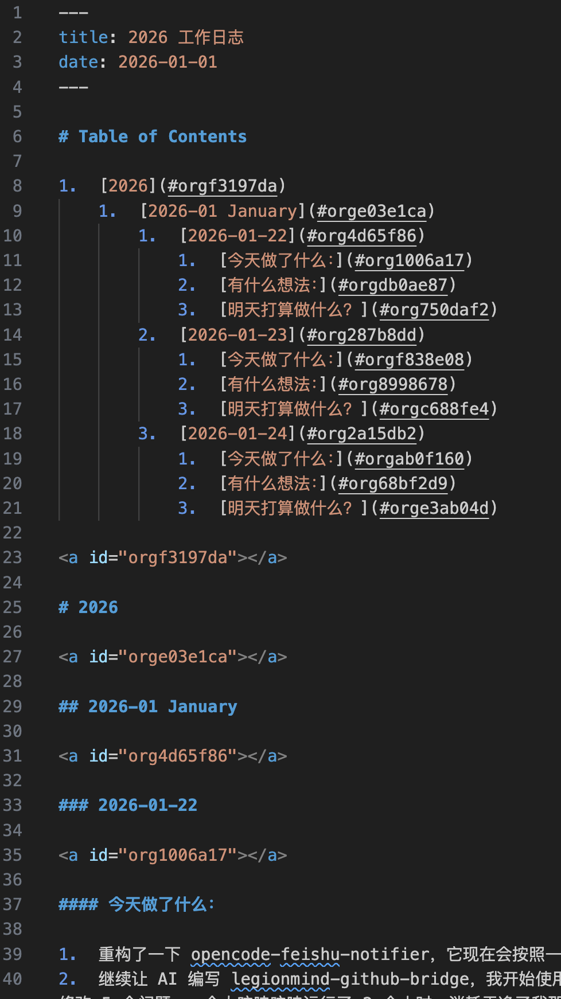

现在是 2026 年 1 月 27 日，晚上。

## 专注内容，减少写作的打扰

看了 C1 的博客，我发现他在用内嵌 TOC 来生成目录。

我认为这会给 Markdown 源文件带来不必要的负担。

如下图所示，他先写了近 40 行结构和元信息，才开始真正的内容。

问题是，TOC 的源码直接写在源文件中，尽管维护应该是有特殊工具的，但是这会使得源文件中充满了很多与内容无关的语法税。
实际上，在 YAML FrontMatter 中编写元数据也是一种语法税。我也是坚决反对的。但是 YAML FrontMatter 不像 TOC 如此丑陋，所以以前姑且没有如此猛烈地反对它。

我坚定地认为，一旦写文章时，开始特别注重样式、格式、结构和排版，关注点就会从内容本身转移开来，注意力就会分散，影响写作效率和质量。影响内容创作。

人在写作的时候，双眼无时不刻不在反复 Review 之前写过的内容。如果内容中充满了各种格式化语法，人的注意力就会被分散，无法专注于内容本身。

在 CZON 中，内容的元信息是应当被提取的，而不是内嵌在内容本身中。内容创作者不应当被迫去编写这些元信息。内容创作可以碎片化，由 AI + Infra 进行整合和排版。降低写作的语法税，是 CZON 的重要指标之一。

## 移动端优先，但桌面端可以做更多优化。

移动端只能做单列滚动布局，而桌面端可以做分栏布局。
所以桌面端的阅读体验可以做得更好一些。
例如，可以把导航栏、目录栏等放在侧边栏中，充分利用桌面端的宽屏优势。
甚至，对于桌面端，可以将脚注都改成边注，就像某些大部头纸质书籍那样。

对于长文章来说，Anchor 也是必备的功能，自 CZON 0.6.3 起便支持了自动 TOC 提取和标题的 Anchor 功能。

## 更好玩的东西

例如，**支持内联评论功能**。可以允许读者/AI 在文章的任意位置添加评论和讨论。这可以极大地提升内容的互动性和参与感。微信读书，微信公众号就支持这种划线评论的交互方式。缺点是，如果原文变动了，评论的位置可能会错乱，需要某种更加稳定的定位方式。
