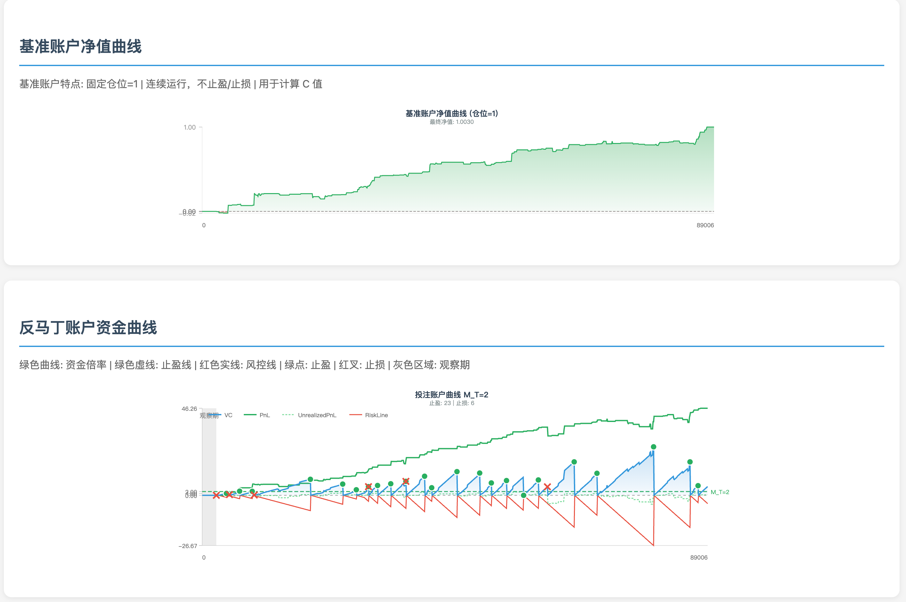

现在是 2026 年 2 月 11 日，下午。

可喜可贺。Mage 给的 FMAB 信号表现非常好，基准信号在 ETH 上的收益率来到了 100%。用反马丁投注之后，性能提到了 4600% ~ 120000%，非常恐怖的数字。相比之下，同样的市场下，基准信号策略的收益率只有 0 ~ 40% (包含趋势跟踪策略、均值回归策略、突破策略等)。Random 信号策略表现一般，属于合理情况。

正如我[之前](./62.md)所说，接下来我们准备上实盘了，现在需要积极地准备资本持久战的相关工程。_Take that money, watch it burn!_

另外也有反面的证据，我们另外的一些信号策略 (FMA) 表现不佳，无法带来好的收益率。但是当时我们认为它是不错的，并且加入了 Midas 豪华午餐套餐。在[上次](./35.md)的回撤中，就是 HYPE 上的 FMA 信号导致了较大的回撤。现在看来，我们有了一个更好的测试平台，可以更好地验证信号策略的质量。

目前有很多证据表明，当年可能真的是仓位管理不够科学。
